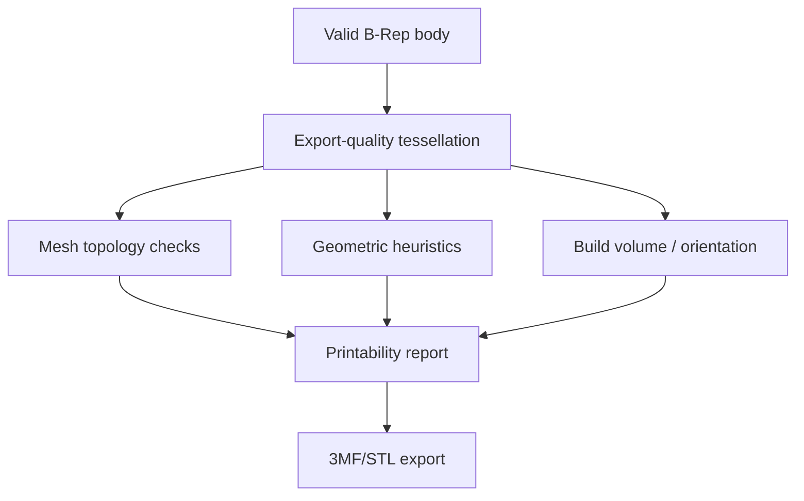

# Контур 3D-печати

## Рекомендация

VibeShape отвечает за **моделирование, валидацию и качественный обмен**, а слайсер — за технологические траектории. Основной экспорт v1 — 3MF; STEP нужен для точного CAD-обмена, STL — для совместимости.

Встроенный slicer не входит в MVP: PrusaSlicer/libslic3r и CuraEngine — большие самостоятельные AGPL C++-проекты со сложными профилями принтеров. Их WebAssembly-перенос не должен блокировать CAD.

## Printer profile

Локальный профиль содержит только сведения, нужные CAD-анализу:

- build volume X/Y/Z;
- форма bed: rectangular/circular;
- nozzle diameter(s);
- nominal layer height;
- process: FDM/FFF или resin;
- material family и пользовательские design rules;
- minimum wall/hole/clearance recommendations;
- overhang warning angle;
- shrink/fit notes;
- имя/источник/версия профиля.

Это не полный slicer profile: temperatures, speeds, accelerations и G-code scripts не входят в alpha.

## Print Check pipeline

### Обязательные P0 проверки

- документ и export units;
- B-Rep validity и наличие solid;
- non-zero volume;
- mesh closed/manifold;
- degenerate triangles, NaN/Infinity, zero-area faces;
- consistent triangle orientation;
- disconnected shells/components;
- bounding box и попадание в build volume;
- triangle count/file size estimate;
- выбранная tessellation tolerance;
- parts below/above bed после placement.

### P1 эвристики

- overhang heatmap относительно выбранного build direction;
- bridge candidates;
- thin-wall approximation через sampling/raycast/SDF strategy;
- minimum hole/slot/embossed feature warnings;
- unsupported islands по слоям (coarse analysis);
- clearance/interference для нескольких bodies;
- orientation suggestions по contact area, height, overhang и support proxy;
- enclosed void/resin drain warnings для SLA, если можно определить надёжно.

Каждый результат имеет:

- severity `info/warning/error`;
- геометрическую selection/overlay;
- правило и его порог;
- confidence/ограничение метода;
- suggestion, но не автоматическую destructive repair по умолчанию.

## Design rules и допуски

Нельзя вшивать универсальные «правильные» числа: они зависят от принтера, материала, ориентации и калибровки.

Приложение предоставляет:

- безопасные стартовые presets, явно помеченные рекомендациями;
- пользовательские калибровочные значения;
- per-document overrides;
- fit intent: loose/sliding/press/custom;
- сохранение фактически выбранного clearance как параметра модели;
- предупреждение, что компенсация размеров должна подтверждаться тестовой печатью.

## 3MF

3MF — ZIP/XML-формат со специфицированными units, mesh, components/transforms, metadata и extensions. Для v1 поддерживается минимальный совместимый профиль:

- Core mesh;
- unit `millimeter`;
- несколько objects/components;
- build items/transforms;
- base color/material labels, если корректно поддержаны;
- thumbnail и application metadata;
- без vendor-specific slicer settings в первом релизе.

Writer обязан:

- следовать OPC package/relationship структуре;
- выдавать valid XML без внешних entities;
- использовать UTF-8;
- обеспечивать уникальные resource IDs;
- писать только finite coordinates;
- проходить official samples/conformance validation, если доступно;
- открываться минимум в двух независимых slicers в release smoke test.

Не следует обещать сохранение slicer profiles между разными программами: vendor metadata и extensions различаются.

## STL

- binary STL export по умолчанию;
- единицы явно показываются пользователю и фиксируются в export report, потому что сам STL не переносит надёжную unit semantics;
- export строится из print-quality tessellation, не display LOD;
- normal пересчитываются/проверяются;
- multi-body: отдельные файлы или один согласованный mesh по выбору;
- import создаёт `MeshBody`; repair не превращает его в точный параметрический solid.

## STEP

- используется для сохранения точной B-Rep geometry;
- рекомендуемый профиль — AP242, fallback AP214 после compatibility spike;
- names/colors/layers сохраняются через XDE, где binding это позволяет;
- import report показывает units, bodies, unsupported entities и healing;
- round-trip сравнивается по geometric invariants, а не byte equality;
- STEP export не содержит feature history VibeShape.

## Placement

Placement for print — производная конфигурация, а не изменение design coordinates:

- body transform на build plate хранится в print setup;
- `Place face on bed`, rotate, arrange вручную;
- design origin не переписывается;
- 3MF build items получают placement transforms;
- STEP export по умолчанию использует design coordinates, с явной опцией applied placement.

## Слайсер: поздний adapter

Возможные P2 пути после v1:

1. deep-link/export в установленный slicer;
2. localhost connector к desktop PrusaSlicer/Cura/Orca CLI с явным consent;
3. отдельный WASM slicer worker;
4. remote opt-in slicing service.

Каждый путь требует отдельного ADR по лицензии, профилям, безопасности G-code и ресурсам. VibeShape не отправляет G-code на реальный принтер без отдельного подтверждаемого safety workflow.

## Release fixtures

- single watertight bracket;
- two-color/two-object assembly-like 3MF;
- thin-wall warning model;
- overhang calibration model;
- multiple disconnected shells;
- intentionally non-manifold STL;
- very large mesh near resource limits;
- millimeter/inch STEP imports с известным bounding box.
