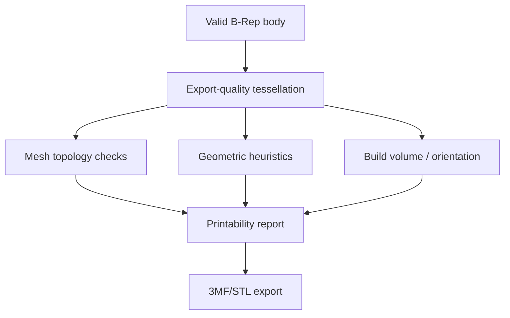

# 3D-printing workflow

## Recommendation

VibeShape owns **modeling, validation, and high-quality exchange**. A slicer owns manufacturing toolpaths. The primary v1 output is 3MF; STEP is the exact CAD exchange format, and STL is retained for compatibility.

A built-in slicer is outside the MVP. PrusaSlicer/libslic3r and CuraEngine are large standalone AGPL C++ projects with complex printer-profile systems. Porting and maintaining them in a browser must not block CAD development.

## Printer profile

A local profile contains only information required for CAD analysis:

- build volume X/Y/Z;
- rectangular or circular bed shape;
- nozzle diameter or diameters;
- nominal layer height;
- FDM/FFF or resin process;
- material family and user-defined design rules;
- recommended minimum wall, hole, and clearance;
- overhang warning angle;
- shrinkage and fit notes;
- profile name, source, and version.

It is not a complete slicer profile. Temperatures, speeds, acceleration, and G-code scripts are outside alpha.

## Print Check pipeline

### Required P0 checks

- document and export units;
- B-Rep validity and solid existence;
- non-zero volume;
- closed and manifold mesh;
- degenerate triangles, NaN/Infinity, and zero-area faces;
- consistent triangle orientation;
- disconnected shells or components;
- bounding box and fit within the build volume;
- estimated triangle count and file size;
- selected tessellation tolerance;
- parts below or above the build plate after placement.

### P1 heuristics

- overhang heatmap relative to build direction;
- bridge candidates;
- thin-wall approximation using sampling, ray casting, or an SDF strategy;
- minimum hole, slot, and embossed-feature warnings;
- coarse unsupported-island analysis by layer;
- clearance and interference between bodies;
- orientation suggestions based on contact area, height, overhang, and a support proxy;
- enclosed-void and resin-drain warnings where they can be determined reliably.

Every result includes:

- severity: `info`, `warning`, or `error`;
- geometry selection or overlay;
- rule and threshold;
- confidence and method limitation;
- suggestion, without destructive automatic repair by default.

## Design rules and tolerances

There are no universal correct numbers. Results depend on printer, material, orientation, calibration, and process.

The application provides:

- conservative starter presets explicitly labeled as recommendations;
- user calibration values;
- per-document overrides;
- fit intent: loose, sliding, press, or custom;
- the selected clearance as an explicit model parameter;
- a warning that compensation requires validation with a test print.

## 3MF

3MF is a ZIP/XML format with defined units, meshes, components and transforms, metadata, and extensions. v1 supports a minimal interoperable profile:

- Core mesh;
- `millimeter` units;
- multiple objects and components;
- build items and transforms;
- base color or material labels when supported correctly;
- thumbnail and application metadata;
- no vendor-specific slicer settings in the first release.

The writer must:

- follow OPC package and relationship structure;
- emit valid XML without external entities;
- use UTF-8;
- use unique resource IDs;
- write only finite coordinates;
- pass official conformance samples or validation where available;
- open in at least two independent slicers in release smoke tests.

Do not promise portability of slicer profiles between vendors; metadata and extensions differ.

SPK-004 selects a deterministic project-owned Core writer using `fflate`. Its local-only gate verifies the same two-mesh component fixture through PrusaSlicer and the Orca/Bambu family and requires matching facet, manifold, and volume metrics. See [SPK-004 evidence](spikes/spk-004-3mf.md).

The Phase 1 product dialog now exports each successful terminal exact B-Rep as a separate 3MF mesh object. The geometry worker retessellates each body with a fixed `0.02 mm` chord tolerance and `0.1 rad` angular tolerance, clears the temporary OCCT triangulation after extraction, and returns bounded triangle soups. The document worker verifies body identity and order, welds face-local duplicate vertices at `1e-7 mm`, validates the resulting manifold mesh through the Core writer, preserves feature labels as object names, and emits millimeter build items. Materials, colors, vendor settings, placement controls, configurable profiles, progress, cancellation, persistent reports, and hostile 3MF import remain outside the current product slice.

## STL

The Phase 1 product smoke exporter currently downloads successful terminal solid features from the exact rebuilt document revision as binary STL. Multiple terminal shapes are combined under one temporary OCCT compound, and bodies consumed by a successful downstream operation are omitted. This establishes a real local browser-to-slicer file path, but it does not yet provide the print-quality tolerance profile, export report, placement workflow, or slicer release matrix required by Phase 4.

- Export binary STL by default.
- Show units explicitly and record them in the export report because STL does not carry reliable unit semantics.
- Build export from print-quality tessellation, never display LOD.
- Recompute or validate normals.
- For multiple bodies, offer separate files or one agreed mesh.
- Import creates a `MeshBody`; repair does not turn it into an exact parametric solid.

## STEP

The same Phase 1 dialog exports those terminal exact B-Rep shapes as STEP for CAD exchange. The file contains resulting geometry, not VibeShape variables, features, or event history. The separate implemented `.vshape` v0 Project flow is the native backup and editability format; it carries semantic parametrics and intentionally excludes derived geometry.

- Preserve exact B-Rep geometry.
- Prefer AP242 and use AP214 as a compatibility fallback after the spike.
- Preserve names, colors, and layers through XDE where bindings allow it.
- The import report records units, bodies, unsupported entities, and healing.
- Round-trip tests compare geometry invariants, not bytes.
- STEP export does not contain VibeShape feature history.

## Placement

Print placement is a derived configuration, not a change to design coordinates:

- body transform on the build plate belongs to print setup;
- provide Place Face on Bed, rotate, and manual arrangement;
- never rewrite design origin;
- 3MF build items receive placement transforms;
- STEP exports design coordinates by default, with an explicit Apply Placement option.

## Future slicer adapter

Possible P2 paths after v1:

1. Deep-link or export to an installed slicer.
2. A localhost connector to desktop PrusaSlicer, Cura, or Orca CLI with explicit consent.
3. A dedicated WASM slicer worker.
4. An optional remote slicing service.

Every path requires a separate ADR covering licensing, profiles, G-code safety, and resources. VibeShape never sends G-code to a real printer without a separate, explicit safety workflow.

## Release fixtures

- Single watertight bracket.
- Two-object or two-color 3MF.
- Thin-wall warning model.
- Overhang calibration model.
- Multiple disconnected shells.
- Intentionally non-manifold STL.
- Very large mesh near resource limits.
- Millimeter and inch STEP imports with known bounding boxes.
