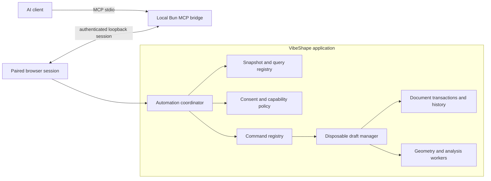

# Automation and MCP architecture

## Recommendation

VibeShape should expose AI automation through a **local MCP adapter over the ordinary document command and query contracts**. MCP is an integration boundary, not a second CAD engine, extension runtime, persistence layer, or privileged scripting API.

The broad target remains proposed in [ADR-0013](../adr/0013-microkernel-modules-and-mcp-automation.md).
The implemented local stdio subset is accepted by [ADR-0043](../adr/0043-local-stdio-mcp-browser-session.md). The adapter-neutral host validates actor identities supplied separately from payloads, owns bounded expiring drafts, retains original parsed commands,
serializes operations, and delegates persistence to an atomic compare-and-commit port. Its required
geometry port now produces exact preview evidence. Preview schema version 2 combines the semantic
summary with bounded measurements and whole-draft geometry validity. Commit recalculates geometry
and rejects failed or blocked evaluations, stale bases, and expiry after asynchronous work.

The application provides a disposable worker preview service with immediate cancellation, replacement,
late-result isolation, and worker termination. The trusted browser composition now connects the host
to the active project's ordinary persistent session. It redispatches retained original commands and
requires the resulting snapshot to equal the exact draft before writing. Successful commits publish
the saved revision to the editor and create one undo checkpoint; typed failures release the save lock
and reconcile lost writer access. An unexpected rejection means the commit could not be confirmed,
not proof that no write occurred.

The browser handle cancels private calculations when the committed revision changes and disposes
them on close, project change, or page exit. It is an internal composition boundary, not an exposed
MCP endpoint by itself. The local adapter now pairs it explicitly and exposes thirty-four named tools, including the CAD authoring and inspection expansion in
[ADR-0044](../adr/0044-local-mcp-cad-authoring-and-inspection.md) and variable/Chamfer tools in
[ADR-0045](../adr/0045-local-mcp-variables-and-chamfer.md), followed by selected-edge inspection and authoring in
[ADR-0046](../adr/0046-local-mcp-selected-edge-inspection.md), and draft inspection in
[ADR-0047](../adr/0047-local-mcp-draft-inspection.md), and sketch-point Hole in
[ADR-0048](../adr/0048-sketch-point-holes.md), and constituent body measurements in
[ADR-0050](../adr/0050-constituent-body-measurements.md).
Commit requires the host-owned browser review described below. See
[ADR-0042](../adr/0042-exact-automation-draft-application-path.md) and the exact transport scope in
[ADR-0043](../adr/0043-local-stdio-mcp-browser-session.md).

The editor and read-only `model_body_measurements` MCP tool consume
`org.vibeshape.model.body-measurements` through the same query dispatcher. The application projects
validated committed worker evidence into revision-bound metrics. Default reads list terminal bodies;
an explicit feature ID inspects historical outputs, and an output role selects exactly one body.
Missing roles never fall back to aggregate measurements. Pages contain at most 200 entries and
128 KiB of serialized UTF-8 data in canonical units. Trusted evidence is separate from query payloads;
a host without it returns unavailable. The existing `org.vibeshape.model.measurements` version 1,
`model_info` response, and exact draft preview retain whole-feature semantics. See
[ADR-0041](../adr/0041-revision-bound-model-measurements.md) and
[ADR-0050](../adr/0050-constituent-body-measurements.md) for ownership, validation, and limits.

The existing `create_hole` and `update_hole` tools accept optional
`parameters.targetBody: { schemaVersion: 0, featureId, outputRole }`. Supplying it selects the
existing Hole v2 contract from [ADR-0049](../adr/0049-constituent-body-identity-and-solid-patterns.md);
omitting it explicitly selects legacy Hole v1 whole-result semantics. Updates must resubmit the
body reference to retain v2 intent. The target feature must equal the first dependency, and a
same-producer sketch support can target only `result` until body-bound topology is available.
Clients obtain committed body roles through `model_body_measurements`. Missing roles fail exact
preview; they never resolve to another body. Both input variants are advertised as client-valid
JSON Schema and use ordinary domain commands, host review, persistence, undo, and exact exports.

The read-only `model_body_topology` tool exposes registered query
`org.vibeshape.model.body-topology` version 1. It inspects committed edges or faces for a required
feature/output-role pair and returns scoped v1 references with conservative resolution status.
Pages bind the full document/rebuild/body/kind provenance and are limited to 100 entries and
128 KiB UTF-8. Missing catalogs/roles and stale cursors fail closed. Existing `model_edges` and
`draft_edges` remain unchanged. The new references are inspection contracts; current modeling
commands still reject them until explicitly versioned consumers are implemented.
[ADR-0051](../adr/0051-body-bound-topology-inspection.md) records that staged boundary.

## Goals and non-goals

The integration must:

- let a model discover available CAD operations with machine-readable schemas;
- expose bounded document, selection, diagnostic, and print-analysis context;
- preserve the same validation, preview, confirmation, undo, persistence, and worker boundaries as human UI;
- identify the document revision used by every read and write;
- report real progress and support cancellation for long geometry operations;
- keep the active browser session authoritative in the initial local integration;
- make every committed model action attributable and inspectable by the user;
- remain useful with only first-party modules and expand safely as approved extension commands become automation-capable.

The first integration does not provide:

- arbitrary code, JavaScript, FeatureScript, shell, SQL, or expression execution;
- direct access to React state, IndexedDB, OPFS, raw `.vshape` ZIP entries, OCCT handles, B-Rep pointers, or extension hosts;
- unattended destructive commits, extension installation, permission grants, or network-capability approval;
- remote multi-user access or a public Internet MCP endpoint;
- a headless CAD authority that can edit files while the browser is closed;
- automatic exposure of every application or extension command.

## One command path

UI controls, first-party modules, third-party extensions, tests, and MCP all request the same domain commands. Adapters may shape presentation and transport, but they cannot bypass eligibility, normalization, revision, geometry, or persistence rules.

The browser shell also has a presentation-level editor command registry. Its serializable descriptors and trusted handlers deliberately mirror the domain registry's ownership and fail-closed composition rules so toolbars, palette items, and shortcuts share one eligibility decision. It is not an automation schema, transport contract, or permission grant: it may contain UI-only workspace and transient-tool actions, and no entry is exposed to MCP automatically. A future adapter may link a presentation command to a versioned domain command descriptor only after the automation host validates schema version, revision, confirmation class, and capability policy.

The current trusted dispatchers and automation host implement the first executable portions of this path. Serializable module, command, query, feature-type, and lifecycle contracts remain separate from function-valued first-party handlers and injected storage ports. Composition fails closed when a descriptor is missing a handler, a handler lacks a descriptor, registration is duplicated, owner or schema-version metadata drifts, or feature handlers use a different feature-type descriptor set. Dispatch validates the route, resolves the registered descriptor, verifies the requested schema version, and delegates strict payload validation to the owning handler. Variable mutations use the document module's ordinary draft-exposed commands. Registry-bound feature add/update handlers run pure document preflight, resolve authored expressions against the committed variable table, reject unavailable or invalid types, normalize parameters, and only then create the final event. The host wraps that path with owner, document, revision, duplicate-command-ID, expiry, and resource-limit checks. The command path reduces an isolated draft; the query path returns only its versioned bounded view; commit crosses one atomic port. A unit-aware box fixture traverses this exact path. Exact geometry and confirmation use separate required host ports; third-party runtime proxies remain open.

The feature module also registers `org.vibeshape.feature.remove` as a destructive, closed-world draft command. Its pure handler rejects dependency-owning features and emits a replayable prior-record event, and browser review uses the registered destructive confirmation class. Command-specific transport exposure remains gated until paired MCP conformance passes.



The bridge contains protocol, static-delivery, and session state only. It does not deserialize a private copy of the document or modify local project storage. If the browser disconnects, mutating tools fail closed and all uncommitted automation drafts expire.

## Module and command exposure

Every cohesive product module registers contributions with stable ownership metadata:

```text
ModuleDescriptor
  id
  version
  compatibility
  dependencies[]
  featureTypes[]
  commands[]
  queries[]
  analyses[]
  codecs[]
```

The exact schema remains gated by the domain and extension spikes. Durable constraints are:

- module IDs and contribution IDs are stable technical identifiers;
- dependencies are explicit and acyclic;
- registration order cannot change document evaluation semantics;
- command ownership, schema version, eligibility, and diagnostics are queryable;
- user-facing labels remain localized host or module catalog entries, never protocol identity;
- disabling an optional module preserves unknown feature payloads and reports typed diagnostics.

First-party modules may use trusted React or worker entry points, while third-party UI remains sandboxed. They share contribution meaning, not ambient runtime authority. Kernel services never pretend to be optional modules.

Candidate first-party module families are:

- `org.vibeshape.core.sketch`;
- `org.vibeshape.core.part-design`;
- `org.vibeshape.core.exchange`;
- `org.vibeshape.core.print-analysis`;
- `org.vibeshape.core.measurement`.

These are logical identities, not a commitment to one Bun workspace per module. Package extraction follows demonstrated dependency, execution, ownership, or publication needs.

The current registry starts with `org.vibeshape.core.document`. Its document create/rename, variable mutation, and sketch add/update/remove commands are the conformance fixtures for command ownership, explicit schema versions, confirmation classes, automation annotations, and deterministic registration. Sketch removal is explicitly destructive; add and update require review. The same module owns exact-revision document-summary, cursor-paginated variable-list, and bounded
model-measurement queries. A bounded sketch resource remains future MCP transport work, but models and the UI already share the same trusted revisioned sketch-command dispatcher.

## MCP primitives

MCP distinguishes model-controlled tools, application-provided resources, and user-selected prompts. The current adapter implements tools and resources. The broader resource catalog, generated-tool design, and prompts below remain targets beyond ADR-0043.

### Resources

Resources are read-only, bounded, serializable views. Candidate URI templates include:

```text
vibeshape://session
vibeshape://documents/{documentId}/summary
vibeshape://documents/{documentId}/variables
vibeshape://documents/{documentId}/feature-tree
vibeshape://documents/{documentId}/selection
vibeshape://documents/{documentId}/diagnostics
vibeshape://documents/{documentId}/print-analysis
vibeshape://documents/{documentId}/drafts/{draftId}/preview
```

Every document resource includes `documentId`, `revision`, schema version, truncation or pagination state, and whether values are semantic state or derived evidence. Large meshes, B-Rep payloads, arbitrary extension HTML, secrets, file handles, and hidden application state are not resources.

`@vibeshape/automation-api` implements two semantic views. `org.vibeshape.document.summary` schema version 1 requires an exact document revision and returns name and timestamp fields with `truncated: false`. `org.vibeshape.variable.list` schema version 1 requires the same revision, accepts a bounded cursor and limit, and returns authored definitions, canonical evaluated dimension/value/unit triples, dependency names, and a next cursor. Neither view exposes an event log, actor data, mutable object graph, storage identity, file path, or geometry payload. The local adapter maps the document summary and bounded measurements to `vibeshape://model`; variable and other semantic URI mappings remain future work.

Resource subscriptions may announce that a view changed, but a client must reread and validate the new revision. Notifications are never a delta mutation protocol.

### Tools

The adapter exposes explicit schema-backed tools. The first nine names are recorded in ADR-0043; ADR-0044 adds six CAD authoring tools and two inspection tools; ADR-0045 adds five variable commands, variable inspection, and two all-edge Chamfer tools. ADR-0046 adds exact edge inspection and selected-edge treatment inputs. ADR-0047 adds four draft inspection tools. The broader lifecycle naming below is proposed, not the current discovery response:

| Tool | Effect | Commit behavior |
|---|---|---|
| `vibeshape.draft.create` | Create a disposable draft from one committed revision | Read-like allocation; no document mutation |
| `vibeshape.draft.validate` | Rebuild and return structured diagnostics and invariants | No document mutation |
| `vibeshape.draft.discard` | Destroy one automation draft | Idempotent cleanup |
| `vibeshape.draft.commit` | Request commit of a valid draft | Requires matching base revision and host policy |

The broader design would generate modeling tools from automation-approved command descriptors, for example `vibeshape.feature.extrude` or `vibeshape.feature.fillet`. They apply only to a named draft. Each descriptor defines:

- JSON input and structured output schemas;
- command and parameter schema versions;
- owning module and required capabilities;
- read-only, destructive, idempotent, and open-world annotations;
- eligibility and revision requirements;
- preview support and confirmation class;
- progress stages, cancellation behavior, output limits, and stable diagnostics.

MCP tool annotations are advisory interoperability metadata. VibeShape enforces all rules independently and does not trust a client or model to interpret annotations correctly.

There is no generic `apply_command`, `execute`, `run_script`, `install_extension`, `grant_permission`, or raw-document mutation tool in the initial surface. Explicit tools improve discovery, schema validation, consent copy, audit, and compatibility.

### Prompts

Optional prompts may guide user-selected workflows such as inspecting printability, designing a bracket, or repairing a failed feature. Prompts do not gain authority, hide tool invocations, or commit changes. Their output remains subject to the same draft and confirmation flow.

## Host-owned browser review

The required review port receives detached parsed commands, actor identity, and an exact version-2
preview only after whole-draft geometry is valid. It returns one validated decision: approved,
rejected, or cancelled. There is no client approval field, reusable approval token, or production
always-approve fallback. The host serializes draft operations while review is pending and rechecks
the committed revision and expiry after approval, before crossing the ordinary persistence port.

The browser renders the review in its responsive task panel, with command summaries, common authored
dimensions, sketch/variable summaries, and bounded exact output measurements. Destructive confirmation
uses the built-in registry metadata. Apply stays pending through persistence; Discard removes the
owned draft. Expiry, a changed document, or session closure cancels a pending review and retains a
bounded message that can be dismissed. A request-specific UI identity prevents an old button from
approving a later review. Only one session can own the confirmation surface at a time.

Once the ordinary atomic persistence operation has started, cancellation is not a rollback request.
The editor keeps action controls locked while it completes. Unexpected persistence failures remain
explicitly unconfirmed; they are not converted into a claim that storage was unchanged. Transport
pairing, request cancellation, revocation, and closed-browser behavior still need a real client test.
The first review presents semantic summaries and metrics, not a general visual geometry diff or a
complete topology inspector. Command-specific MCP exposure must respect that inspection scope.

## Draft, preview, and commit

The target mutating sequence is transactional. The current slice records command IDs and MCP actor/session provenance; dedicated tool names and request correlation in durable history remain deferred:

1. Create a draft from `documentId` and `baseRevision`.
2. Apply one or more explicit feature commands to that draft.
3. Rebuild through the normal worker and receive progress, diagnostics, invariant summaries, and a bounded preview resource.
4. Present the proposed changes in host-owned UI, including the MCP client, tool names, affected features, and warnings.
5. Commit atomically only when the base revision still matches and policy permits the operation.
6. Record normal undo history plus `actor = mcp`, session identity, client identity, tool names, and request correlation IDs.
7. Reject conflicts without rebasing or guessing. The model must reread and create a new draft.

A disconnected, cancelled, timed-out, invalid, or rejected request cannot leave partial committed geometry. Drafts have owner-bound unguessable IDs, inactivity expiry, memory limits, and a per-session concurrency limit.

The current `@vibeshape/automation-host` retains original validated commands in owner-bound drafts,
serializes operations, checks inactivity and command limits, and requires exact geometry and browser
review before commit. A failed or stale atomic commit retains the draft for inspection or explicit
discard; a successful commit removes it. The injected document port owns durable compare-and-commit.
The local adapter exposes box and all-edge fillet creation/correction through this path, with real
client tests for progress, revocation, and ordinary persistence/Undo. It exposes no generic command
execution tool. Disconnect during an already-entered persistence transaction cannot guarantee rollback;
the editor waits for its actual result, and a reconnecting client must inspect the current revision.

## Local transport and pairing

The first bridge uses MCP `stdio` because the client launches a local subprocess and the protocol channel does not require a listening MCP port. Protocol JSON is the only stdout content; diagnostics use stderr.

The browser still needs an explicit local session with the bridge. The initial automation mode serves the reviewed production static build and its session endpoint from one stable loopback origin. Normal hosted and installed PWA modes remain independent and do not require this process.

The loopback origin has these requirements:

- bind only to `127.0.0.1`; a stable per-profile origin preserves browser storage identity;
- validate the exact `Host` and `Origin`, reject absent or unexpected origins, and provide no wildcard CORS;
- require a host-owned **Enable AI session** user action before exposing any document;
- authenticate every browser request with a session-bound, same-origin credential that is never placed in a URL;
- bind one bridge session to an explicit set of shared documents and capabilities;
- enforce sequence, size, frequency, lifetime, and concurrent-request limits;
- revoke immediately from the VibeShape UI and close on browser or MCP-client disconnect;
- fail startup rather than selecting a different storage origin silently when the configured local origin is unavailable;
- never assume that loopback or same-origin delivery implies user consent.

Connecting an already open app from another origin is deferred. Its spike must cover CSP `connect-src`, mixed-content behavior, CORS, Private Network Access, DNS rebinding, pairing UX, and Chromium, Firefox, and WebKit behavior before that mode is documented as supported.

Streamable HTTP is deferred. If introduced, it requires the MCP authorization profile, origin validation, localhost-only defaults for local mode, secure session IDs, token audience validation, and a separate deployment threat model. Remote HTTP is not enabled by a command-line flag on the local bridge.

## Progress, cancellation, and long tasks

MCP progress tokens map to command execution IDs. The coordinator forwards real worker stages and never invents precision that the kernel cannot provide. Notifications are rate-limited and stop after a terminal result.

Cancellation requests propagate to draft evaluation and worker generation cancellation. If the underlying kernel cannot interrupt safely, VibeShape terminates the disposable worker and rebuilds the last committed document state. A cancelled operation remains cancelled even if lower-level work completes later.

Long-lived task support may be added after the base tool flow passes. Task IDs must be cryptographically unguessable, scoped to the paired session, bounded by TTL and concurrency, and inaccessible after revocation.

## Extension interaction

An extension can propose automation metadata for one of its registered commands, but the host controls exposure. A command appears through MCP only when:

- the exact extension artifact is installed, enabled, compatible, and not quarantined;
- its runtime capabilities are granted independently of MCP;
- its command schema passes the automation conformance suite;
- the host classifies its effects and confirmation requirements;
- all inputs and outputs are bounded and serializable;
- its deterministic or side-effect behavior matches the declared annotations.

MCP never expands an extension's capability grant. An MCP client also receives no general extension-management or catalog capability. Disabling or revoking an extension removes its tools and invalidates its active drafts.

## Owned draft inspection

`draft_tree`, `draft_entity`, `draft_variables` and `draft_edges` require the owned draft ID and its
exact current revision. They dispatch the existing registered queries over the draft snapshot and
return `{ schemaVersion, draft, view }`. The browser injects the paired document; the broker binds
successful responses to the draft, revision, view kind, target and edge cursor. Inspection is
read-only and does not renew the draft expiration time. Semantic reads do not start a geometry worker.

Draft edge inspection calculates one requested feature in a disposable worker, projects measurements
and exact edge evidence from the same rebuild, and terminates the worker. Failed downstream geometry
does not hide a successful source feature. The host retains one detached catalog of at most 4 MiB,
with no meshes or native handles. Pages reuse its rebuild identity. Commands invalidate affected
catalogs; stale cursors require restarting at `cursor: null`. Ownership, expiration and the committed
base revision are checked before and after asynchronous work. Creating source geometry, inspecting
edges and repairing selected treatments can therefore precede one final browser Apply.

## Security and privacy

The user explicitly pairs a client and chooses which document sessions are shared. Pairing one document does not expose the project library, recent files, other tabs, extension storage, or browser origin data.

The bridge and application enforce:

- deny-by-default tool and resource exposure;
- runtime validation at MCP, loopback, query, command, worker, and extension boundaries;
- user-visible invocation and commit history;
- explicit confirmation for mutating and destructive work;
- revision preconditions and idempotency keys;
- prompt and resource size limits plus pagination;
- redaction of paths, tokens, private extension data, and diagnostic internals;
- rate, CPU, memory, task, draft, and output limits;
- session-scoped audit records without storing model prompts by default.

Tool descriptions, extension catalogs, document names, parameters, and imported metadata are untrusted content. They cannot modify tool definitions, capability policy, confirmation copy, or host instructions.

## Implementation boundaries

The executable document-summary query justifies the first package boundary. The remaining boundaries are created only when their own executable slices require them:

```text
packages/
  automation-api/        # implemented: serializable query and draft lifecycle contracts
  automation-host/       # implemented: owner-bound draft and query/command coordination

apps/
  mcp-server/            # local Bun MCP transport and authenticated browser pairing bridge
```

The MCP SDK belongs only in `apps/mcp-server`. Domain, geometry, persistence, and feature packages never import it. The browser depends on the adapter-neutral automation protocol rather than MCP types.

`packages/automation-api` and `packages/automation-host` are checked in because the document-summary query and owner-bound draft lifecycle execute end to end in tests. `apps/mcp-server` now implements the first paired transport slice. Its command list and limits are
explicitly narrower than the target contract in this document; see ADR-0043.

## Acceptance gate

The first MCP spike must prove:

1. A local client can discover resources and tools through `stdio` without non-protocol stdout output.
2. The browser pairs and revokes a session without exposing another document or accepting a hostile web origin.
3. A read resource is bounded, revision-tagged, and invalidated correctly after a commit.
4. An automation-approved feature command creates a draft, reports progress, previews, confirms, commits once, and participates in undo/redo.
5. Stale revisions, duplicate requests, cancellation, browser disconnect, worker crash, invalid schemas, and output floods fail without partial committed state.
6. Tool annotations and structured outputs match actual behavior, while host policy still denies unsafe requests independently.
7. An extension command remains hidden until all extension and automation gates pass and disappears immediately on revocation.
8. The complete scenario works offline from the bridge-served static build and records inspectable provenance without storing model prompts.

The initial SDK pin and local configuration are covered by ADR-0043. Broader conformance, extension
exposure, offline installation, and full command/resource coverage remain release gates.
