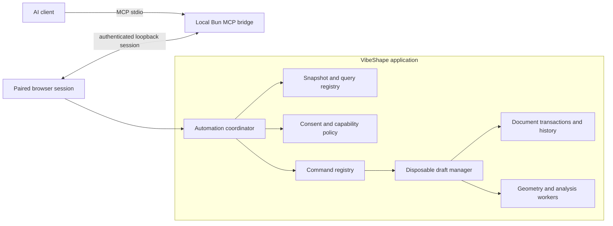

# Automation and MCP architecture

## Recommendation

VibeShape should expose AI automation through a **local MCP adapter over the ordinary document command and query contracts**. MCP is an integration boundary, not a second CAD engine, extension runtime, persistence layer, or privileged scripting API.

This document describes the target proposed by [ADR-0013](../adr/0013-microkernel-modules-and-mcp-automation.md). It is not yet an implemented server contract. The adapter-neutral foundation now proves command and query descriptors, actor provenance, deterministic event replay, one strict bounded document-summary view, and an owner-bound multi-command draft lifecycle. The query dispatcher fails closed on handler drift and stale requested revisions. The host generates draft IDs, validates authenticated actor context separately from payloads, serializes operations, enforces inactivity and count limits, returns bounded previews through the query dispatcher, and delegates revision-safe persistence to an atomic compare-and-commit port. Geometry validation, durable persistence integration, confirmation UI, automation-session pairing and expiry, undo/redo integration, cancellation, and transport remain required before an MCP server is scaffolded.

## Goals and non-goals

The integration must:

- let a model discover available CAD operations with machine-readable schemas;
- expose bounded document, selection, diagnostic, and print-analysis context;
- preserve the same validation, preview, confirmation, undo, persistence, and worker boundaries as human UI;
- identify the document revision used by every read and write;
- report real progress and support cancellation for long geometry operations;
- keep the active browser session authoritative in the initial local integration;
- make every committed model action attributable and inspectable by the user;
- remain useful with only first-party modules and expand safely as approved extension commands become automation-capable.

The first integration does not provide:

- arbitrary code, JavaScript, FeatureScript, shell, SQL, or expression execution;
- direct access to React state, IndexedDB, OPFS, raw `.vshape` ZIP entries, OCCT handles, B-Rep pointers, or extension hosts;
- unattended destructive commits, extension installation, permission grants, or network-capability approval;
- remote multi-user access or a public Internet MCP endpoint;
- a headless CAD authority that can edit files while the browser is closed;
- automatic exposure of every application or extension command.

## One command path

UI controls, first-party modules, third-party extensions, tests, and MCP all request the same domain commands. Adapters may shape presentation and transport, but they cannot bypass eligibility, normalization, revision, geometry, or persistence rules.

The current trusted dispatchers and automation host implement the first executable portions of this path. Serializable module, command, query, and lifecycle contracts remain separate from function-valued first-party handlers and injected storage ports. Composition fails closed when a descriptor is missing a handler, a handler lacks a descriptor, registration is duplicated, or owner and schema-version metadata drift. Dispatch validates the route, resolves the registered descriptor, verifies the requested schema version, and delegates strict payload validation to the owning handler. The host wraps that path with owner, document, revision, duplicate-command-ID, expiry, and resource-limit checks. The command path reduces an isolated draft; the query path returns only its versioned bounded view; commit crosses one atomic port. A non-geometric feature-add fixture now traverses this exact path and commits only after whole-DAG validation. Module-specific eligibility, geometry validation, durable persistence, confirmation, and third-party runtime proxies remain open.



The bridge contains protocol, static-delivery, and session state only. It does not deserialize a private copy of the document or modify local project storage. If the browser disconnects, mutating tools fail closed and all uncommitted automation drafts expire.

## Module and command exposure

Every cohesive product module registers contributions with stable ownership metadata:

```text
ModuleDescriptor
  id
  version
  compatibility
  dependencies[]
  featureTypes[]
  commands[]
  queries[]
  analyses[]
  codecs[]
```

The exact schema remains gated by the domain and extension spikes. Durable constraints are:

- module IDs and contribution IDs are stable technical identifiers;
- dependencies are explicit and acyclic;
- registration order cannot change document evaluation semantics;
- command ownership, schema version, eligibility, and diagnostics are queryable;
- user-facing labels remain localized host or module catalog entries, never protocol identity;
- disabling an optional module preserves unknown feature payloads and reports typed diagnostics.

First-party modules may use trusted React or worker entry points, while third-party UI remains sandboxed. They share contribution meaning, not ambient runtime authority. Kernel services never pretend to be optional modules.

Candidate first-party module families are:

- `org.vibeshape.core.sketch`;
- `org.vibeshape.core.part-design`;
- `org.vibeshape.core.exchange`;
- `org.vibeshape.core.print-analysis`;
- `org.vibeshape.core.measurement`.

These are logical identities, not a commitment to one Bun workspace per module. Package extraction follows demonstrated dependency, execution, ownership, or publication needs.

The current registry starts with `org.vibeshape.core.document`. Its `org.vibeshape.document.create` and `org.vibeshape.document.rename` commands are the conformance fixture for one-command ownership, explicit schema versions, confirmation classes, automation annotations, and deterministic registration. This minimal descriptor is expected to grow only when a real consumer proves each additional field.

## MCP primitives

MCP distinguishes model-controlled tools, application-provided resources, and user-selected prompts. VibeShape uses each for its intended role.

### Resources

Resources are read-only, bounded, serializable views. Candidate URI templates include:

```text
vibeshape://session
vibeshape://documents/{documentId}/summary
vibeshape://documents/{documentId}/feature-tree
vibeshape://documents/{documentId}/selection
vibeshape://documents/{documentId}/diagnostics
vibeshape://documents/{documentId}/print-analysis
vibeshape://documents/{documentId}/drafts/{draftId}/preview
```

Every document resource includes `documentId`, `revision`, schema version, truncation or pagination state, and whether values are semantic state or derived evidence. Large meshes, B-Rep payloads, arbitrary extension HTML, secrets, file handles, and hidden application state are not resources.

The first implemented view is `org.vibeshape.document.summary` schema version 1 in `@vibeshape/automation-api`. It requires an exact document revision and returns semantic name and timestamp fields with `truncated: false`. It exposes no event log, actor data, mutable object graph, storage identity, file path, or geometry payload. URI mapping remains a future adapter responsibility.

Resource subscriptions may announce that a view changed, but a client must reread and validate the new revision. Notifications are never a delta mutation protocol.

### Tools

The host exposes explicit schema-backed tools. Initial lifecycle tools are:

| Tool | Effect | Commit behavior |
|---|---|---|
| `vibeshape.draft.create` | Create a disposable draft from one committed revision | Read-like allocation; no document mutation |
| `vibeshape.draft.validate` | Rebuild and return structured diagnostics and invariants | No document mutation |
| `vibeshape.draft.discard` | Destroy one automation draft | Idempotent cleanup |
| `vibeshape.draft.commit` | Request commit of a valid draft | Requires matching base revision and host policy |

Modeling tools are generated from automation-approved command descriptors, for example `vibeshape.feature.extrude` or `vibeshape.feature.fillet`. They apply only to a named draft. Each descriptor defines:

- JSON input and structured output schemas;
- command and parameter schema versions;
- owning module and required capabilities;
- read-only, destructive, idempotent, and open-world annotations;
- eligibility and revision requirements;
- preview support and confirmation class;
- progress stages, cancellation behavior, output limits, and stable diagnostics.

MCP tool annotations are advisory interoperability metadata. VibeShape enforces all rules independently and does not trust a client or model to interpret annotations correctly.

There is no generic `apply_command`, `execute`, `run_script`, `install_extension`, `grant_permission`, or raw-document mutation tool in the initial surface. Explicit tools improve discovery, schema validation, consent copy, audit, and compatibility.

### Prompts

Optional prompts may guide user-selected workflows such as inspecting printability, designing a bracket, or repairing a failed feature. Prompts do not gain authority, hide tool invocations, or commit changes. Their output remains subject to the same draft and confirmation flow.

## Draft, preview, and commit

A mutating automation sequence is transactional:

1. Create a draft from `documentId` and `baseRevision`.
2. Apply one or more explicit feature commands to that draft.
3. Rebuild through the normal worker and receive progress, diagnostics, invariant summaries, and a bounded preview resource.
4. Present the proposed changes in host-owned UI, including the MCP client, tool names, affected features, and warnings.
5. Commit atomically only when the base revision still matches and policy permits the operation.
6. Record normal undo history plus `actor = mcp`, session identity, client identity, tool names, and request correlation IDs.
7. Reject conflicts without rebasing or guessing. The model must reread and create a new draft.

A disconnected, cancelled, timed-out, invalid, or rejected request cannot leave partial committed geometry. Drafts have owner-bound unguessable IDs, inactivity expiry, memory limits, and a per-session concurrency limit.

The current `@vibeshape/automation-host` implements the non-geometry portion of this lifecycle for document create and rename plus one whole-DAG-validated feature-add fixture. Draft IDs come from a required host generator, full actor identity controls every operation, inactivity renews only after successful activity, explicit discard is idempotent, and per-actor plus per-draft command limits bound retained state. Operations are initially serialized through one host queue so concurrent requests cannot overwrite draft revisions. A failed or stale atomic commit retains the draft for inspection or explicit discard; a successful commit removes it. The injected document port, not the host, owns the durable compare-and-commit transaction. The generic feature contract is not an advertised MCP tool: geometry rebuild, module eligibility, validation, progress, confirmation, undo/redo, session revocation, and persistence adapters are not implemented by this slice.

## Local transport and pairing

The first bridge uses MCP `stdio` because the client launches a local subprocess and the protocol channel does not require a listening MCP port. Protocol JSON is the only stdout content; diagnostics use stderr.

The browser still needs an explicit local session with the bridge. The initial automation mode serves the reviewed production static build and its session endpoint from one stable loopback origin. Normal hosted and installed PWA modes remain independent and do not require this process.

The loopback origin has these requirements:

- bind only to `127.0.0.1`; a stable per-profile origin preserves browser storage identity;
- validate the exact `Host` and `Origin`, reject absent or unexpected origins, and provide no wildcard CORS;
- require a host-owned **Enable AI session** user action before exposing any document;
- authenticate every browser request with a session-bound, same-origin credential that is never placed in a URL;
- bind one bridge session to an explicit set of shared documents and capabilities;
- enforce sequence, size, frequency, lifetime, and concurrent-request limits;
- revoke immediately from the VibeShape UI and close on browser or MCP-client disconnect;
- fail startup rather than selecting a different storage origin silently when the configured local origin is unavailable;
- never assume that loopback or same-origin delivery implies user consent.

Connecting an already open app from another origin is deferred. Its spike must cover CSP `connect-src`, mixed-content behavior, CORS, Private Network Access, DNS rebinding, pairing UX, and Chromium, Firefox, and WebKit behavior before that mode is documented as supported.

Streamable HTTP is deferred. If introduced, it requires the MCP authorization profile, origin validation, localhost-only defaults for local mode, secure session IDs, token audience validation, and a separate deployment threat model. Remote HTTP is not enabled by a command-line flag on the local bridge.

## Progress, cancellation, and long tasks

MCP progress tokens map to command execution IDs. The coordinator forwards real worker stages and never invents precision that the kernel cannot provide. Notifications are rate-limited and stop after a terminal result.

Cancellation requests propagate to draft evaluation and worker generation cancellation. If the underlying kernel cannot interrupt safely, VibeShape terminates the disposable worker and rebuilds the last committed document state. A cancelled operation remains cancelled even if lower-level work completes later.

Long-lived task support may be added after the base tool flow passes. Task IDs must be cryptographically unguessable, scoped to the paired session, bounded by TTL and concurrency, and inaccessible after revocation.

## Extension interaction

An extension can propose automation metadata for one of its registered commands, but the host controls exposure. A command appears through MCP only when:

- the exact extension artifact is installed, enabled, compatible, and not quarantined;
- its runtime capabilities are granted independently of MCP;
- its command schema passes the automation conformance suite;
- the host classifies its effects and confirmation requirements;
- all inputs and outputs are bounded and serializable;
- its deterministic or side-effect behavior matches the declared annotations.

MCP never expands an extension's capability grant. An MCP client also receives no general extension-management or catalog capability. Disabling or revoking an extension removes its tools and invalidates its active drafts.

## Security and privacy

The user explicitly pairs a client and chooses which document sessions are shared. Pairing one document does not expose the project library, recent files, other tabs, extension storage, or browser origin data.

The bridge and application enforce:

- deny-by-default tool and resource exposure;
- runtime validation at MCP, loopback, query, command, worker, and extension boundaries;
- user-visible invocation and commit history;
- explicit confirmation for mutating and destructive work;
- revision preconditions and idempotency keys;
- prompt and resource size limits plus pagination;
- redaction of paths, tokens, private extension data, and diagnostic internals;
- rate, CPU, memory, task, draft, and output limits;
- session-scoped audit records without storing model prompts by default.

Tool descriptions, extension catalogs, document names, parameters, and imported metadata are untrusted content. They cannot modify tool definitions, capability policy, confirmation copy, or host instructions.

## Implementation boundaries

The executable document-summary query justifies the first package boundary. The remaining boundaries are created only when their own executable slices require them:

```text
packages/
  automation-api/        # implemented: serializable query and draft lifecycle contracts
  automation-host/       # implemented: owner-bound draft and query/command coordination

apps/
  mcp-server/            # local Bun MCP transport and authenticated browser pairing bridge
```

The MCP SDK belongs only in `apps/mcp-server`. Domain, geometry, persistence, and feature packages never import it. The browser depends on the adapter-neutral automation protocol rather than MCP types.

`packages/automation-api` and `packages/automation-host` are checked in because the document-summary query and owner-bound draft lifecycle execute end to end in tests. `apps/mcp-server` remains absent until a complete paired transport slice proves that boundary. Empty packages would imply stability without executable evidence.

## Acceptance gate

The first MCP spike must prove:

1. A local client can discover resources and tools through `stdio` without non-protocol stdout output.
2. The browser pairs and revokes a session without exposing another document or accepting a hostile web origin.
3. A read resource is bounded, revision-tagged, and invalidated correctly after a commit.
4. An automation-approved feature command creates a draft, reports progress, previews, confirms, commits once, and participates in undo/redo.
5. Stale revisions, duplicate requests, cancellation, browser disconnect, worker crash, invalid schemas, and output floods fail without partial committed state.
6. Tool annotations and structured outputs match actual behavior, while host policy still denies unsafe requests independently.
7. An extension command remains hidden until all extension and automation gates pass and disappears immediately on revocation.
8. The complete scenario works offline from the bridge-served static build and records inspectable provenance without storing model prompts.

Only then should VibeShape pin an MCP TypeScript SDK version or publish a server configuration example.
