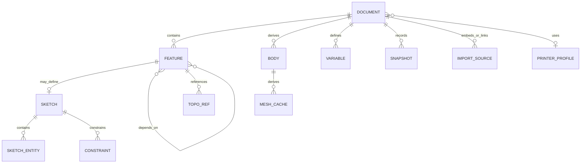

# Data model and native file format

## Core entities



## Identifiers

- Use lowercase UUIDv7 identifiers for current document, command, draft, and automation-session contracts. A future compatible sortable identifier requires an explicit schema migration.
- IDs never encode array position or user-visible names.
- Renaming does not change an ID.
- Copying creates new IDs and explicit `derivedFrom` metadata.
- Sketch sub-elements have their own IDs.
- Kernel handles and array indices are never serialized as identity.

## Document schema

Conceptually:

```text
Document
  id, schemaVersion, createdAt, updatedAt
  name, description, units, coordinateSystem
  extensionLocks[]
  variables[]
  features[]
  bodiesMetadata[]
  imports[]
  printerProfileRef?
  applicationMetadata
```

`features[]` uses a stable presentation order, while every feature retains explicit inputs. Opening a file constructs the DAG and rejects missing IDs and cycles.

A built-in feature stores a stable first-party module ID, module version, contributed feature-type ID, and feature schema version. A custom feature additionally stores:

- its contributed feature-type identifier;
- parameter-schema version;
- a reference to one exact `ExtensionLockEntry` containing extension ID, version, API version, and integrity hash;
- its original validated parameter payload;
- the last evaluation status and stable diagnostic codes.

The document preserves unknown custom-feature payloads without interpreting or rewriting them. Exact extension bytes are installed and stored separately; they are never authoritative entries inside the project archive.

## Command and event model

Alpha uses a hybrid model:

- A current snapshot opens the project quickly.
- An append-only command/event journal supports autosave, undo, and crash recovery.
- Periodic snapshots bound replay time.
- Geometry caches never enter the semantic event stream.

A command contains:

- `commandId`, `documentId`, and `baseRevision`;
- `kind`, `schemaVersion`, and typed payload;
- structured actor provenance such as `user`, `extension`, `mcp`, or `system`, with bounded source and session identifiers where applicable but no model prompt;
- `issuedAt` for UX and audit only, never for the geometry result;
- inverse data or sufficient information for deterministic reduction;
- no derived geometry or transport-specific prompt data.

An accepted event records the resulting revision. The persistence transaction will add the authoritative content hash when the journal and snapshot store are implemented.

The domain reducer MUST be deterministic: one snapshot plus the same commands produces the same domain state. Geometry may vary slightly between OCCT builds, so engine build metadata is recorded separately.

### Implemented foundation slice

`@vibeshape/domain` currently implements a deliberately narrow versioned slice:

- strict runtime schemas for document, command, draft, actor, event, module, and command-descriptor boundaries;
- `org.vibeshape.document.create`, `org.vibeshape.document.rename`, `org.vibeshape.feature.add`, `org.vibeshape.feature.update`, and `org.vibeshape.feature.set-suppressed` command schema version 1;
- deterministic document and feature events, canonical snapshots, and event replay with prior feature state recorded for tamper detection and future inverse generation;
- safe non-negative revision preconditions, explicit stale-revision diagnostics, and revision-exhaustion rejection;
- actor-bound disposable drafts whose commands share one transaction ID and commit only against the original base revision;
- first-party `org.vibeshape.core.document` and `org.vibeshape.core.features` module descriptors plus deterministic registry validation for ownership, uniqueness, dependencies, and cycles;
- canonical quantity schema v0 for length, angle, and scalar parameters, with millimeter/radian storage, normalized finite values, exact source-unit consistency, and optional normalized expression text;
- a first-party `org.vibeshape.core.part-design` module that contributes exact versioned box and cylinder feature descriptors with bounded positive length parameters;
- a trusted feature-type registry that requires descriptor-handler parity, validates dependency/reference cardinality and parameter schemas, contains normalizer exceptions and non-JSON outputs, and reports unavailable types without rewriting their records;
- an executable trusted-command dispatcher that requires exactly one handler per descriptor and validates command route, owner, and schema-version parity before execution;
- strict feature schema v0 records with stable type ownership, bounded JSON parameters, explicit dependencies, declared `TopoRef` inputs, suppression, and presentation order;
- deterministic feature-graph construction with duplicate, missing-dependency, self-reference, undeclared-reference, and cycle rejection;
- atomic feature collection mutations that validate the complete resulting DAG before advancing the document revision and never retain partial state after rejection;
- a pure rebuild seam with stable topological scheduling, transitive dirty propagation, independent cache reuse, conservative suppression, dependent-only blocking, bounded stable diagnostics, and validated SHA-256 result identities;
- automation exposure and confirmation metadata without importing MCP or transport types.

The feature evaluator receives a trusted injected operation and contains thrown or invalid outcomes as stable feature failures; it does not import geometry, React, persistence, or worker code. The generic feature commands preserve presentation order and unknown schema-valid feature records, but they are trusted kernel seams rather than a public extension or MCP tool surface. The registry now proves module-specific parameter validation, but command eligibility, parameter migration, and confirmation policy are not yet connected to it. This slice does not yet compute authoritative content hashes, integrate OCCT results, persist evaluation results, implement autosave, feature deletion, undo/redo, expression evaluation, display-unit preferences, geometry preview, extension execution, or the `.vshape` codec. Its schemas remain internal contracts until their Phase 1 persistence and geometry integration gates stabilize them.

## Units and expressions

A quantity schema v0 now stores:

- one explicit `length`, `angle`, or `scalar` dimension;
- a finite normalized numeric value in millimeters, radians, or scalar identity;
- a strict source numeric value and input-unit enum, checked against the canonical value;
- optional normalized expression text as metadata only.

Length input metadata currently accepts `um`, `mm`, `cm`, `m`, `in`, and `ft`; angle input metadata accepts `rad` and `deg`. Constructors normalize negative zero so semantic JSON remains stable. Box and cylinder schemas require positive dimensions no greater than `1,000,000 mm`. General dimension vectors, expression parsing and dependency tracking, document display-unit preferences, localized input, and tolerance-aware UI stepping remain future contracts.

JSON never depends on locale. The native decimal separator is always `.`. The UI may accept localized input but normalizes it before commit.

## `.vshape`

The extension identifies a ZIP container with MIME type `application/vnd.vibeshape.project+zip`.

```text
project.vshape
  manifest.json
  document.json
  journal/events.jsonl
  snapshots/<revision>.json.zst       # optional
  imports/<source-id>/<original-name> # optional embedded source
  cache/brep/<hash>.brep.gz           # optional, untrusted
  cache/mesh/<hash>.bin               # optional, untrusted
  previews/thumbnail.png              # optional
  reports/last-print-check.json       # optional, derived
  extensions/lock.json                # exact requirements, no executable code
  licenses/NOTICE.txt                 # optional per-project attachments
```

Alpha may use gzip or deflate instead of zstd to reduce dependencies. The selected compression algorithm is recorded in the manifest.

### `manifest.json`

Required fields:

- `format: "vshape"`;
- `formatVersion`;
- `minimumReaderVersion`;
- `documentId`;
- `createdBy: { application, version, build }`;
- `engine: { adapter, occtVersion, buildHash, tolerancePolicyVersion }`;
- `rootDocument: "document.json"`;
- semantic-entry `checksums`;
- `requiredCapabilities` and a checksum for `extensions/lock.json` when present;
- `createdAt` and `exportedAt`;
- `units` and `coordinateSystem`.

### Authoritative data

`document.json` plus journals and snapshots are authoritative. `cache/` and `reports/` MAY be deleted without project loss. Readers must open a project without cache and must not trust B-Rep, mesh, topology mapping, version, or checksum blindly.

### Extension requirements

`extensions/lock.json` deduplicates exact requirements used by custom features:

```text
ExtensionLockEntry
  id
  version
  apiVersion
  integrity: { algorithm: "sha256", digest }
  sourceHint?
  signatureIdentity?
```

The lock file is authoritative metadata, but it contains no JavaScript, WebAssembly, HTML, or remote loader URL. `sourceHint` is informational and is never fetched while opening or rebuilding a project.

Opening a project never installs, updates, enables, or grants permissions to an extension. If an exact artifact is unavailable, disabled, incompatible, or fails its budget, the reader:

1. preserves its lock and feature payload unchanged;
2. marks the owning feature with a typed extension diagnostic;
3. blocks or stales downstream features through ordinary DAG rules;
4. allows safe metadata inspection and export of the original archive;
5. may display the last valid cache only as stale, non-authoritative geometry;
6. never substitutes another version or exports stale geometry as newly validated output.

The detailed package, upgrade, and restricted-mode behavior is defined in [Extension architecture](extensions.md).

### Versioning

- Major format changes update `formatVersion` and may require explicit migration.
- Old readers ignore additive fields only when the extension is optional.
- Unknown required capabilities block editing but SHOULD allow safe metadata preview and export of the original archive.
- Unknown extension lock fields are preserved; an unsupported required extension API blocks evaluation rather than migration by guesswork.
- Migrations are pure, sequential, and fixture-tested.
- Readers never overwrite the source during migration until a complete save succeeds.
- Export to an older version is allowed only when conversion is proven lossless.

## External and embedded imports

By default, imported STEP and STL sources are **embedded** so the project remains portable. Advanced mode may retain an external handle or path hint, but:

- browser permissions may not survive sessions;
- a path is not identity;
- the source has a checksum and last import report;
- external changes never apply automatically;
- privacy-sensitive absolute paths are excluded from export unless explicitly requested.

## Binary mesh cache

Use a simple project-owned little-endian envelope:

- magic and version;
- body ID, source feature hash, and tolerance policy;
- counts and byte lengths;
- typed-array sections;
- checksum;
- optional face mapping.

Validate all counts before allocation and protect size arithmetic from overflow.

## Reader limits

Initial safe defaults:

| Limit | Default |
|---|---:|
| Compressed ZIP input | 512 MiB |
| Total uncompressed ZIP size | 2 GiB or available quota, whichever is lower |
| Compression ratio | Warn or block at 100:1 according to policy |
| Entry count | 10,000 |
| JSON depth | 100 |
| Feature count | 100,000 hard limit with a much lower UX warning |
| Single typed-array allocation | 512 MiB |
| Filename/path | 1,024 UTF-8 bytes |

Fuzzing and performance tests refine these numbers. Reject entries containing `..`, absolute paths, symlinks, or duplicate normalized paths.

## Compatibility promise

The format remains experimental before v1. Starting with v1:

- the current reader opens every older stable `.vshape` through migrations;
- the last two stable writer versions remain in the CI fixture corpus;
- semantic data is never removed without an explicit migration report;
- the format is documented well enough for an independent implementation to extract documents, events, and imports without a CAD kernel.
