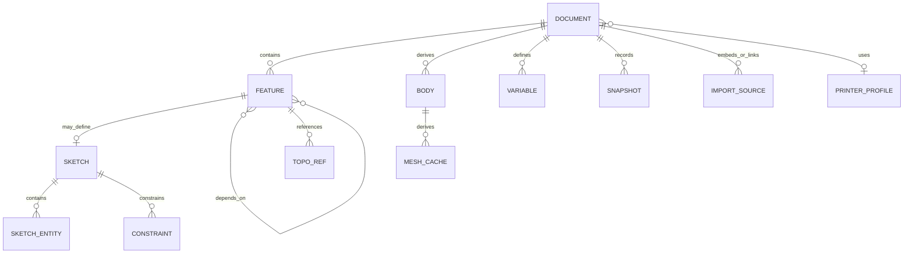

# Модель данных и native-формат

## Основные сущности



## Идентификаторы

- UUIDv7/совместимый sortable ID для persistent entities;
- ID не содержит позицию в массиве или имя пользователя;
- rename не меняет ID;
- copy создаёт новые IDs и явную `derivedFrom` metadata;
- sub-elements sketch имеют свои IDs;
- kernel handles и array indices никогда не сериализуются как identity.

## Document schema

Концептуально:

```text
Document
  id, schemaVersion, createdAt, updatedAt
  name, description, units, coordinateSystem
  variables[]
  features[]
  bodiesMetadata[]
  imports[]
  printerProfileRef?
  applicationMetadata
```

`features[]` хранится в стабильном presentation order, но каждый feature имеет explicit inputs. При чтении строится DAG, проверяются missing IDs и cycles.

## Command и event model

Alpha использует гибрид:

- current snapshot быстро открывает проект;
- append-only command/event journal обеспечивает autosave, undo и crash recovery;
- periodic snapshots ограничивают время replay;
- geometry caches не входят в semantic event stream.

Команда имеет:

- `commandId`, `documentId`, `baseRevision`;
- `kind`, `schemaVersion`, typed payload;
- `issuedAt` для UX/audit, но не для геометрического результата;
- inverse data или достаточно информации для deterministic reducer;
- result revision и content hash.

Domain reducer MUST быть детерминированным: один snapshot + те же commands дают одинаковый domain state. Геометрические результаты могут слегка отличаться между OCCT builds, поэтому engine build записывается отдельно.

## Units и expressions

Numeric parameter хранится как:

- canonical SI-like dimension vector (`length`, `angle`, dimensionless), но базовое CAD-значение длины — mm;
- normalized numeric value;
- optional original expression string;
- display unit preference отдельно.

Нельзя полагаться на локаль JSON. В native-файле decimal separator всегда `.`. UI принимает локализованный ввод и нормализует его до commit.

## `.vshape`

Расширение — ZIP-контейнер с MIME `application/vnd.vibeshape.project+zip`.

```text
project.vshape
  manifest.json
  document.json
  journal/events.jsonl
  snapshots/<revision>.json.zst       # optional
  imports/<source-id>/<original-name> # optional embedded source
  cache/brep/<hash>.brep.gz           # optional, untrusted
  cache/mesh/<hash>.bin               # optional, untrusted
  previews/thumbnail.png              # optional
  reports/last-print-check.json       # optional, derived
  licenses/NOTICE.txt                 # optional per-project attachments
```

Для alpha допустим gzip/deflate вместо zstd, если это уменьшает зависимости. Алгоритм compression записывается в manifest.

### `manifest.json`

Обязательные поля:

- `format: "vshape"`;
- `formatVersion`;
- `minimumReaderVersion`;
- `documentId`;
- `createdBy: { application, version, build }`;
- `engine: { adapter, occtVersion, buildHash, tolerancePolicyVersion }`;
- `rootDocument: "document.json"`;
- `checksums` для semantic entries;
- `capabilities`/extensions;
- `createdAt`, `exportedAt`;
- `units`, `coordinateSystem`.

### Источник истины в архиве

`document.json` + journal/snapshots являются authoritative. `cache/` и `reports/` MAY быть удалены без потери проекта. Reader обязан открыть проект без cache и не доверять B-Rep/mesh checksum, version или topology mapping.

### Versioning

- major format change меняет `formatVersion` и может требовать explicit migration;
- minor additive fields игнорируются старым reader только если extension помечено optional;
- неизвестный required capability блокирует редактирование, но SHOULD позволить safe metadata preview/export original;
- migrations pure, sequential и test-fixtured;
- reader не перезаписывает исходный файл при migration без успешного полного save;
- экспорт старой версии возможен только при доказанной lossless conversion.

## External vs embedded imports

По умолчанию импортируемый STEP/STL **встраивается** в `.vshape`, чтобы проект был переносимым. Advanced mode может хранить external handle/path hint, но:

- browser permission не гарантируется между сессиями;
- path не является identity;
- источник имеет checksum и last imported report;
- изменение внешнего файла не применяется автоматически;
- privacy-sensitive absolute paths не экспортируются без явного выбора.

## Binary mesh cache

Собственный простой little-endian envelope:

- magic/version;
- body ID, source feature hash, tolerance policy;
- counts и byte lengths;
- typed-array sections;
- checksum;
- optional face mapping.

Все counts проверяются до allocation; арифметика размеров защищена от overflow.

## Ограничения reader

Начальные safe defaults:

| Ограничение | Default |
|---|---:|
| ZIP compressed file | 512 MiB |
| ZIP uncompressed total | 2 GiB или доступная quota, что меньше |
| Compression ratio | 100:1 warning/block policy |
| Entries | 10 000 |
| JSON depth | 100 |
| Features | 100 000 hard limit, существенно меньший UX warning |
| Single typed array allocation | 512 MiB |
| Filename/path | 1024 UTF-8 bytes |

Значения уточняются fuzz/performance tests. ZIP entries с `..`, absolute path, symlink или duplicate normalized path отклоняются.

## Compatibility promise

До v1 формат experimental. Начиная с v1:

- текущая версия читает все стабильные старые `.vshape` через migrations;
- last two stable writers проверяются в CI fixture corpus;
- semantic data не удаляется без explicit migration report;
- формат специфицирован достаточно, чтобы независимая реализация могла извлечь document/events/imports без CAD-ядра.
