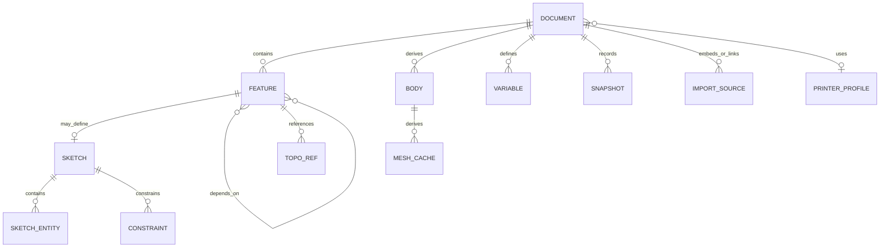

# Data model and native file format

## Core entities



## Identifiers

- Use lowercase UUIDv7 identifiers for current document, command, draft, and automation-session contracts. A future compatible sortable identifier requires an explicit schema migration.
- IDs never encode array position or user-visible names.
- Renaming does not change an ID.
- Copying creates new IDs and explicit `derivedFrom` metadata.
- Sketch sub-elements have their own IDs.
- Kernel handles and array indices are never serialized as identity.

## Document schema

Conceptually:

```text
Document
  id, schemaVersion, createdAt, updatedAt
  name, description, units, coordinateSystem
  extensionLocks[]
  variables[]
  sketches[]
  features[]
  bodiesMetadata[]
  imports[]
  printerProfileRef?
  applicationMetadata
```

`sketches[]` uses stable UUIDv7 identities and stores analytical origin-plane entities plus constraints independently of disposable solved state. `features[]` uses a stable presentation order, while every feature retains explicit inputs. Opening a file validates sketch reference compatibility, constructs the feature DAG, and rejects missing IDs and cycles.

A built-in feature stores a stable first-party module ID, module version, contributed feature-type ID, and feature schema version. A custom feature additionally stores:

- its contributed feature-type identifier;
- parameter-schema version;
- a reference to one exact `ExtensionLockEntry` containing extension ID, version, API version, and integrity hash;
- its original validated parameter payload;
- the last evaluation status and stable diagnostic codes.

The document preserves unknown custom-feature payloads without interpreting or rewriting them. Exact extension bytes are installed and stored separately; they are never authoritative entries inside the project archive.

## Command and event model

Alpha uses a hybrid model:

- A current snapshot opens the project quickly.
- An append-only command/event journal supports autosave, undo, and crash recovery.
- Periodic snapshots bound replay time.
- Geometry caches never enter the semantic event stream.

A command contains:

- `commandId`, `documentId`, and `baseRevision`;
- `kind`, `schemaVersion`, and typed payload;
- structured actor provenance such as `user`, `extension`, `mcp`, or `system`, with bounded source and session identifiers where applicable but no model prompt;
- `issuedAt` for UX and audit only, never for the geometry result;
- inverse data or sufficient information for deterministic reduction;
- no derived geometry or transport-specific prompt data.

An accepted event records the resulting revision. The IndexedDB repository atomically stores either one event or a bounded transaction-tagged event sequence, the resulting snapshot, project head, and recovery marker with SHA-256 checksums for every serialized event and snapshot payload.

The application persisted-session boundary treats the repository as semantic authority. It renews the single-writer lease, dispatches one ordinary command or a bounded draft through the trusted registry, commits the event sequence and final snapshot, advances the in-memory committed snapshot, and then rebuilds only the saved final revision. A failed persistence transaction advances neither state nor geometry. A later worker failure does not roll back the saved semantic revision; reopening or an explicit retry rebuilds from that revision. See [ADR-0016](../adr/0016-persisted-document-session-and-rebuild-sequencing.md).

The domain reducer MUST be deterministic: one snapshot plus the same commands produces the same domain state. Geometry may vary slightly between OCCT builds, so engine build metadata is recorded separately.

### Implemented foundation slice

`@vibeshape/domain` currently implements a deliberately narrow versioned slice:

- strict runtime schemas for document, command, draft, actor, event, module, and command-descriptor boundaries;
- `org.vibeshape.document.create`, `org.vibeshape.document.rename`, variable add/expression-update/remove/rename, feature add/update, and feature suppression command schema version 1;
- deterministic document, variable, and feature events, canonical snapshots, and event replay with prior semantic state recorded for tamper detection and future inverse generation;
- safe non-negative revision preconditions, explicit stale-revision diagnostics, and revision-exhaustion rejection;
- actor-bound disposable drafts whose commands share one transaction ID and commit only against the original base revision;
- first-party `org.vibeshape.core.document` and `org.vibeshape.core.features` module descriptors plus deterministic registry validation for ownership, uniqueness, dependencies, and cycles;
- canonical quantity schema v0 for length, angle, and scalar parameters, with millimeter/radian storage, normalized finite values, exact source-unit consistency, and optional authored expression text;
- bounded document-variable schema v0 with stable UUIDv7 identity, ASCII names, dimensional arithmetic, unit literals, arbitrary DAG dependencies, cycle detection, and typed command rejection;
- bounded sketch schema v0 with stable sketch/entity/constraint identities, analytical point/line/circle/arc records, construction flags, origin planes, every P0 constraint family, Quantity-backed dimensions, semantic reference validation, and revisioned add/update/remove replay;
- a first-party `org.vibeshape.core.part-design` module that contributes exact versioned box, cylinder, and ordered two-input Boolean/Subtract feature descriptors with bounded parameters;
- a trusted feature-type registry that requires descriptor-handler parity, resolves owned parameter expressions, validates dependency/reference cardinality and parameter schemas, contains normalizer exceptions and non-JSON outputs, and reports unavailable types without rewriting their records;
- an executable trusted-command dispatcher that requires exactly one handler per descriptor and validates command route, owner, and schema-version parity before execution;
- strict feature schema v0 records with stable type ownership, bounded JSON parameters, explicit dependencies, declared `TopoRef` inputs, suppression, and presentation order;
- deterministic feature-graph construction with duplicate, missing-dependency, self-reference, undeclared-reference, and cycle rejection;
- atomic feature collection mutations that validate the complete resulting DAG before advancing the document revision and never retain partial state after rejection;
- a pure rebuild seam with stable topological scheduling, transitive dirty propagation, independent cache reuse, conservative suppression, dependent-only blocking, bounded stable diagnostics, and validated SHA-256 result identities;
- automation exposure and confirmation metadata without importing MCP or transport types.

The feature evaluator receives a trusted injected operation and contains thrown or invalid outcomes as stable feature failures; it does not import geometry, React, persistence, or worker code. The generic reducer preserves presentation order and unknown schema-valid feature records, but it is a trusted kernel seam rather than a public extension or MCP tool surface. Registry-bound add/update handlers first run the ordinary pure reducer as a preflight, resolve expressions owned by the exact feature handler, validate and normalize the feature and its bounded semantic-content projection, and only then reduce the normalized command; a rejected expression or validation exposes no event or partial snapshot. Leaf removal is runtime-independent: it rejects any feature with direct dependents, then records the exact removed feature in a tamper-resistant replay event. Dispatcher composition rejects feature handlers whose registry descriptors differ from the active module registry. Replay never requires a runtime type handler, and suppression remains available for a preserved unavailable feature. Variable rename is also replayable without a feature runtime: it parses exact project expression tokens and rewrites only schema-valid Quantity sources nested in JSON feature parameters and analytical sketch constraints, then validates every affected feature and sketch before publishing one revision. Variable removal and whole-table replacement fail closed while either owner type retains a reference. Extension-specific expression encodings remain opaque until the extension contract can declare a bounded refactor contribution. Canonical feature-content identity version `0` excludes record-only identity, variable names, expression formatting, and presentation metadata; it replaces dependency UUIDs with ordered input hashes and reference slot indices and includes resolved parameters plus exact runtime, tolerance, and provider identity. The domain accepts SHA-256 only through an injected validated port, preserving its environment-neutral boundary. Protocol v7 independently parses the worker wire identity and recomputes the digest for box, cylinder, and Boolean/Subtract evaluation; it deliberately duplicates the narrow runtime schema instead of creating a forbidden domain-to-worker package dependency. Dependency UUIDs travel beside the identity only to resolve document-owned shapes, and their hashes must exactly match canonical input slots. In-memory B-Rep reuse remains disposable derived state and is not serialized; the document worker deletes entries that are absent from the exact successful feature-content set after each current rebuild. The `.vshape` v0 codec now makes that semantic boundary portable without serializing derived geometry. Command-specific eligibility beyond type validation, parameter migration, confirmation policy, caches, autosave, undo/redo, richer expressions, display-unit preferences, product geometry preview, extension execution, and native-format migrations remain open. Its schemas remain experimental contracts until their Phase 1 persistence and geometry integration gates stabilize them.

## Units and expressions

A quantity schema v0 now stores:

- one explicit `length`, `angle`, or `scalar` dimension;
- a finite normalized numeric value in millimeters, radians, or scalar identity;
- a strict source numeric value and input-unit enum, checked against the canonical value;
- optional normalized authored expression text and the last validated source-unit value.

Length input metadata accepts `um`, `mm`, `cm`, `m`, `in`, and `ft`; angle input metadata accepts `rad` and `deg`. Constructors normalize negative zero so semantic JSON remains stable. Expression schema v0 adds `#name` references, unary signs, `+ - * /`, parentheses, the same unit literals, dimensional checking, arbitrary document-variable DAG evaluation, and cycle detection. Trusted box and cylinder handlers resolve their quantity expressions before enforcing positive dimensions no greater than `1,000,000 mm`. The authored expression remains semantic document data, while resolved canonical values enter geometry identity. Atomic rename preserves the variable UUID and refactors exact `#name` tokens in variable definitions and nested project Quantity sources before committing one new revision. General dimension vectors, exponentiation, functions, document display-unit preferences, localized input, and tolerance-aware UI stepping remain future contracts. See [ADR-0015](../adr/0015-document-variables-and-dimensional-expressions.md) and [ADR-0017](../adr/0017-atomic-variable-rename-and-reference-refactor.md).

JSON never depends on locale. The native decimal separator is always `.`. The UI may accept localized input but normalizes it before commit.

## `.vshape`

The extension identifies a ZIP container with MIME type `application/vnd.vibeshape.project+zip`.

The implemented v0 archive contains exactly three entries:

```text
project.vshape
  manifest.json
  document.json
  journal/events.jsonl
```

`document.json` is canonical JSON for the current `DocumentSnapshot`. It retains stable variable IDs, authored variable formulas, analytical sketch records, sketch dimension sources such as `#width`, feature parameter source expressions, and every other semantic feature field. `journal/events.jsonl` contains the complete canonical event history, one strict event per line with a final newline. The writer uses deterministic DEFLATE ZIP output with a fixed ZIP timestamp. Periodic snapshot entries, embedded imports, caches, previews, reports, extension locks, and license attachments remain planned versioned additions; a v0 reader rejects every extra entry rather than guessing whether it is authoritative.

### `manifest.json`

Required fields:

- `format: "vshape"`;
- `schemaVersion: 0`, `formatVersion: 0`, and `minimumReaderVersion: 0`;
- `documentId` and `documentRevision`;
- `createdBy: { application, version, build }`;
- nullable `engine` metadata; v0 semantic backup does not claim an engine build when the writer cannot bind one reliably;
- `rootDocument: "document.json"`;
- `eventJournal: "journal/events.jsonl"` and `compression: "deflate"`;
- two `semanticEntries` with path, media type, byte count, and lowercase SHA-256;
- `requiredCapabilities` and nullable `extensionsLockChecksum` reserved for later versions;
- `createdAt` and `exportedAt`;
- `units: "millimeter"` and `coordinateSystem: "right-handed-z-up"`.

### Authoritative data

`document.json` and the full journal are jointly authoritative in v0. A reader verifies both SHA-256 digests, strictly parses every schema, replays the journal from `null`, and requires its canonical result to equal the enclosed snapshot before import. The persistence adapter then inserts all events, one head snapshot, clean-close metadata, and the project head in one IndexedDB transaction. A same-ID local project is never silently overwritten. Derived B-Rep, mesh, evaluated variable values, and topology mappings are absent and rebuild locally after open.

### Extension requirements

`extensions/lock.json` deduplicates exact requirements used by custom features:

```text
ExtensionLockEntry
  id
  version
  apiVersion
  integrity: { algorithm: "sha256", digest }
  sourceHint?
  signatureIdentity?
```

The lock file is authoritative metadata, but it contains no JavaScript, WebAssembly, HTML, or remote loader URL. `sourceHint` is informational and is never fetched while opening or rebuilding a project.

Opening a project never installs, updates, enables, or grants permissions to an extension. If an exact artifact is unavailable, disabled, incompatible, or fails its budget, the reader:

1. preserves its lock and feature payload unchanged;
2. marks the owning feature with a typed extension diagnostic;
3. blocks or stales downstream features through ordinary DAG rules;
4. allows safe metadata inspection and export of the original archive;
5. may display the last valid cache only as stale, non-authoritative geometry;
6. never substitutes another version or exports stale geometry as newly validated output.

The detailed package, upgrade, and restricted-mode behavior is defined in [Extension architecture](extensions.md).

### Versioning

- Major format changes update `formatVersion` and may require explicit migration.
- Old readers ignore additive fields only when the extension is optional.
- Unknown required capabilities block editing but SHOULD allow safe metadata preview and export of the original archive.
- Unknown extension lock fields are preserved; an unsupported required extension API blocks evaluation rather than migration by guesswork.
- Migrations are pure, sequential, and fixture-tested.
- Readers never overwrite the source during migration until a complete save succeeds.
- Export to an older version is allowed only when conversion is proven lossless.

## External and embedded imports

By default, imported STEP and STL sources are **embedded** so the project remains portable. Advanced mode may retain an external handle or path hint, but:

- browser permissions may not survive sessions;
- a path is not identity;
- the source has a checksum and last import report;
- external changes never apply automatically;
- privacy-sensitive absolute paths are excluded from export unless explicitly requested.

## Binary mesh cache

Use a simple project-owned little-endian envelope:

- magic and version;
- body ID, source feature hash, and tolerance policy;
- counts and byte lengths;
- typed-array sections;
- checksum;
- optional face mapping.

Validate all counts before allocation and protect size arithmetic from overflow.

## Reader limits

The deliberately narrow v0 reader uses these current hard limits:

| Limit | Default |
|---|---:|
| Compressed ZIP input | 32 MiB |
| Total uncompressed ZIP size | 64 MiB |
| Per-entry size | 32 MiB |
| Compression ratio | 200:1 |
| Entry count | 16, with exactly 3 allowed by v0 |
| Feature count | 100,000 hard limit with a much lower UX warning |
| Event count | 100,000 |
| Filename/path | 160 Unicode code units |

The reader rejects multi-disk archives, comments, encryption, unsupported compression, symlinks, invalid UTF-8, traversal, absolute paths, directory entries, and duplicate case-insensitive NFC paths before decompression. Fuzzing and performance tests may refine these numbers only through a versioned compatibility decision.

## Compatibility promise

The format remains experimental before v1. Starting with v1:

- the current reader opens every older stable `.vshape` through migrations;
- the last two stable writer versions remain in the CI fixture corpus;
- semantic data is never removed without an explicit migration report;
- the format is documented well enough for an independent implementation to extract documents, events, and imports without a CAD kernel.
