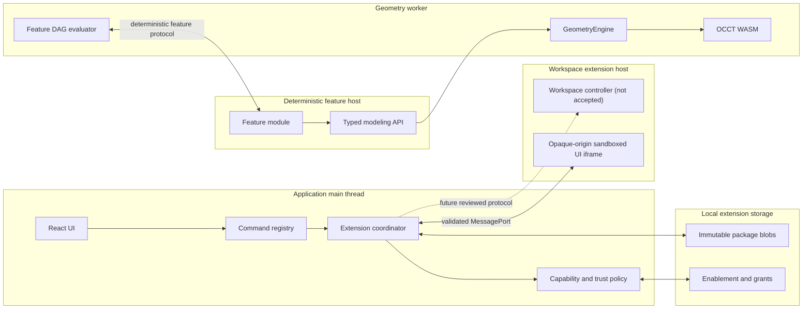

# Extension architecture

## Recommendation

VibeShape should use a **microkernel with modular first-party features and separate deterministic and interactive third-party extension profiles**, not one general-purpose plugin runtime. Parametric regeneration must stay reproducible and offline; UI and external integrations need explicit capabilities and stronger isolation.

This document describes the target contract accepted with reduced scope by [ADR-0012](../adr/0012-capability-based-extension-platform.md). [ADR-0013](../adr/0013-microkernel-modules-and-mcp-automation.md) defines which functionality remains in the trusted kernel, how first-party modules reuse the contribution model, and how external automation reaches commands. [SPK-006](../spikes/spk-006-extension-sandbox.md) accepts immutable packages, exact locks, capabilities, restricted mode, opaque iframe UI, and a narrow no-import WebAssembly feature candidate. It rejects arbitrary same-origin workspace JavaScript and does not publish a public API.

## Goals and non-goals

The platform must:

- let developers add parametric features, analysis, import/export codecs, commands, and focused UI;
- preserve deterministic rebuilds and stable failure ownership;
- keep raw OCCT, solver, React, application-store, and persistence objects private;
- work offline from explicitly installed, integrity-verified packages;
- make permissions, resource use, missing dependencies, updates, and failure visible;
- allow a document to remain recoverable when an extension is unavailable or broken;
- support self-hosted package catalogs without requiring a VibeShape cloud account.

The first platform does not provide:

- native browser plugins or arbitrary operating-system access;
- arbitrary JavaScript embedded in projects;
- direct extension access to the application DOM or internal state stores;
- direct OCCT calls or serialized kernel handles;
- silent installation, permission grants, version changes, or remote code loading;
- an official marketplace before review, signing, revocation, and governance policies exist.

## Extension profiles

| Profile | Primary uses | Execution environment | Available authority | Determinism |
|---|---|---|---|---|
| Parametric feature module | Custom feature types, procedural geometry, computed properties | Terminable no-import WebAssembly worker candidate; production modeling ABI pending | Immutable scalar spike input; future host-owned modeling/query functions | Required |
| Workspace extension | Commands, panels, property editors, reports, analysis views | Declarative contributions and opaque-origin iframe UI; arbitrary JavaScript controller disabled | Explicit host-mediated UI capabilities only in the accepted subset | Not required, but mutations use deterministic commands |
| Compute or codec module | Mesh analysis, format codecs, bounded algorithms | Dedicated WebAssembly worker; imports require separate review | Typed buffers and narrowly scoped callbacks | Required when its output enters semantic state |

One package may contain more than one profile, but each entry point has its own capability set, lifecycle, and resource budget. Privileges never flow from a workspace entry point into a feature entry point.

## Trusted kernel and first-party modules

Not every application subsystem is an extension. The trusted kernel owns the invariants required to load, validate, execute, disable, and recover every optional module:

- document IDs, revisions, transactions, command dispatch, and undo/redo;
- feature-DAG scheduling, schema migration, and unknown-payload preservation;
- geometry, solver, persistence, and file-format ownership ports;
- extension installation, integrity, capability, lifecycle, and recovery policy;
- automation session policy, audit provenance, and host-owned confirmation;
- localization, diagnostics, and security-critical UI meaning.

Product capabilities above that kernel are cohesive first-party modules. Sketching, part design, exchange, print analysis, and measurement register stable feature types, commands, queries, analyses, codecs, property schemas, and declarative UI contributions. This keeps feature ownership explicit and lets new families be added without editing a central switch statement.

First-party modules and third-party extensions share contribution semantics where practical, but **contract parity is not runtime parity**:

| Concern | First-party module | Third-party extension |
|---|---|---|
| Distribution | Bundled and reviewed with the application | Immutable installed `.vsext` artifact |
| Trust | Project source under normal review and release controls | Untrusted by default |
| Execution | Trusted main-thread or worker container selected by subsystem | Restricted feature, workspace, iframe, or compute host |
| Permissions | Release-reviewed host authority | Declared and user-granted capabilities |
| Availability | Required module families participate in application compatibility | May be missing, disabled, incompatible, or quarantined |
| Contract | Explicit registries, commands, schemas, diagnostics, and ownership | Compatible public subset plus package and sandbox protocol |

Built-in code does not receive a second private document mutation path. UI and modules request the same domain commands used by extensions and automation. Trusted performance-sensitive evaluators may access internal host ports that are never promised to third parties, but they still cannot bypass transactions, revisions, geometry ownership, or persistence invariants.

The initial domain implementation keeps serializable descriptors and trusted executable handlers as distinct registrations. Command composition requires one handler for every command descriptor and rejects duplicates, orphaned handlers, owner mismatch, schema-version mismatch, and a feature handler bound to a different descriptor set. Feature-type composition applies the same fail-closed rule to exact module version, type ID, and parameter schema version. The initial `org.vibeshape.core.part-design` module contributes unit-aware box and cylinder descriptors; its trusted schemas validate bounded parameters and the registry contains thrown or non-JSON normalizer results as stable diagnostics. Registry-bound add/update execution validates and normalizes a feature only after pure document preflight and before final event creation. A structurally valid record with no available type remains preservable and suppressible but cannot be added or updated through the trusted typed handler. This is a first-party runtime invariant, not a public extension execution API: third-party handlers still require production isolation, capability, lifecycle, transaction, and recovery integration on the accepted SPK-006 seams.

Modularity does not require one Bun workspace or distributable package per feature. Closely related features can live in one module family until dependency, execution, ownership, testing, or publication evidence justifies extraction. Module dependencies are explicit, acyclic, and unable to change evaluation semantics through registration order.

## Why this differs from Onshape

Onshape's FeatureScript demonstrates that custom features can behave like built-in feature-tree entries when regeneration is deterministic, modules are version-linked, and execution is sandboxed. Its separate application extensions use hosted iframe or REST integrations. VibeShape keeps that separation but adapts it to a local-first browser product:

- packages are installed locally and pinned by integrity rather than fetched during rebuild;
- deterministic feature modules have no network or account access;
- interactive extensions use a least-privilege capability manifest rather than ambient document access;
- `.vshape` records requirements but never carries auto-executable code;
- missing packages produce an explicit degraded mode instead of an implicit upgrade or network dependency;
- package catalogs may be local, community-hosted, or self-hosted.

## Package and manifest

The proposed distributable is a ZIP-based `.vsext` package. It is immutable after publication and contains a root `vibeshape-extension.json`, entry bundles, localization catalogs, assets, license material, and an optional signature envelope.

Conceptual package layout:

```text
example.vsext
  vibeshape-extension.json
  feature/main.wasm             # optional deterministic entry
  workspace/main.js             # optional isolated host entry
  ui/panel.html                 # optional sandboxed UI entry
  locales/en.json
  assets/icon.svg
  LICENSE
  THIRD_PARTY_NOTICES
  signature.json                # optional publisher identity
```

Required manifest concepts:

```json
{
  "schemaVersion": 1,
  "id": "org.example.threaded-insert",
  "name": "Threaded Insert",
  "version": "1.2.0",
  "apiVersion": "1.0",
  "license": "GPL-3.0-or-later",
  "engines": { "vibeshape": ">=1.0.0 <2.0.0" },
  "entrypoints": {
    "feature": "feature/main.wasm",
    "workspace": "workspace/main.js",
    "ui": "ui/panel.html"
  },
  "activationEvents": ["onFeature:org.example.threaded-insert.create"],
  "contributes": {
    "features": [],
    "commands": [],
    "panels": [],
    "propertyEditors": [],
    "codecs": []
  },
  "capabilities": {
    "model": ["read", "command"],
    "ui": ["command", "panel"],
    "network": { "allowedOrigins": [] }
  },
  "files": {
    "feature/main.wasm": { "sha256": "..." },
    "workspace/main.js": { "sha256": "..." }
  }
}
```

The example is illustrative, not a frozen schema. SPK-006 implements a smaller strict manifest-v1 candidate with one flat capability list, explicit entry points, exact file digests, and a required `LICENSE`; it remains private evidence rather than a public `.vsext` contract. The artifact's SHA-256 digest is computed over the exact archive outside the archive and stored in the installation record and document lock, avoiding a self-referential package digest. The candidate ECDSA P-256 envelope signs the exact manifest bytes; signature identity never bypasses validation or sandboxing.

Package validation occurs before installation and includes:

- normalized paths with traversal, absolute path, symlink, duplicate, and case-collision rejection;
- compressed size, expanded size, entry count, path length, JSON depth, and asset limits;
- exact manifest schema and identifier validation;
- declared-entry and checksum verification;
- executable-content and MIME allowlists;
- license and notice presence for public distribution;
- API compatibility and permission review before enablement.

## Versioning and document lock

Extension identity has four independent dimensions:

- stable reverse-DNS `id` identifies the publisher namespace and package;
- SemVer `version` describes the extension release;
- `apiVersion` selects the host protocol contract;
- SHA-256 `integrity` identifies the exact bytes that ran.

Each custom feature stores a stable contributed feature type, its parameter schema version, and the extension lock reference. The document manifest deduplicates complete lock entries:

```text
ExtensionLockEntry
  id
  version
  apiVersion
  integrity
  sourceHint?             # informational catalog URL, never fetched during rebuild
  signatureIdentity?      # informational until verified against a trust store
```

The feature content hash includes the lock entry, feature type, normalized parameters, inputs, host API version, geometry adapter build, and tolerance policy. An installed package with the same ID and version but different bytes is rejected.

Updates are explicit transactions:

1. Download or import the new immutable package without replacing the old version.
2. Display changed permissions, API compatibility, publisher identity, and release notes.
3. Rebuild a disposable document revision with the new lock.
4. Compare diagnostics and required geometry invariants.
5. Commit the lock change as one undoable document command or keep the old version.
6. Retain the previous artifact while any local document references it.

## Runtime architecture



The diagram is logical. SPK-006 places the no-import feature fixture in a dedicated terminable worker, but production placement relative to the geometry worker remains open until a high-level modeling ABI exists. The dashed workspace-controller path is not accepted: a same-origin JavaScript worker exposes ambient browser authority. In every future placement, extension code never receives an OCCT object. It emits typed modeling operations or calls a narrow host facade whose ownership and cleanup remain inside VibeShape.

### Parametric feature contract

A feature evaluation receives:

- exact extension, feature-type, and parameter-schema versions;
- immutable normalized parameters with dimensions and units;
- resolved semantic inputs and query results;
- stable feature and operation identifiers;
- a deterministic modeling/query interface;
- bounded diagnostic and progress sinks.

It returns:

- declared semantic output roles used to construct `TopoRef` lineage;
- result-body ownership and typed metadata;
- deterministic diagnostics using stable codes and structured values;
- optional derived preview data that does not become semantic truth;
- resource-accounting data for diagnostics.

The host rejects feature modules that attempt undeclared imports. The SPK-006 candidate permits no imports at all and exactly one scalar `evaluate` export; modeling and query imports require a follow-up ABI and threat review. Time, randomness, locale, user preferences, network, storage, DOM, and mutable global state are not feature inputs. Locale-specific text is resolved by the application from extension catalogs after evaluation.

Feature evaluation is sequential within a document, budgeted, and abortable by terminating its execution container. A timeout is a typed feature failure; it never commits partial geometry.

### Workspace and UI contract

The accepted subset registers declarative contributions without running a general-purpose workspace controller. If a future isolated controller is accepted, activation is lazy and event-driven, such as a contributed command invocation, panel opening, supported document type, or explicit enable action. Wildcard startup activation remains prohibited.

Custom UI runs in an iframe without `allow-same-origin`, navigation, downloads, popups, forms, or top-level access unless a later capability explicitly proves the need. The frame receives an extension-specific CSP and communicates through a dedicated `MessagePort`. The coordinator validates message schema, session nonce, sequence, extension ID, capability, size, and lifecycle state. The frame never receives authentication tokens, file handles, domain objects, or application store references.

The host owns all application mutations. A UI extension can request a registered command, but the application validates eligibility, presents preview/confirmation when required, commits one normal domain command, and records ordinary undo/redo history.

### Compute and codec contract

Compute modules use typed buffers and reviewed host imports. WebAssembly is preferred for CPU-bound portable code because it has no system calls beyond host-provided imports, but it is not sufficient by itself: the worker still needs time, memory, output-size, and message budgets plus termination and restart. SPK-006 proves termination, message, and output containment but does not establish a portable hard per-worker memory ceiling.

Codecs run on copied or transferred input, stage output, and never write files directly. A codec cannot mutate the current document on parse failure. Exact B-Rep codecs that need kernel access remain trusted built-in adapters until a safe high-level exchange contract is proven.

## Capability model

Capabilities are deny-by-default, independently declared per entry point, and granted per installed package. Initial candidate namespaces are:

| Capability | Meaning | Initial policy |
|---|---|---|
| `model.read` | Read immutable document view models | Workspace host only; selection and field scopes may narrow it |
| `model.command` | Request registered application commands | Validate normal command eligibility and confirmation |
| `selection.read` | Read the current serializable selection summary | No geometry handles or hidden document data |
| `geometry.query` | Request bounded measurements or tessellation-derived analysis | Typed request and result limits |
| `ui.command` | Contribute a command | Declarative metadata; host renders labels and shortcuts |
| `ui.panel` | Contribute a sandboxed panel | Opaque-origin iframe only |
| `ui.propertyEditor` | Extend a supported property surface | Host-controlled slot and schema |
| `file.open` | Ask the user to choose input | User gesture; extension receives bytes, not a persistent handle |
| `file.save` | Ask the user to save staged output | User gesture and application-owned picker |
| `clipboard.write` | Write explicit user-selected output | User gesture and preview where sensitive |
| `network.connect` | Contact exact HTTPS or WSS origins | Empty by default; display origins and reason before grant |

There is no general `model.write`, `filesystem`, `dom`, `storage`, `kernel`, `eval`, or wildcard network capability. New capabilities require threat modeling, protocol tests, UX, and an ADR when they expand the trust boundary.

Installed, enabled, and granted are different states:

- **Installed** means an immutable package passed structural and integrity validation.
- **Enabled** means its compatible contribution points may activate.
- **Granted** means the user approved its current privileged capability set.

An update that expands capabilities returns the package to a disabled or limited state until approval. Revocation immediately blocks new requests and terminates active hosts.

## Trust and failure behavior

Third-party packages are untrusted by default. Publisher signatures help answer who produced an artifact; they do not replace integrity checks, sandboxing, capability limits, or code review.

VibeShape provides a restricted mode that:

- disables executable third-party extension entry points;
- still opens metadata, built-in features, and cached non-authoritative previews where safe;
- preserves all unknown feature payloads and extension locks byte-for-byte;
- prevents project-controlled settings from granting or expanding capabilities;
- offers explicit enable, locate package, replace version, export original, and remove-feature workflows.

Opening a `.vshape` file never installs a package, grants permissions, contacts a catalog, or runs extension code. Missing or incompatible extensions create visible feature states:

- `extension-missing` when the exact artifact is not installed;
- `extension-disabled` when trust or permissions prevent execution;
- `extension-incompatible` when the host API cannot load it;
- `extension-timeout` or `extension-resource-limit` when a budget is exceeded;
- `extension-failed` for a validated runtime error.

Downstream features become stale or blocked according to normal DAG rules. VibeShape preserves the last valid derived preview only when clearly labeled as stale; it is never exported as a newly validated solid.

## UX contract

The extension manager must show:

- package name, stable ID, installed versions, source, integrity, publisher identity, and license;
- installed, enabled, granted, active, incompatible, update-available, and quarantined states;
- capabilities grouped by data, document mutation, files, clipboard, and network;
- every exact origin and the author-provided reason for network access;
- documents that still reference each installed version;
- resource failures and a direct path to disable or inspect the owning extension.

Extension commands use the same command registry, palette, eligibility, preview, busy, double-activation, cancellation, and undo rules as built-in commands. Extension panels use VibeShape's density and semantic tokens through host-provided theme values, but their iframe DOM remains independently owned. A panel cannot imitate browser, permission, save, or destructive-confirmation chrome.

An extension update never appears as a blocking toast. The document tree identifies affected custom features, and the update review reports added permissions, schema migrations, rebuild failures, and rollback status.

## Localization

Extension identifiers, manifest fields, diagnostic codes, capability names, and command IDs are English technical identifiers. User-facing copy uses extension-owned ICU catalogs with English as the required base locale. The host validates key and placeholder parity before installation and falls back to the package's English catalog without executing extension code.

Extension messages have an isolated namespace derived from the package ID. They cannot override application or other extension messages. Host-owned security, permission, save, and recovery copy always comes from `@vibeshape/i18n` so an extension cannot misrepresent a host decision.

## Developer experience and package promotion

SPK-006 uses one private evidence package:

```text
packages/
  extension-spike/        # non-public package, runtime, panel, policy, and hostile fixtures
```

This package deliberately combines concerns so no evidence-only boundary becomes a compatibility promise. Production evidence may later justify `extension-api`, `extension-host`, `extension-packaging`, and `extension-testkit`, but their names and boundaries are not reserved. A public API must expose explicit package subpaths, generated API documentation, compatibility fixtures, and a Bun CLI for pack, inspect, sign, and test operations.

First-party module descriptors and the adapter-neutral automation surface are designed before this public SDK. MCP is not an extension entry point: it translates protocol resources and tools into the same bounded query, draft, and command contracts. Extension-contributed commands require a separate host-controlled automation approval before they can appear through MCP. See [Automation and MCP architecture](automation-and-mcp.md).

An extension release must pass:

- manifest and package conformance;
- deterministic replay for feature modules;
- capability-denial and restricted-mode scenarios;
- timeout, memory, message, and output-size budgets;
- upgrade, rollback, missing-version, and uninstall-preservation scenarios;
- localization parity and accessibility checks;
- license and third-party notice validation.

## `SPK-006` result and remaining gate

The spike must compare at least two restricted compute approaches and prove the UI iframe design in Chromium, Firefox, and WebKit. It must answer:

1. Can an infinite loop be terminated without losing the committed document or freezing the main thread?
2. Can feature code be prevented from accessing network, time, randomness, DOM, storage, and undeclared host functions?
3. Can an opaque-origin iframe render a usable panel with strict CSP and a schema-validated `MessagePort` protocol?
4. Can package and message resource limits reject hostile fixtures before large allocation or execution?
5. Can two exact extension versions coexist offline and rebuild the same fixture reproducibly?
6. Can permissions be denied, granted, expanded on update, and revoked without residual authority?
7. Can missing, incompatible, timed-out, and failed extensions preserve and recover the document without silent geometry substitution?
8. What API and package versioning policy can be supported across at least two host versions?

The recorded result is **Proceed with reduced scope**. The package, lock, capability, restricted-mode, opaque iframe, termination, and no-import WebAssembly candidates pass in Chromium, Firefox, and WebKit. Arbitrary workspace JavaScript is rejected because the dedicated worker retains ambient authority. The memory-growth fixture is contained through termination after its message budget, but no browser-independent hard memory quota is proven.

This result does not authorize a public `extension-api` package or product claim of executable third-party support. Those remain gated on a deterministic modeling ABI, production document and transaction integration, portable memory policy, update/rollback persistence, uninstall preservation, localization and accessibility conformance, hostile iframe navigation coverage, package governance, and an end-to-end recovery rebuild.
