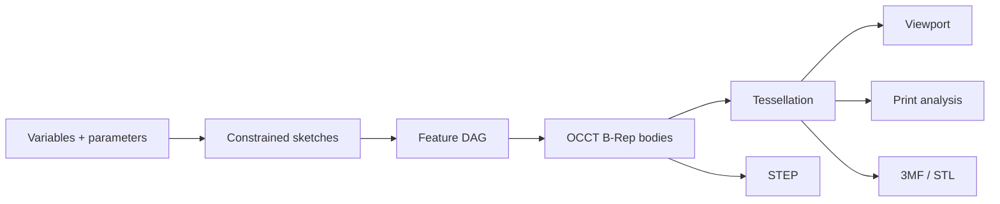

# Geometry and parametrics

## Source of truth

The parametric **feature graph** is the source of design intent. B-Rep is the computed exact body state; the triangle mesh is a derived visualization and manufacturing state.

Parametrics cannot be reconstructed from a mesh, and a visually correct mesh is not proof of a valid solid.

## Geometry conventions

- Right-handed coordinate system with **Z up**.
- Internal document length unit is **millimeter**.
- Domain serialization stores angles in radians, while retaining explicit input-unit metadata.
- Calculations use `float64`.
- The tolerance policy is centralized and versioned.
- UI code never compares geometry with `===` or an arbitrary epsilon.
- Imported units are converted explicitly and recorded in the import report.

The implemented quantity schema v0 covers length, angle, and scalar dimensions. Length source values in `um`, `mm`, `cm`, `m`, `in`, or `ft` normalize to millimeters; `deg` and `rad` normalize to radians; scalar values retain unit `1`. Every record carries strict source metadata that must recompute to the canonical finite value, and negative zero is normalized before serialization. Document-variable and expression schema v0 evaluates unit literals, `#name` references, unary signs, `+ - * /`, and parentheses with dimensional checking and cycle detection. Box and cylinder handlers resolve expression-bound quantities before validating their positive `1,000,000 mm` limit. Authored source remains in the semantic document; only the resolved canonical value enters geometry identity. Revisioned project preferences select the display and bare-input length and angle units without changing canonical values, geometry identity, tolerances, or existing expressions. Rich functions, exponentiation, compound dimensions, localized numeric input, and tolerance-aware UI stepping remain separate versioned work under [ADR-0015](../adr/0015-document-variables-and-dimensional-expressions.md) and [ADR-0022](../adr/0022-project-display-unit-preferences.md).

Initial tolerance goals, subject to spike validation:

| Parameter | Initial value | Purpose |
|---|---:|---|
| Modeling linear tolerance | `1e-7 mm` or kernel default | Exact operations; never reuse blindly for meshes |
| Sketch solve tolerance | `1e-6 mm` | Constraint residuals |
| Angular tolerance | `1e-8 rad` | Parallel and perpendicular checks |
| Display chord tolerance | Adaptive, default `0.05 mm` | Viewport mesh |
| Export chord tolerance | Profile-driven, default `0.02 mm` | STL and 3MF |

These values are hypotheses. Excessively small tolerances reduce robustness and must be calibrated against the model corpus.

## Feature evaluator

Every feature is a declarative, pure-like record:

- `id`, `kind`, and `schemaVersion`;
- `parameters`;
- `inputs`;
- `references`;
- `suppressed`;
- optional user label and metadata.

The evaluator returns:

- zero or more output bodies;
- OCCT operation history where available;
- generated semantic roles;
- `TopoSignature` values for faces, edges, and vertices;
- validation metrics;
- typed diagnostics;
- content hash.

A feature never mutates its committed input shape. If the OCCT API uses mutable objects, the adapter establishes explicit copy and ownership boundaries.

## Sketch representation

Sketch schema v0 stores analytical entities, not sampled polylines:

- point `(x, y)`;
- line segment;
- circle;
- arc;
- ellipse and B-spline later;
- construction flag;
- constraint records referencing entities and sub-elements;
- dimensional constraints linked to variables or expressions.

The implemented document record binds each sketch to one immutable origin plane (`xy`, `xz`, or `yz`), uses stable UUIDv7 identities for sketches, entities, and constraints, and caps one document at 256 sketches. A sketch accepts at most 4,990 authored entities and 10,000 constraints; the entity limit reserves the remaining native capacity for the workplane and projected axes. Entity-reference compatibility is validated in the pure domain before a command can create an event. Add, update, and remove use the ordinary revisioned command path and retain exact prior records for tamper-resistant replay.

The solver receives normalized parameters and constraints and returns solved coordinates, degrees of freedom, residuals, and stable conflict IDs. Length and angle dimensions reuse the document Quantity grammar, so a constraint can retain an authored expression such as `#width` while the worker sends only a dimensionally validated canonical value to SolveSpace. The committed document does not store native handles or require solved coordinates for recovery; a solver-version change or worker replacement triggers a fresh solve from semantic state.

ADR-0014 selects the pinned SolveSpace v3.2 subset behind a Zod-validated flat typed-array ABI. Native execution is stateless per solve: parameters, entities, constraints, scalar values, and dragged handles are copied in; solved values, normalized status inputs, residual, and failed constraint handles are copied out. No SolveSpace or C++ pointer is stored in the document or exposed to UI code. Horizontal and vertical dimensions project against immutable sketch axes, concentric constraints share coincident centers, and radius input is converted to the native diameter equation.

`@vibeshape/sketch-solver` now compiles the production record to that ABI. Stable IDs become ephemeral handles for one solve and map the result back to stable point, circle, and constraint identities. A continuation carries the prior solved values plus source revision; matching values replace authored guesses before the next solve, and explicit drag targets replace continuation values last. A semantic line-chain Offset owns one signed Quantity, ordered source/offset line pairs with stable direction scales, and both endpoint pairs for an open chain. The adapter emits one native parallel and signed point-to-line distance per line pair plus two absolute endpoint distances for an open chain; all emitted handles map back to the one stable constraint ID. The adapter alone reverses SolveSpace's point-to-line sign convention so domain geometry, pointer preview, authored expressions, and solved coordinates share one orientation. Document protocol v8 keeps solving inside the existing document worker and requires the exact rebuilt document, revision, and generation. It can solve either the committed record or a complete schema-valid request-owned draft with the same requested sketch identity; variables remain committed authority and the draft is never persisted or retained by the worker. A recoverable solve failure replaces the worker, rebuilds the last successful committed snapshot, and retries once. The browser bundle contains the exact reviewed module (`60c8714fbd5d94a50bdfcde7bd1658cfb2a180ad44be124997905ece7be545c7`) and WASM (`c9e3e35084b3812e9eae7bdff8fd3290394918c88ba38504e58a9a9d4a2bd978`) outputs and verifies both SHA-256 values before normal repository checks.

## Sketch profiles

After every valid solve, the implemented pure topology builder:

1. Collects non-construction analytical lines, arcs, and circles from stable solved identities.
2. Sorts curves by stable entity ID and snaps endpoints within `1e-7 mm`.
3. Rejects coincident overlaps and curves with unsplit interior intersections.
4. Builds a planar half-edge graph and extracts positive closed loops.
5. Computes analytical area and perimeter, then determines outer, hole, and island nesting.
6. Returns strict protocol-v8 derived data or bounded diagnostics for invalid values, budget overflow, degenerate entities, duplicates, intersections, and open chains.

One extraction accepts at most 2,000 non-construction curves and 2,000 diagnostics. Output loop and profile indices are transient response ordering, never persistent model identity. Domain selector schema v0 stores the stable owning sketch plus canonical outer and hole boundary entity-ID sets. Its pure resolver survives transient index reordering and fails closed with `missing` or `ambiguous` when the selected boundary no longer resolves uniquely. The real-browser worker fixture solves a `#width` by `#height` rectangle and returns one `360 mm²`, `84 mm` profile. The product editor uses pure domain operations to build a complete transient Point/Line/Midpoint Line/corner Rectangle/Center Rectangle/Aligned Rectangle/Centered Aligned Rectangle/center-point and three-point Circle/center-point, three-point, and Tangent Arc/Straight Slot/Centered Slot/selected-line Slot sketch with stable identities, solves that draft through document protocol v8 without publishing a document revision, and commits exactly once through the ordinary revisioned sketch add or update path on Finish. A center rectangle stores one center point, four non-profile construction spokes, horizontal and vertical outline intent, and one nonredundant opposite-spoke equal/parallel pair; the other diagonal relationship follows from the axis-aligned rectangle and is not duplicated as an over-constraint. Aligned Rectangle derives a signed perpendicular offset from the third pick and stores explicit perpendicular and parallel intent instead of depending on initial coordinates. Centered Aligned Rectangle derives four corners from a center, symmetric half-axis, and signed perpendicular half-width; one construction axis plus midpoint constraints attach the center and both opposite side midpoints to the analytical outline. Each Slot variant persists one construction centerline, two side lines, and two analytical semicircular arcs. Straight Slot authors the centerline directly, Centered Slot adds midpoint symmetry, and selected-line Slot converts exactly one existing line to construction geometry. Shared end points and analytical arc centers/radii imply tangent end caps and equal radii; one boundary-parallel constraint is the minimal nonredundant solver intent. Three-point Arc computes a circumcenter from two stable endpoints and a transient point-on-arc pick, rejects collinear input, and orders its endpoint references so the existing positive-sweep arc schema passes through the authored third position without a schema migration. Tangent Arc derives its analytical center from a referenced line endpoint and tangent direction, reuses that stable endpoint, and persists the existing line-arc tangent constraint. Offset adds the protocol-v8 compound constraint; the other listed tools reuse existing sketch records. Pure automatic inference ranks existing points, bounded segment intersections, segment midpoints, point-on-line projections, and line direction candidates deterministically. Accepted midpoint, point-on-line, horizontal, vertical, parallel, perpendicular, and tangent candidates become ordinary stable constraints; existing-point placement reuses identity, while point dragging records a coincidence only at release. The viewport excludes the dragged point and its incident lines from candidates, coalesces raw pointer samples before inference, and keeps intermediate drag state outside the semantic document. Per-frame solves reuse the unchanged schema-valid sketch and pass the latest stable-ID drag target separately, avoiding full-record cloning and Zod parsing in the pointer hot path. The application session exposes both transient and committed solves through the same rebuilt document-worker port used for geometry and export, so the accessible orthographic SVG presents exact-revision live geometry, conflict identities, and stable selectable regions without persisting solver output.

The first selector consumer is extrusion. The semantic feature persists the stable selector, distance `Quantity`, symmetric flag, and operation intent; it does not persist solved coordinates, native geometry, or transient profile indices. `New` has no B-Rep input, while Add, Remove, and Intersect store exactly one explicit target-feature dependency. Before canonical geometry hashing, the document worker resolves distance variables, solves each referenced sketch at most once, resolves the selector fail-closed, and materializes exact analytical line/arc/circle loops from stable solved entity IDs. Geometry protocol v8 independently validates this bounded transient content. The geometry worker maps XY, XZ, or YZ sketch coordinates into world space, constructs OCCT edges, wires, and a face, creates an exact prism with deterministic temporary ownership, then applies Fuse, Cut, or Common when required. Identical prepared content and ordered target hashes reuse successful geometry even though selector preparation runs for every document rebuild. Start and end caps receive semantic roles, and a uniquely attributable side receives `extrusion.side.<SketchEntityId>`. The Chromium corpus proves the `3,600 mm³` prism plus exact Add, Remove, and Intersect volumes and bounds against a box target. The product selects one stable solver-produced region at a time, including a region with holes. Create and edit forms publish a debounced, schema-valid draft into an isolated ephemeral document-worker session, reuse the production preparation and OCCT path, ignore stale results, and never mutate the authoritative document or worker. Terminal meshes whose content hashes differ from committed geometry render with non-selectable preview appearance. Multi-profile feature input and interior-intersection splitting remain the next increments. See [ADR-0018](../adr/0018-deterministic-sketch-profile-extraction.md), [ADR-0019](../adr/0019-selector-backed-new-body-extrusion.md), and [ADR-0023](../adr/0023-explicit-target-extrusion-operations.md).

## Topological naming problem

An index such as `Face3` or the OCCT edge order is unstable after booleans, fillets, and parameter changes. An index-only reference leads to broken or, worse, incorrectly reassigned features.

### `TopoRef`

A reference contains:

- owning or producing `FeatureId`;
- sub-shape kind;
- semantic role when the operation can provide one, such as `extrude.side(profileEdgeId)` or `extrude.cap.start`;
- kernel history lineage such as `generated`, `modified`, and `deleted`, where available;
- geometry signature;
- adjacency signature;
- user-intent hints such as near point, expected normal/axis, and selection context;
- latest confidence and repair history.

The implemented schema is `TopoRef` version `0`. It validates finite normalized signatures with Zod and carries one authoritative semantic role or lineage token when available. Candidate IDs are evaluation-local diagnostics only. OCCT `HashCode` values may join native history to candidates inside one worker evaluation, but MUST NOT cross the worker boundary or enter a saved document.

A face signature MAY include surface type, normalized analytical parameters, area, centroid, normal or axis, bounding box, loop count, and neighboring edge signatures. An edge signature may include curve type, length, endpoints, center or axis, and adjacent face roles. Values are quantized according to the tolerance policy.

### Resolution algorithm

1. Filter candidates by topology kind.
2. Resolve an exact semantic role. A missing or duplicated authoritative role returns `missing` or `ambiguous`; it never falls through to a similar shape.
3. Resolve an exact immediate lineage token. A missing token returns `missing`; multiple descendants are ranked only within that lineage set.
4. When the reference has no authoritative role or lineage, filter by geometry class and score measure, centroid or intent point, direction, bounds, boundary count, and adjacency.
5. If one candidate passes the versioned score threshold and confidence margin, return `resolved`.
6. If candidates are close, return `ambiguous`; never evaluate downstream features silently.
7. If no compatible candidate exists or the best score exceeds the threshold, return `missing` and identify the first broken feature.

Thresholds and weights are versioned. A user repair stores a new intent hint and event without rewriting old history.

SPK-003 implements policy version `1` with a `0.22` maximum score and `0.035` ambiguity margin. Its weights are measure `0.20`, centroid or near-point intent `0.25`, direction `0.20`, bounds `0.15`, boundary count `0.10`, and adjacency `0.10`. These values pass the bounded spike corpus; changing them requires new corpus evidence, not UI tuning.

### Robust-modeling rules

- By default, attach sketches to origin or datum planes, not arbitrary faces.
- Add datum plane, axis, and point in P1.
- Face attachment is allowed, but the UI shows reference stability.
- Pattern and mirror operations preserve semantic IDs from source elements.
- Fillet and chamfer select edge sets through reference collections, never positional indices.

## Dirty propagation and partial rebuild

- Editing a feature marks all downstream nodes dirty.
- Independent upstream branches retain their caches.
- The evaluator processes nodes in topological order.
- The first failure blocks only dependent descendants; independent bodies remain available.
- The last valid result may be shown as a ghost, but MUST be visibly marked stale and excluded from export by default.

`@vibeshape/domain/feature-graph` now implements the pure scheduling boundary. Feature schema v0 binds a stable feature and type identity to bounded JSON parameters, explicit dependencies, declared `TopoRef` inputs, suppression, and optional normalized labels. Graph creation preserves presentation order separately from a deterministic stable topological order and fails closed on invalid records, duplicates, missing dependencies, self-dependencies, undeclared reference owners, and cycles.

The injected evaluator receives only the current immutable feature record, ordered dependency results, and its previous result. It may complete asynchronously, but the scheduler awaits one node at a time to preserve deterministic dependency order. Missing cache records and explicit edits mark transitive descendants dirty; independent successful or failed results are reused. A failed or suppressed feature blocks only its dependent branch, while independent branches continue. Rejected, thrown, and malformed evaluator results become stable diagnostics rather than leaking implementation details. The domain also assembles canonical feature-content identity version `0` from handler-projected semantic parameters, ordered input hashes, slot-relative topology references, and exact runtime/provider metadata. An injected digest port keeps hashing environment-neutral and validates lowercase SHA-256 output.

`@vibeshape/application/feature-rebuild` is the port-driven document and graph coordinator. Its document entry point runtime-validates the committed snapshot, evaluates the variable DAG, resolves trusted feature parameters, and constructs the derived DAG internally without rewriting the authored snapshot. It validates a complete previous rebuild state against its resolved source features, successful graph hashes, document identity, non-future revision, worker generation, exact geometry environment, and mesh policy. Missing geometry or cross-document state fails closed; environment, tessellation-policy, or generation changes rebuild every derived record. Otherwise it derives dirty roots by comparing canonical resolved feature scheduling fingerprints, excluding presentation-only labels and expression edits that produce the same value. Parameter-expression failures become stable owning-feature diagnostics and block only descendants. It asks the domain scheduler for dirty or reusable nodes, constructs each canonical identity from ordered successful dependency records, invokes a geometry port sequentially, verifies that returned engine metadata matches the requested environment, contains rejected hash and port operations as stable diagnostics, and returns geometry only for final successful matching hashes in presentation order. A failed branch cannot publish stale geometry as authoritative, while independent branches continue. The coordinator remains independent of the DOM, worker clients, persistence, and the kernel.

`@vibeshape/document-worker` now owns the production browser composition under ADR-0002. Document protocol v8 carries a bounded committed snapshot, including project display units, authored variables, sketches, and compound signed line-chain Offset constraints, plus mesh policy, revision, and worker generation across the structured-clone boundary. The runtime keeps the last successful rebuild state per document, serializes document operations, rejects stale queued generations, initializes the geometry engine lazily, and invokes the application coordinator through a direct in-worker geometry port. It clones every returned typed mesh before transferring buffers, preserving the worker-owned cache for clean reuse. After a successful current-generation rebuild, it synchronizes the adapter-owned native registry to the exact successful `(featureId, contentHash)` set; removed, suppressed, failed, and superseded entries are deleted without touching another document. An `exportDocument` request must match the exact document, revision, and generation of that successful state. The runtime exports only successful terminal features with solid geometry; dependencies consumed by a successful downstream feature are not emitted as duplicate bodies. For STEP or STL, one terminal B-Rep is written directly while multiple terminal B-Reps are attached to a temporary, explicitly disposed OCCT compound. STEP preserves exact B-Rep data and binary STL uses the worker-owned exact shapes rather than display-mesh reconstruction. For 3MF, each exact terminal body is retessellated at a fixed `0.02 mm` chord and `0.1 rad` angular tolerance, its temporary attached triangulation is cleared, and the document worker verifies feature identity before deterministic per-object welding and Core packaging. Every response transfers a non-empty owned `Uint8Array`. `disposeDocument` removes both rebuild state and document-scoped native shapes; `healthCheck` exposes initialization, active-document, shape-count, and WASM-heap diagnostics. The browser client validates response schema, type correlation, and the exact document, revision, and generation envelope before routing progress or settling a request. A document-scoped session detects worker errors, structured-clone message failures, timeouts, and retryable worker failures; it terminates the old client, increments generation, creates a new worker, rebuilds the latest successfully rebuilt semantic snapshot including display units, variables, and sketches, and retries one recoverable solve, export, or rebuild. Session operations are serialized so recovery cannot race a later revision. The real-browser SolveSpace harness proves exact runtime identity, committed and transient variable-backed solving, stable-ID continuation and drag precedence, interactive variable-driven profile authoring, and the initial 1,000-point budget. The real-browser OCCT harness proves explicit hard restart, full generation-change rebuild, subsequent descendant-only rebuild, and multi-object 3MF and multi-body STEP/STL export. Persistence-backed page reload and clean save/reopen rebuild are also covered; persistent derived geometry caches remain open.

Protocol v8 implements the dependency-aware geometry consumer without importing the domain or application package. The engine revalidates and canonically serializes the feature identity, compares the exact active host/adapter/kernel/tolerance/provider environment, recomputes SHA-256 with Web Crypto, and verifies that each request dependency preserves the canonical hash-slot order before invoking OCCT. Box, cylinder, and new-body extrusion have no feature inputs; Add, Remove, and Intersect extrusion require exactly one target input and Boolean/Subtract requires exactly two ordered inputs. Every dependency resolves only from an exact same-document content-hash entry. Evaluation is transactional: a new shape must produce exactly one valid positive-volume solid and a successful tessellation before it replaces the prior feature entry. An empty, disjoint, or invalid Boolean result is released and cannot evict the prior valid result. Successful entries are owned per document and feature and reused only on an exact content-hash match; document disposal releases only that document's feature shapes. The result carries B-Rep hit status, invariant measurements, topology candidates, timings, and four mesh buffers. Primitive and extrusion faces have semantic roles; Boolean-derived output currently has conservative geometric candidates but no persisted OCCT lineage. Persisted sessions rebuild semantic snapshots without native cache state after reload. Persistent cache records, user-driven cancellation, stale-geometry presentation, lineage repair, and repair events remain integration work.

## Tessellation

Each body has at least two levels of detail:

- interactive/display;
- print/export using the configured chord and angular tolerances.

Mesh payload:

- positions and normals as `Float32Array`;
- indices as `Uint32Array`, or `Uint16Array` where possible;
- triangle-to-face mapping;
- edge polylines in separate buffers;
- body and face material IDs;
- bounding box and revision/hash.

Tessellation runs in the worker. The UI never builds an OCCT mesh. Changing display quality invalidates display mesh cache independently of B-Rep.

## B-Rep validation

After every committed modeling operation, check:

- kernel algorithm completion and error status;
- non-null result;
- allowed shape type;
- `BRepCheck` or equivalent shape validity;
- absence of unexpected zero-volume solids;
- expected body and solid count;
- finite metrics;
- optional shape healing only as an explicit operation or import policy.

Healing must not hide material geometry changes. The import report records every applied correction.

## Kernel memory policy

Emscripten/C++ objects requiring `.delete()` have an explicit owner. Persistent document shapes use an adapter-owned registry; operation temporaries use lexical `try/finally` scopes:

- Register persistent or ownership-transferred shapes immediately after creation.
- Delete temporary builders, explorers, progress ranges, locations, transforms, mesh values, and exchange handles in reverse order in `finally`.
- Do not rely on `FinalizationRegistry` as an operation-lifetime boundary.
- Clear OCCT caches that outlive their consumer, including attached display triangulation after STL export and reader/writer-owned STEP state.
- Explicitly remove transferred or disposed shapes from the persistent registry.
- Index permanent document objects by opaque IDs.
- Controlled builds report live allocator bytes and fail post-warmup and per-operation budgets.

## Phase 0 corpus

Minimum models:

- bracket with holes, pattern, and fillet;
- enclosure with shell, lid clearance, and bosses;
- flange with revolve and circular pattern;
- lofted adapter;
- imported STEP plus a mating part;
- intentionally failing boolean and fillet;
- symmetric model with intentionally ambiguous topology;
- large mesh import.

Compare invariants rather than B-Rep bytes: validity, body count, expected topology counts where stable, volume, area, bounding box, semantic reference outcomes, and export round-trip.
