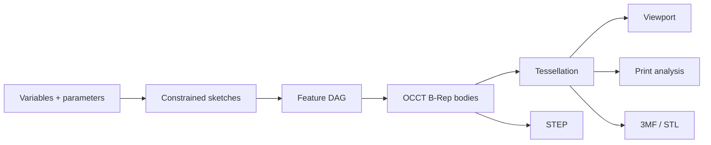

# Геометрия и параметрика

## Источник истины

Параметрический **feature graph** — источник design intent. B-Rep является вычисленным точным состоянием тела, а triangle mesh — производным состоянием визуализации/печати.

Нельзя восстанавливать параметрику из mesh и нельзя считать красиво отрисованный mesh доказательством валидного solid.

## Геометрические соглашения

- правая система координат, **Z вверх**;
- внутренняя единица документа — **millimeter**;
- углы в domain serialization — radians с явным unit metadata ввода;
- вычисления — `float64`;
- tolerance policy централизована и versioned;
- UI не сравнивает геометрию через `===` или произвольный epsilon;
- imported document units преобразуются явно и записываются в import report.

Начальные tolerance goals, подтверждаемые spike:

| Параметр | Стартовое значение | Назначение |
|---|---:|---|
| modeling linear tolerance | `1e-7 mm` либо kernel default | точные операции; не использовать слепо для mesh |
| sketch solve tolerance | `1e-6 mm` | residual constraints |
| angular tolerance | `1e-8 rad` | parallel/perpendicular checks |
| display chord tolerance | адаптивно, default `0.05 mm` | viewport mesh |
| export chord tolerance | профиль, default `0.02 mm` | STL/3MF |

Числа являются гипотезой. Слишком малые tolerance ухудшают устойчивость; их нужно калибровать на model corpus.

## Feature evaluator

Каждый feature — pure-like декларация:

- `id`, `kind`, `schemaVersion`;
- `parameters`;
- `inputs`;
- `references`;
- `suppressed`;
- optional user label/metadata.

Evaluator возвращает:

- zero or more output bodies;
- OCCT operation history, если доступна;
- generated semantic roles;
- `TopoSignature` для faces/edges/vertices;
- validation metrics;
- typed diagnostics;
- content hash.

Feature не мутирует committed input shape. Если OCCT API использует mutable объект, adapter обеспечивает copy/ownership boundary.

## Sketch representation

Эскиз хранит аналитические entities, а не sampled polyline:

- point `(x,y)`;
- line segment;
- circle;
- arc;
- позднее ellipse/B-spline;
- construction flag;
- constraint records со ссылками на entity/sub-element;
- dimensional constraints, связанные с variable/expression.

Solver получает нормализованный массив параметров и constraints, возвращает solved coordinates, degrees of freedom, residuals и conflicts. Committed document хранит исходные значения и подтверждённое solved state только как cache; после смены solver version решает заново.

## Профили эскиза

После solve отдельный topology builder:

1. находит intersections в tolerance;
2. строит half-edge graph;
3. выделяет замкнутые loops;
4. определяет outer/inner nesting;
5. сообщает open/self-intersecting/duplicate segments;
6. создаёт OCCT wires/faces только из выбранных profiles.

Preview закрашивает распознанные regions, чтобы пользователь видел фактический профиль до extrude.

## Topological naming problem

Индекс `Face3` или порядок рёбер OCCT нестабилен после boolean/fillet/изменения параметров. Ссылка только по индексу приведёт к сломанным или, что хуже, неверно переназначенным операциям.

### `TopoRef`

Ссылка содержит:

- owning/producing `FeatureId`;
- subshape kind;
- semantic role, если операция может его выдать (`extrude.side(profileEdgeId)`, `extrude.cap.start`);
- kernel history lineage (`generated/modified/deleted`), если доступна;
- геометрическую signature;
- adjacency signature;
- user intent hints: near point, expected normal/axis, selection context;
- последнюю confidence и repair history.

Face signature MAY включать surface type, normalized analytic parameters, area, centroid, normal/axis, bounding box, loop count и соседние edge signatures. Edge signature — curve type, length, endpoints/center/axis и adjacent face roles. Значения quantized по tolerance policy.

### Алгоритм разрешения

1. Exact semantic/history match.
2. Match persistent lineage от непосредственной операции.
3. Candidate filter по kind/surface/adjacency.
4. Weighted geometric score относительно прежней signature и intent point.
5. Если один кандидат проходит порог и margin — `resolved`.
6. Если кандидаты близки — `ambiguous`, downstream feature не вычисляется молча.
7. Если кандидатов нет — `missing` с первым сломанным feature.

Пороги и веса versioned. Пользовательский repair сохраняет новый intent hint и событие, но не переписывает старую историю задним числом.

### Правила устойчивого моделирования

- sketch по умолчанию крепится к origin/datum plane, а не к случайной face;
- datum plane/axis/point вводятся в P1;
- выбор face допустим, но UI показывает степень устойчивости reference;
- pattern/mirror наследуют semantic IDs исходных элементов;
- fillet/chamfer выбирают edge set через reference collection, а не порядковый номер.

## Dirty propagation и partial rebuild

- изменение feature помечает dirty все downstream nodes;
- независимые upstream ветви сохраняют cache;
- evaluator идёт topological order;
- первый failure блокирует только зависимых потомков; независимые bodies остаются доступны;
- старый последний валидный result может отображаться ghosted, но MUST иметь явную метку stale и не экспортироваться по умолчанию.

## Tessellation

Для каждого body строятся минимум два LOD:

- interactive/display;
- print/export по заданной chord/angular tolerance.

Mesh payload:

- positions/normals `Float32Array`;
- indices `Uint32Array` или `Uint16Array` при возможности;
- triangle-to-face mapping;
- edge polylines отдельно;
- body/face material IDs;
- bounding box и revision/hash.

Тесселяция выполняется в worker. UI никогда не строит OCCT mesh. При изменении качества display cache меняется независимо от B-Rep.

## Валидация B-Rep

После committed моделирующей операции проверяются:

- kernel algorithm completion/error status;
- non-null result;
- допустимый shape type;
- `BRepCheck`/аналог shape validity;
- отсутствие неожиданных zero-volume solids;
- ожидаемое число bodies/solids;
- finiteness metrics;
- optional shape healing только как явная политика операции/import.

Healing не должен скрывать существенное изменение геометрии; import report записывает применённые исправления.

## Kernel memory policy

Emscripten/C++ objects с ручным `.delete()` оборачиваются в scoped registry:

- все временные объекты регистрируются сразу после создания;
- `finally` освобождает их в обратном порядке;
- ownership transfer явно снимает объект с registry;
- permanent document heap индексируется по opaque ID;
- development build считает live objects и падает тестом при leak delta.

## Phase 0 corpus

Минимальные модели:

- bracket с holes/pattern/fillet;
- enclosure с shell, lid clearance и bosses;
- flange с revolve и circular pattern;
- lofted adapter;
- imported STEP + mating part;
- intentionally failing boolean/fillet;
- symmetric model с заведомо ambiguous topology;
- large mesh import.

Сравниваются не B-Rep bytes, а invariants: validity, body/face counts в допустимых местах, volume/area/bbox, semantic reference outcomes и экспортный round-trip.
