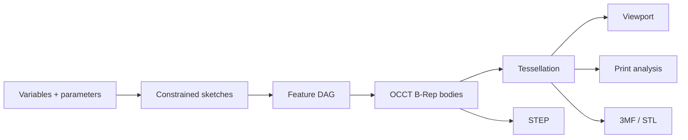

# Geometry and parametrics

## Source of truth

The parametric **feature graph** is the source of design intent. B-Rep is the computed exact body state; the triangle mesh is a derived visualization and manufacturing state.

Parametrics cannot be reconstructed from a mesh, and a visually correct mesh is not proof of a valid solid.

## Geometry conventions

- Right-handed coordinate system with **Z up**.
- Internal document length unit is **millimeter**.
- Domain serialization stores angles in radians, while retaining explicit input-unit metadata.
- Calculations use `float64`.
- The tolerance policy is centralized and versioned.
- UI code never compares geometry with `===` or an arbitrary epsilon.
- Imported units are converted explicitly and recorded in the import report.

Initial tolerance goals, subject to spike validation:

| Parameter | Initial value | Purpose |
|---|---:|---|
| Modeling linear tolerance | `1e-7 mm` or kernel default | Exact operations; never reuse blindly for meshes |
| Sketch solve tolerance | `1e-6 mm` | Constraint residuals |
| Angular tolerance | `1e-8 rad` | Parallel and perpendicular checks |
| Display chord tolerance | Adaptive, default `0.05 mm` | Viewport mesh |
| Export chord tolerance | Profile-driven, default `0.02 mm` | STL and 3MF |

These values are hypotheses. Excessively small tolerances reduce robustness and must be calibrated against the model corpus.

## Feature evaluator

Every feature is a declarative, pure-like record:

- `id`, `kind`, and `schemaVersion`;
- `parameters`;
- `inputs`;
- `references`;
- `suppressed`;
- optional user label and metadata.

The evaluator returns:

- zero or more output bodies;
- OCCT operation history where available;
- generated semantic roles;
- `TopoSignature` values for faces, edges, and vertices;
- validation metrics;
- typed diagnostics;
- content hash.

A feature never mutates its committed input shape. If the OCCT API uses mutable objects, the adapter establishes explicit copy and ownership boundaries.

## Sketch representation

Sketches store analytical entities, not sampled polylines:

- point `(x, y)`;
- line segment;
- circle;
- arc;
- ellipse and B-spline later;
- construction flag;
- constraint records referencing entities and sub-elements;
- dimensional constraints linked to variables or expressions.

The solver receives normalized parameters and constraints and returns solved coordinates, degrees of freedom, residuals, and conflicts. The committed document may cache solved state, but changes to solver version always trigger a fresh solve.

## Sketch profiles

After solving, a separate topology builder:

1. Finds intersections within tolerance.
2. Builds a half-edge graph.
3. Extracts closed loops.
4. Determines outer and inner nesting.
5. Reports open, self-intersecting, and duplicate segments.
6. Creates OCCT wires and faces only from selected profiles.

Preview fills recognized regions so users see the exact profile before extrusion.

## Topological naming problem

An index such as `Face3` or the OCCT edge order is unstable after booleans, fillets, and parameter changes. An index-only reference leads to broken or, worse, incorrectly reassigned features.

### `TopoRef`

A reference contains:

- owning or producing `FeatureId`;
- sub-shape kind;
- semantic role when the operation can provide one, such as `extrude.side(profileEdgeId)` or `extrude.cap.start`;
- kernel history lineage such as `generated`, `modified`, and `deleted`, where available;
- geometry signature;
- adjacency signature;
- user-intent hints such as near point, expected normal/axis, and selection context;
- latest confidence and repair history.

A face signature MAY include surface type, normalized analytical parameters, area, centroid, normal or axis, bounding box, loop count, and neighboring edge signatures. An edge signature may include curve type, length, endpoints, center or axis, and adjacent face roles. Values are quantized according to the tolerance policy.

### Resolution algorithm

1. Exact semantic or history match.
2. Persistent lineage match from the immediate operation.
3. Candidate filtering by kind, surface, and adjacency.
4. Weighted geometry score against the previous signature and intent point.
5. If one candidate passes the threshold and margin, return `resolved`.
6. If candidates are close, return `ambiguous`; never evaluate downstream features silently.
7. If no candidate exists, return `missing` and identify the first broken feature.

Thresholds and weights are versioned. A user repair stores a new intent hint and event without rewriting old history.

### Robust-modeling rules

- By default, attach sketches to origin or datum planes, not arbitrary faces.
- Add datum plane, axis, and point in P1.
- Face attachment is allowed, but the UI shows reference stability.
- Pattern and mirror operations preserve semantic IDs from source elements.
- Fillet and chamfer select edge sets through reference collections, never positional indices.

## Dirty propagation and partial rebuild

- Editing a feature marks all downstream nodes dirty.
- Independent upstream branches retain their caches.
- The evaluator processes nodes in topological order.
- The first failure blocks only dependent descendants; independent bodies remain available.
- The last valid result may be shown as a ghost, but MUST be visibly marked stale and excluded from export by default.

## Tessellation

Each body has at least two levels of detail:

- interactive/display;
- print/export using the configured chord and angular tolerances.

Mesh payload:

- positions and normals as `Float32Array`;
- indices as `Uint32Array`, or `Uint16Array` where possible;
- triangle-to-face mapping;
- edge polylines in separate buffers;
- body and face material IDs;
- bounding box and revision/hash.

Tessellation runs in the worker. The UI never builds an OCCT mesh. Changing display quality invalidates display mesh cache independently of B-Rep.

## B-Rep validation

After every committed modeling operation, check:

- kernel algorithm completion and error status;
- non-null result;
- allowed shape type;
- `BRepCheck` or equivalent shape validity;
- absence of unexpected zero-volume solids;
- expected body and solid count;
- finite metrics;
- optional shape healing only as an explicit operation or import policy.

Healing must not hide material geometry changes. The import report records every applied correction.

## Kernel memory policy

Emscripten/C++ objects requiring `.delete()` have an explicit owner. Persistent document shapes use an adapter-owned registry; operation temporaries use lexical `try/finally` scopes:

- Register persistent or ownership-transferred shapes immediately after creation.
- Delete temporary builders, explorers, progress ranges, locations, transforms, mesh values, and exchange handles in reverse order in `finally`.
- Do not rely on `FinalizationRegistry` as an operation-lifetime boundary.
- Clear OCCT caches that outlive their consumer, including attached display triangulation after STL export and reader/writer-owned STEP state.
- Explicitly remove transferred or disposed shapes from the persistent registry.
- Index permanent document objects by opaque IDs.
- Controlled builds report live allocator bytes and fail post-warmup and per-operation budgets.

## Phase 0 corpus

Minimum models:

- bracket with holes, pattern, and fillet;
- enclosure with shell, lid clearance, and bosses;
- flange with revolve and circular pattern;
- lofted adapter;
- imported STEP plus a mating part;
- intentionally failing boolean and fillet;
- symmetric model with intentionally ambiguous topology;
- large mesh import.

Compare invariants rather than B-Rep bytes: validity, body count, expected topology counts where stable, volume, area, bounding box, semantic reference outcomes, and export round-trip.
