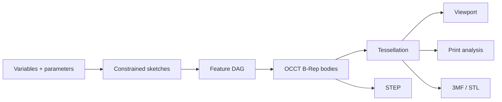

# Geometry and parametrics

## Source of truth

The parametric **feature graph** is the source of design intent. B-Rep is the computed exact body state; the triangle mesh is a derived visualization and manufacturing state.

Parametrics cannot be reconstructed from a mesh, and a visually correct mesh is not proof of a valid solid.

## Geometry conventions

- Right-handed coordinate system with **Z up**.
- Internal document length unit is **millimeter**.
- Domain serialization stores angles in radians, while retaining explicit input-unit metadata.
- Calculations use `float64`.
- The tolerance policy is centralized and versioned.
- UI code never compares geometry with `===` or an arbitrary epsilon.
- Imported units are converted explicitly and recorded in the import report.

The implemented quantity schema v0 covers the first required dimensions without introducing a general expression engine. Length source values in `um`, `mm`, `cm`, `m`, `in`, or `ft` normalize to millimeters; `deg` and `rad` normalize to radians; scalar values retain unit `1`. Every record carries strict source metadata that must recompute to the canonical finite value, and negative zero is normalized before serialization. Optional expression text is retained metadata only and is not evaluated. The initial box and cylinder parameter schemas consume these quantities and bound positive primitive dimensions to `1,000,000 mm`; document display preferences and tolerance-aware UI stepping remain separate concerns.

Initial tolerance goals, subject to spike validation:

| Parameter | Initial value | Purpose |
|---|---:|---|
| Modeling linear tolerance | `1e-7 mm` or kernel default | Exact operations; never reuse blindly for meshes |
| Sketch solve tolerance | `1e-6 mm` | Constraint residuals |
| Angular tolerance | `1e-8 rad` | Parallel and perpendicular checks |
| Display chord tolerance | Adaptive, default `0.05 mm` | Viewport mesh |
| Export chord tolerance | Profile-driven, default `0.02 mm` | STL and 3MF |

These values are hypotheses. Excessively small tolerances reduce robustness and must be calibrated against the model corpus.

## Feature evaluator

Every feature is a declarative, pure-like record:

- `id`, `kind`, and `schemaVersion`;
- `parameters`;
- `inputs`;
- `references`;
- `suppressed`;
- optional user label and metadata.

The evaluator returns:

- zero or more output bodies;
- OCCT operation history where available;
- generated semantic roles;
- `TopoSignature` values for faces, edges, and vertices;
- validation metrics;
- typed diagnostics;
- content hash.

A feature never mutates its committed input shape. If the OCCT API uses mutable objects, the adapter establishes explicit copy and ownership boundaries.

## Sketch representation

Sketches store analytical entities, not sampled polylines:

- point `(x, y)`;
- line segment;
- circle;
- arc;
- ellipse and B-spline later;
- construction flag;
- constraint records referencing entities and sub-elements;
- dimensional constraints linked to variables or expressions.

The solver receives normalized parameters and constraints and returns solved coordinates, degrees of freedom, residuals, and conflicts. The committed document may cache solved state, but changes to solver version always trigger a fresh solve.

ADR-0014 selects the pinned SolveSpace v3.2 subset behind a Zod-validated flat typed-array ABI. Native execution is stateless per solve: parameters, entities, constraints, scalar values, and dragged handles are copied in; solved values, normalized status inputs, residual, and failed constraint handles are copied out. No SolveSpace or C++ pointer is stored in the document or exposed to UI code. Horizontal and vertical dimensions project against immutable sketch axes, concentric constraints share coincident centers, and radius input is converted to the native diameter equation.

## Sketch profiles

After solving, a separate topology builder:

1. Finds intersections within tolerance.
2. Builds a half-edge graph.
3. Extracts closed loops.
4. Determines outer and inner nesting.
5. Reports open, self-intersecting, and duplicate segments.
6. Creates OCCT wires and faces only from selected profiles.

Preview fills recognized regions so users see the exact profile before extrusion.

## Topological naming problem

An index such as `Face3` or the OCCT edge order is unstable after booleans, fillets, and parameter changes. An index-only reference leads to broken or, worse, incorrectly reassigned features.

### `TopoRef`

A reference contains:

- owning or producing `FeatureId`;
- sub-shape kind;
- semantic role when the operation can provide one, such as `extrude.side(profileEdgeId)` or `extrude.cap.start`;
- kernel history lineage such as `generated`, `modified`, and `deleted`, where available;
- geometry signature;
- adjacency signature;
- user-intent hints such as near point, expected normal/axis, and selection context;
- latest confidence and repair history.

The implemented schema is `TopoRef` version `0`. It validates finite normalized signatures with Zod and carries one authoritative semantic role or lineage token when available. Candidate IDs are evaluation-local diagnostics only. OCCT `HashCode` values may join native history to candidates inside one worker evaluation, but MUST NOT cross the worker boundary or enter a saved document.

A face signature MAY include surface type, normalized analytical parameters, area, centroid, normal or axis, bounding box, loop count, and neighboring edge signatures. An edge signature may include curve type, length, endpoints, center or axis, and adjacent face roles. Values are quantized according to the tolerance policy.

### Resolution algorithm

1. Filter candidates by topology kind.
2. Resolve an exact semantic role. A missing or duplicated authoritative role returns `missing` or `ambiguous`; it never falls through to a similar shape.
3. Resolve an exact immediate lineage token. A missing token returns `missing`; multiple descendants are ranked only within that lineage set.
4. When the reference has no authoritative role or lineage, filter by geometry class and score measure, centroid or intent point, direction, bounds, boundary count, and adjacency.
5. If one candidate passes the versioned score threshold and confidence margin, return `resolved`.
6. If candidates are close, return `ambiguous`; never evaluate downstream features silently.
7. If no compatible candidate exists or the best score exceeds the threshold, return `missing` and identify the first broken feature.

Thresholds and weights are versioned. A user repair stores a new intent hint and event without rewriting old history.

SPK-003 implements policy version `1` with a `0.22` maximum score and `0.035` ambiguity margin. Its weights are measure `0.20`, centroid or near-point intent `0.25`, direction `0.20`, bounds `0.15`, boundary count `0.10`, and adjacency `0.10`. These values pass the bounded spike corpus; changing them requires new corpus evidence, not UI tuning.

### Robust-modeling rules

- By default, attach sketches to origin or datum planes, not arbitrary faces.
- Add datum plane, axis, and point in P1.
- Face attachment is allowed, but the UI shows reference stability.
- Pattern and mirror operations preserve semantic IDs from source elements.
- Fillet and chamfer select edge sets through reference collections, never positional indices.

## Dirty propagation and partial rebuild

- Editing a feature marks all downstream nodes dirty.
- Independent upstream branches retain their caches.
- The evaluator processes nodes in topological order.
- The first failure blocks only dependent descendants; independent bodies remain available.
- The last valid result may be shown as a ghost, but MUST be visibly marked stale and excluded from export by default.

`@vibeshape/domain/feature-graph` now implements the pure scheduling boundary. Feature schema v0 binds a stable feature and type identity to bounded JSON parameters, explicit dependencies, declared `TopoRef` inputs, suppression, and optional normalized labels. Graph creation preserves presentation order separately from a deterministic stable topological order and fails closed on invalid records, duplicates, missing dependencies, self-dependencies, undeclared reference owners, and cycles.

The injected evaluator receives only the current immutable feature record, ordered dependency results, and its previous result. Missing cache records and explicit edits mark transitive descendants dirty; independent successful or failed results are reused. A failed or suppressed feature blocks only its dependent branch, while independent branches continue. Thrown and malformed evaluator results become stable diagnostics rather than leaking implementation details. The domain also assembles canonical feature-content identity version `0` from handler-projected semantic parameters, ordered input hashes, slot-relative topology references, and exact runtime/provider metadata. An injected digest port keeps hashing environment-neutral and validates lowercase SHA-256 output. This remains a domain seam: authoritative worker hashing and cache comparison, OCCT transactions, cancellation, stale-geometry retention, persistence, and repair events remain production integration work.

## Tessellation

Each body has at least two levels of detail:

- interactive/display;
- print/export using the configured chord and angular tolerances.

Mesh payload:

- positions and normals as `Float32Array`;
- indices as `Uint32Array`, or `Uint16Array` where possible;
- triangle-to-face mapping;
- edge polylines in separate buffers;
- body and face material IDs;
- bounding box and revision/hash.

Tessellation runs in the worker. The UI never builds an OCCT mesh. Changing display quality invalidates display mesh cache independently of B-Rep.

## B-Rep validation

After every committed modeling operation, check:

- kernel algorithm completion and error status;
- non-null result;
- allowed shape type;
- `BRepCheck` or equivalent shape validity;
- absence of unexpected zero-volume solids;
- expected body and solid count;
- finite metrics;
- optional shape healing only as an explicit operation or import policy.

Healing must not hide material geometry changes. The import report records every applied correction.

## Kernel memory policy

Emscripten/C++ objects requiring `.delete()` have an explicit owner. Persistent document shapes use an adapter-owned registry; operation temporaries use lexical `try/finally` scopes:

- Register persistent or ownership-transferred shapes immediately after creation.
- Delete temporary builders, explorers, progress ranges, locations, transforms, mesh values, and exchange handles in reverse order in `finally`.
- Do not rely on `FinalizationRegistry` as an operation-lifetime boundary.
- Clear OCCT caches that outlive their consumer, including attached display triangulation after STL export and reader/writer-owned STEP state.
- Explicitly remove transferred or disposed shapes from the persistent registry.
- Index permanent document objects by opaque IDs.
- Controlled builds report live allocator bytes and fail post-warmup and per-operation budgets.

## Phase 0 corpus

Minimum models:

- bracket with holes, pattern, and fillet;
- enclosure with shell, lid clearance, and bosses;
- flange with revolve and circular pattern;
- lofted adapter;
- imported STEP plus a mating part;
- intentionally failing boolean and fillet;
- symmetric model with intentionally ambiguous topology;
- large mesh import.

Compare invariants rather than B-Rep bytes: validity, body count, expected topology counts where stable, volume, area, bounding box, semantic reference outcomes, and export round-trip.
