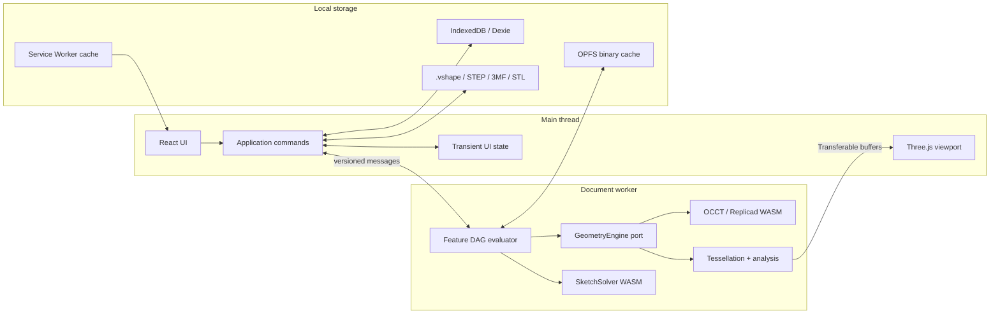
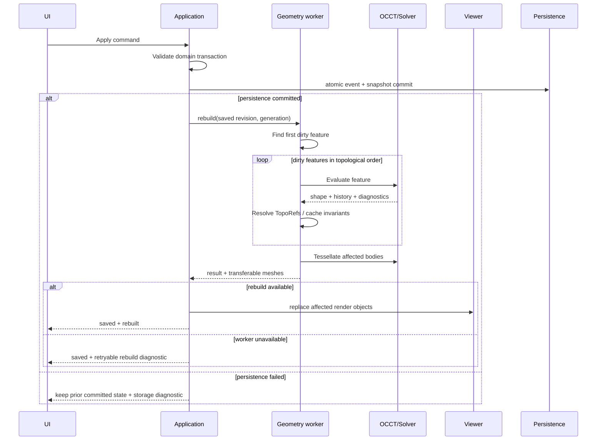

# Architecture

## Decision

VibeShape is a **static local-first web application** that separates the UI process from the geometry process. The required configuration has no backend. The CAD kernel and sketch solver execute as WebAssembly inside workers; the main thread owns the interface and Three.js viewport.



## Layers

### `domain`

Pure TypeScript without DOM, React, Three.js, or OCCT dependencies:

- `Document`, `Feature`, `Sketch`, `Body`, `Variable`, `Material`, and `PrinterProfile`;
- IDs, units, expressions, and parameter types;
- commands, events, undo/redo, and DAG dependency rules;
- invariants and schema migrations;
- typed error states without UI copy.

The domain never contains WASM-class instances and never serializes third-party CAD objects.

### `application`

- use cases for creating, editing, and suppressing features, importing/exporting, and save/recovery;
- preview, commit, and rebuild orchestration;
- generation and revision control;
- transaction boundaries;
- adaptation of domain diagnostics into user workflows.

### `ports`

Minimal stable interfaces:

- `GeometryEngine`;
- `SketchSolver`;
- `ProjectRepository`;
- `BlobStore`;
- `NativeFormatCodec`;
- `CadExchangeCodec`;
- `PrintMeshCodec`;
- `Clock`, `IdGenerator`, and `Telemetry`, with telemetry using a no-op default.

### `adapters`

- Replicad/OpenCascade.js worker;
- SolveSpace-derived WASM solver;
- Three.js renderer and picker;
- Dexie/IndexedDB and OPFS;
- File System Access plus upload/download fallbacks;
- STEP, STL, and 3MF codecs;
- PWA and service worker.

### `ui`

React components, command palette, model tree, property panels, diagnostics, and project library. UI geometry consists of IDs and immutable view models, never kernel handles.

## Monorepo structure

```text
apps/
  web/                    # PWA shell and composition root
packages/
  domain/                 # model, units, commands, events
  application/            # environment-neutral rebuild and use-case coordination
  automation-api/         # versioned bounded query views and dispatch
  automation-host/        # owner-bound draft lifecycle and host policy
  protocol/               # main ↔ worker messages and schema versions
  document-worker/        # document-scoped rebuild runtime and browser client
  geometry-worker/        # evaluator and OCCT adapter
  sketch-solver/          # solver adapter and WASM build
  viewer/                 # Three.js scene, selection, overlays
  persistence/            # IndexedDB, OPFS, migrations, recovery
  formats/                # .vshape, STEP orchestration, STL, 3MF
  print-analysis/         # mesh and build-volume checks
  i18n/                   # ICU catalogs, locale resolution, React provider
  ui/                     # Tailwind v4, shadcn/Radix primitives, tokens
  test-models/            # fixtures and expected invariants
  typescript-config/      # browser, worker, React, and pure-library configs
docs/
```

The root `package.json` declares Bun workspaces for `apps/*` and `packages/*`. Local packages use `workspace:*`; shared React, TypeScript, Tailwind, and test versions use Bun default or named catalogs; `bun.lock` is committed.

This structure is now checked in. `apps/web` renders a static, accessible CAD-shell placeholder through Vite, resolves typed product copy through `@vibeshape/i18n`, and proves Tailwind discovery across `@vibeshape/ui`. `packages/protocol` contains document protocol v2 and geometry protocol v7; `packages/geometry-worker` contains the production-oriented box, cylinder, and dependency-aware Boolean evaluation seam alongside the isolated SPK-001 operations. `packages/domain` contains the first narrow document, variable, and feature-command slice, including canonical quantity schemas, dimensional expression schema v0, strict document and feature records, whole-DAG validation, deterministic events and replay, revision-safe drafts, command and feature-type module descriptors, unit-aware box/cylinder and Boolean/Subtract schemas, asynchronous rebuild scheduling, and trusted registries. `packages/application` accepts a committed document snapshot, evaluates its variable DAG, resolves trusted feature parameters, constructs the derived graph, derives changed roots from prior resolved feature records, and composes the pure scheduler, canonical content hashing, a serializable geometry port, previous-state validation, and authoritative derived-geometry selection. It also owns the adapter-neutral persisted document session: ordinary commands renew the writer lease, commit atomically through a repository port, and only then rebuild the saved semantic snapshot. A persistence failure advances neither session state nor geometry; an infrastructure rebuild failure leaves the saved revision available for retry. `packages/document-worker` owns per-document rebuild state, generation ordering, sequential execution, the geometry engine, transferable mesh cloning, health reporting, and document disposal outside the main thread. Its document-scoped session serializes main-thread requests, retains only the latest successfully rebuilt semantic snapshot including variables, detects fatal client failures, replaces the worker, increments the generation, and retries one recoverable rebuild. Rebuild state is bound to document, revision, worker generation, geometry environment, and mesh policy; a generation change rebuilds every native shape, while document labels, feature labels, and expression edits with equivalent resolved values do not invalidate geometry. `apps/web` composes the application session with the Dexie repository, lease adapter, and versioned document-worker session; the browser harness proves interrupted reload recovery and clean save/reopen rebuilds. `packages/automation-api` contains strict draft-lifecycle schemas, the bounded revision-tagged document-summary view, and trusted query dispatch. `packages/automation-host` binds host-generated drafts to a complete actor identity, serializes lifecycle operations, enforces inactivity and count limits, previews through the query dispatcher, and commits document, variable, or feature records only through an injected atomic compare-and-commit port. `packages/formats` owns the SPK-004 deterministic 3MF Core writer and strict export report. `packages/persistence` owns the SPK-005 strict Dexie records, atomic repository, checksum recovery, writer leases, progressive storage capability probing, and verified disposable OPFS cache. These packages do not yet provide variable rename/refactor, the richer expression grammar, undo/redo, autosave scheduling, confirmation UI, paired automation sessions, `.vshape`, persistent derived-cache promotion, BroadcastChannel ownership UX, or production export orchestration. The viewer and print-analysis package entry points remain intentionally empty until their owning work introduces tested contracts and dependency evidence.

The current web composition extends the original shell with a persisted Variables workspace. Its semantic table keeps incomplete rows outside the committed document, reuses the same DOM through TanStack Form, previews dimensional results, and applies one whole-table command through a transaction-tagged persisted draft. The persistence repository validates multi-event replay and commits every draft event plus the final snapshot in one IndexedDB transaction; only the final saved revision is rebuilt.

Lint and import rules enforce package boundaries. For example, `domain` cannot import `viewer`, `geometry-worker`, or `ui`.

`packages/ui` exports only visual primitives, hooks, tokens, and CSS. CAD-specific compositions such as `ModelTree`, `FeatureEditor`, and `PrintCheckPanel` remain in `apps/web` or a later feature package. The UI package cannot import domain or geometry packages.

`packages/i18n` exports locale resolution, safe local preference storage, catalog validation and merging, the React provider, and typed `use-intl` hooks. It is independent of application, UI, domain, persistence, and geometry packages. The complete contract is defined in [Internationalization](internationalization.md) and [ADR-0011](../adr/0011-use-intl-localization-layer.md).

## Main-to-worker protocol

Every message:

- includes `protocolVersion`, `requestId`, `documentId`, `revision`, and `generation`;
- is validated with runtime schemas on both sides;
- contains only structured-clone data;
- transfers large typed arrays as `Transferable` objects instead of copying them;
- reports a progress stage and typed diagnostic;
- never exposes an OCCT pointer or handle.

Minimum commands:

- `initializeEngine`;
- `openDocumentSnapshot`;
- `previewCommand`;
- `commitRevision`;
- `rebuildFromFeature`;
- `tessellateBodies`;
- `analyzeBodies`;
- `importCad`;
- `exportCad`;
- `disposeDocument`;
- `healthCheck`.

In alpha, `cancel(requestId)` is a **logical cancellation**: results from an obsolete generation are ignored. A synchronous OCCT call cannot always be interrupted safely. If a call exceeds its timeout or hangs, the worker is restarted and the document is restored from the latest committed snapshot.

Document protocol v2 implements `rebuildDocument`, `disposeDocument`, and `healthCheck` between the main thread and the document worker. A rebuild request carries one bounded committed snapshot including variables, mesh policy, revision, and generation. The runtime rejects envelope/snapshot identity drift and stale queued generations, owns the previous successful state, initializes the engine lazily, and returns evaluation records plus cloned transferable meshes so worker-retained cache buffers are never detached. The client validates response schemas, request/response type correlation, and the complete request envelope before settling a request; worker `error`, `messageerror`, and timeout paths reject pending work immediately or at the configured deadline. The document session replaces a failed client, increments generation, and retries one recoverable rebuild from semantic data rather than native or mesh state.

Geometry protocol v7 remains the narrower internal evaluation contract and implements `initializeEngine`, `evaluateFeature`, `cancel`, `disposeDocument`, and `healthCheck` alongside isolated spike operations. `evaluateFeature` accepts built-in box, cylinder, and ordered two-input Boolean/Subtract identities. It verifies the exact runtime environment, recomputed SHA-256 digest, dependency count, unique feature IDs, canonical hash-slot order, and same-document B-Rep availability before or during OCCT execution; reports validation/evaluation/tessellation progress; returns typed failures; and transfers positions, normals, triangle indices, and triangle-to-face IDs without copying. The broader minimum command set above remains the target contract rather than a claim of current implementation.

## Two document states

- **Committed domain state** is the sole source of parametric truth. It is serialized and participates in undo/redo.
- **Derived geometry state** includes OCCT shapes, meshes, BVHs, B-Rep caches, and analysis. It can always be rebuilt.

Preview is a third, short-lived state but can never enter autosave as a confirmed operation.

## Rebuild pipeline



The UI feature-list order usually matches topological order, but the real structure is a DAG. Reordering is allowed only when it creates no cycle and all inputs remain available before the feature.

## Caching

Every feature has a content hash derived from:

- operation type and schema version;
- normalized parameters and units;
- input-feature hashes;
- canonical references;
- geometry adapter and OCCT versions;
- tolerance-policy version.

A matching hash MAY reuse B-Rep and tessellation caches. Every cache is untrusted derived data. Version or checksum mismatches delete and rebuild it.

The domain now defines canonical feature-content identity schema version `0`. Trusted feature-type handlers project validated records into bounded semantic parameters; primitive projections retain canonical millimeter values but exclude source-unit presentation metadata, while Boolean/Subtract contributes its operation and two ordered input hashes. Dependency hashes remain ordered by declared input slots, and topology-reference owners become slot indices so equivalent documents do not diverge solely because their feature UUIDs differ. Feature UUID, label, and suppression are not geometry content. The environment identity includes exact host API, adapter, kernel, optional source revision, modeling-tolerance policy, and built-in or exact-integrity extension provider metadata. Canonical JSON sorts object keys while preserving array order. The domain validates the output of an injected SHA-256 port. The application rebuild coordinator validates complete previous rebuild snapshots against source feature records, successful hashes, document identity, non-future revision, worker generation, the exact geometry environment, and the mesh policy. It derives changed roots from canonical scheduling fingerprints; an environment, tessellation-policy, or worker-generation change invalidates all derived records. It otherwise reuses only clean matching records, computes dirty identities sequentially, and exposes only geometry whose hash matches the final successful graph record. The protocol-v7 worker independently reproduces serialization and the digest and owns one in-memory per-document B-Rep entry per feature. Boolean inputs resolve by request-only UUID plus exact canonical slot hash; UUIDs do not enter content identity. These caches are disposable and never authoritative. Persisted save/reopen rebuilds deliberately start without native cache state; promotion of checksum-validated derived-cache records remains open.

## Hangs and memory

- One geometry worker per active document in alpha.
- CAD jobs execute sequentially to avoid shared mutable OCCT state.
- Every temporary kernel object is released with a `finally` or RAII-style facade.
- Closing a document invokes `disposeDocument` and verifies live-handle counts.
- The viewer disposes `BufferGeometry`, materials, textures, and render targets when replacing them.
- A soft memory threshold evicts mesh and B-Rep caches.
- A hard threshold or worker crash triggers a safe restart and recovery.

## Extensibility

The architecture follows a microkernel boundary. Trusted kernel services own transactions, revisions, history, feature scheduling, persistence and geometry ports, capability policy, recovery, and audit provenance. Product functionality such as sketching, part design, exchange, and print analysis is organized as cohesive first-party modules with explicit registries. [ADR-0013](../adr/0013-microkernel-modules-and-mcp-automation.md) defines this boundary.

The executable third-party extension platform is outside alpha, but the foundation must remain extension-ready. [ADR-0012](../adr/0012-capability-based-extension-platform.md) accepts reduced-scope profiles for deterministic no-import WebAssembly feature modules, opaque-origin iframe UI, and bounded compute modules while rejecting arbitrary same-origin workspace JavaScript.

Durable constraints apply before the SDK exists:

- built-in feature types register through explicit stable identifiers rather than switch statements scattered across packages;
- commands and UI contribution points use registries with ownership metadata and eligibility checks;
- domain and worker protocols accept serializable feature-type and extension-lock metadata without importing an extension runtime;
- feature and cache hashes reserve the exact extension ID, version, API version, and integrity identity;
- raw kernel handles, application stores, React nodes, file handles, and ambient browser APIs never become extension contracts;
- `.vshape` never executes embedded code, auto-installs a package, or silently resolves a missing version from the network.
- built-in UI, extensions, tests, and automation request the same serializable domain commands rather than mutating stores or documents directly;
- command descriptors reserve machine-readable schemas, ownership, eligibility, side-effect annotations, preview behavior, revision preconditions, cancellation, and diagnostics;
- bounded revision-tagged query views back accessibility, diagnostics, tests, and later MCP resources without exposing internal object graphs; the initial document-summary view proves this contract.

The private `@vibeshape/extension-spike` package records SPK-006 evidence without creating a public API. Product execution remains disabled until the accepted seams gain a modeling ABI, portable memory policy, production document transactions, persisted update/rollback, and recovery rebuild coverage. See [Extension architecture](extensions.md) and [SPK-006 evidence](../spikes/spk-006-extension-sandbox.md).

The initial AI automation path is a local MCP bridge over those same query and command contracts. The bridge never owns document state or bypasses draft, preview, confirmation, commit, undo, and persistence behavior. See [Automation and MCP architecture](automation-and-mcp.md).
