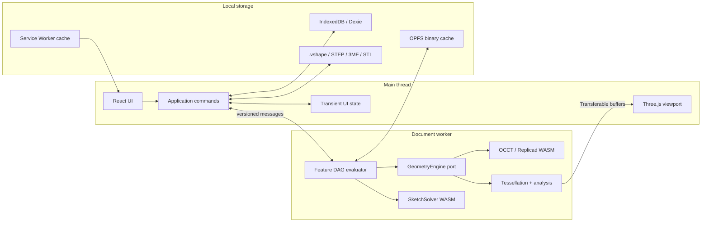
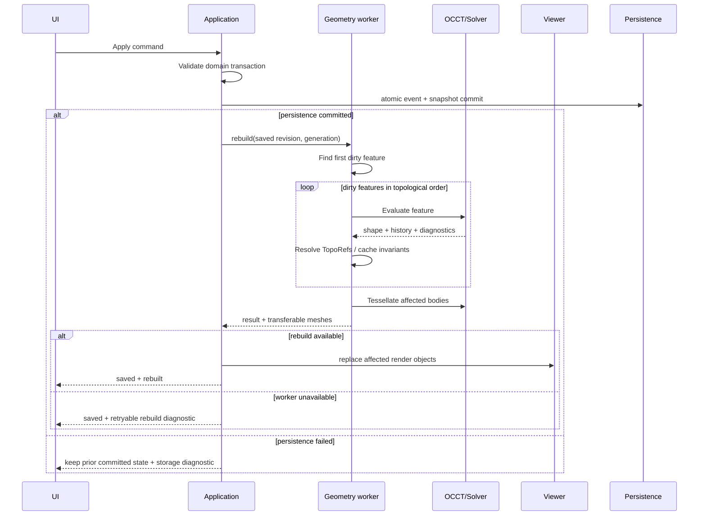

# Architecture

## Decision

VibeShape is a **static local-first web application** that separates the UI process from the geometry process. The required configuration has no backend. The CAD kernel and sketch solver execute as WebAssembly inside workers; the main thread owns the interface and Three.js viewport.



## Layers

### `domain`

Pure TypeScript without DOM, React, Three.js, or OCCT dependencies:

- `Document`, `Feature`, `Sketch`, `Body`, `Variable`, `Material`, and `PrinterProfile`;
- IDs, units, expressions, and parameter types;
- commands, events, undo/redo, and DAG dependency rules;
- invariants and schema migrations;
- typed error states without UI copy.

The domain never contains WASM-class instances and never serializes third-party CAD objects.

### `application`

- use cases for creating, editing, and suppressing features, importing/exporting, and save/recovery;
- preview, commit, and rebuild orchestration;
- generation and revision control;
- transaction boundaries;
- adaptation of domain diagnostics into user workflows.

### `ports`

Minimal stable interfaces:

- `GeometryEngine`;
- `SketchSolver`;
- `ProjectRepository`;
- `BlobStore`;
- `NativeFormatCodec`;
- `CadExchangeCodec`;
- `PrintMeshCodec`;
- `Clock`, `IdGenerator`, and `Telemetry`, with telemetry using a no-op default.

### `adapters`

- Replicad/OpenCascade.js worker;
- SolveSpace-derived WASM solver;
- Three.js renderer and picker;
- Dexie/IndexedDB and OPFS;
- File System Access plus upload/download fallbacks;
- STEP, STL, and 3MF codecs;
- PWA and service worker.

### `ui`

React components, command palette, model tree, property panels, diagnostics, and project library. UI geometry consists of IDs and immutable view models, never kernel handles.

## Monorepo structure

```text
apps/
  web/                    # PWA shell and composition root
  slicer-bridge/          # authenticated loopback-to-desktop handoff
packages/
  domain/                 # model, units, commands, events
  application/            # environment-neutral rebuild and use-case coordination
  automation-api/         # versioned bounded query views and dispatch
  automation-host/        # owner-bound draft lifecycle and host policy
  protocol/               # main ↔ worker messages and schema versions
  document-worker/        # document-scoped rebuild runtime and browser client
  geometry-worker/        # evaluator and OCCT adapter
  sketch-solver/          # solver adapter and WASM build
  viewer/                 # Three.js scene, selection, overlays
  persistence/            # IndexedDB, OPFS, migrations, recovery
  formats/                # .vshape, STEP orchestration, STL, 3MF
  print-analysis/         # mesh and build-volume checks
  slicer-handoff/         # strict browser-to-bridge protocol
  i18n/                   # ICU catalogs, locale resolution, React provider
  ui/                     # Tailwind v4, shadcn/Radix primitives, tokens
  test-models/            # fixtures and expected invariants
  typescript-config/      # browser, worker, Bun, React, and pure-library configs
docs/
```

The root `package.json` declares Bun workspaces for `apps/*` and `packages/*`. Local packages use `workspace:*`; shared React, TypeScript, Tailwind, and test versions use Bun default or named catalogs; `bun.lock` is committed.

This structure is now checked in. `apps/web` renders an accessible CAD shell through Vite, resolves typed product copy through `@vibeshape/i18n`, and proves Tailwind discovery across `@vibeshape/ui`. `packages/protocol` contains document protocol v17, including strict display-unit preservation, committed or transient-draft sketch solve, deterministic profile-result and signed line-chain Offset records, and bounded transferable saved-sketch display records with selector-backed profile regions, plus geometry protocol v12 with bounded transient analytical extrusion profiles and rebuild-local exact vertex, linear-edge, circle-edge, arc-edge, ellipse-edge, and elliptical-arc-edge reference geometry; `packages/geometry-worker` contains production-oriented box, cylinder, selector-backed new/add/remove/intersect extrusion, dependency-aware Boolean, exact B-Rep STEP/STL export, and fixed-tolerance print-mesh export seams alongside the isolated SPK-001 operations. `packages/domain` contains the document, variable, analytical sketch, and feature-command slices, including canonical quantity schemas, dimensional expression schema v0, strict document and feature records, whole-DAG validation, deterministic events and replay, revision-safe drafts, command and feature-type module descriptors, unit-aware box/cylinder, selector-backed extrusion, and Boolean/Subtract schemas, asynchronous rebuild scheduling, and trusted registries. `packages/application` accepts a committed document snapshot, evaluates its variable DAG, resolves trusted feature parameters, constructs the derived graph, derives changed roots from prior resolved feature records, and composes the pure scheduler, canonical content hashing, transient feature-content preparation, a serializable geometry port, previous-state validation, and authoritative derived-geometry selection. It also owns the adapter-neutral persisted document session: ordinary commands renew the writer lease, commit atomically through a repository port, and only then rebuild the saved semantic snapshot. A persistence failure advances neither session state nor geometry; an infrastructure rebuild failure leaves the saved revision available for retry. Export remains available to a read-only session because it mutates neither semantic state nor the writer lease. `packages/document-worker` owns per-document semantic sketch and rebuild state, exact-revision sketch solving, deterministic profile extraction, selector resolution and analytical extrusion-content materialization, exact support-frame projection of solved or authored fallback sketch display, terminal-body export selection, 3MF mesh-identity verification and writer orchestration, generation ordering, sequential execution, the SolveSpace and geometry engines, transferable mesh, sketch-display, and file ownership, health reporting, and document disposal outside the main thread. Its document-scoped session serializes main-thread requests, retains only the latest successfully rebuilt semantic snapshot including display units, variables, and sketches, detects fatal client failures, replaces the worker, increments generation, rebuilds that snapshot, and retries one recoverable solve, export, or rebuild. Rebuild state is bound to document, revision, worker generation, geometry environment, and mesh policy; a generation change rebuilds every native shape, while document labels, feature labels, and expression edits with equivalent resolved values do not invalidate geometry. `apps/web` composes the application session with the Dexie repository, lease adapter, versioned document-worker session, and native-format codec; its current product paths atomically replace the Variables table, explicitly rename a committed variable through one revisioned refactor command, author transient interactive sketches through shared domain operations and worker-owned live solves, create or edit Boxes and Cylinders whose dimensions may retain `#variable` expressions, create or edit selector-backed extrusion whose distance may retain a `#variable` expression and whose modifying operations carry one explicit terminal target dependency, rebuild schema-valid unsaved extrusion drafts under disposable document identities, create or edit Boolean/Subtract features with ordered target and tool dependencies, download rebuilt terminal bodies through a localized 3MF/STEP/STL dialog, send generated 3MF through the remembered authenticated slicer handoff, and download or open `.vshape` semantic backups through a separate Project dialog. Rename rewrites exact grammar tokens in document formulas and project Quantity sources while preserving stable variable and feature IDs. Feature editing emits a full-record `org.vibeshape.feature.update` while preserving identity, label, references, suppression, unchanged source expressions, and all record fields not owned by the visible operation; primitive centered state, extrusion profile, symmetric state, operation and target, and Boolean dependency order remain explicit. `packages/slicer-handoff` owns the strict versioned browser-to-loopback schemas without CAD or native authority. `apps/slicer-bridge` pairs one exact application origin, accepts only bounded authenticated 3MF handoffs for allowlisted slicer IDs, writes owned expiring temporary files, and launches a reviewed executable argument array without a shell. `packages/viewer` owns a raw Three.js/WebGL2 adapter that receives terminal authoritative worker meshes, explicitly marked disposable preview meshes, saved-sketch display transfers with transient selectable profile regions, and transient selectable sketch/model reference candidates; it binds typed arrays without converting them to ordinary arrays, fits an orthographic Z-up camera, renders on demand, and explicitly disposes every replaced GPU resource. It raycasts authoritative rendered triangles for exact face preselection and selection, and raycasts only supplied point, line, and curve candidate overlays while graphical Use is active. It keeps preview geometry outside hit testing, publishes an accessible DOM summary, and clears every transient candidate and face identity on replacement rather than treating renderer-local IDs as stable topology. The browser harness proves interrupted reload recovery, clean save/reopen rebuilds, persisted variable-driven Box, Cylinder, interactive sketch, saved-sketch 3D visibility, exact extrusion creation and editing, unsaved exact create/edit extrusion preview and cancellation, OCCT volume and bounds for each extrusion operation, ordered Boolean/Subtract creation and editing, variable refactor, real WebGL2 rendering, rendered-face selection, multi-object 3MF plus multi-body STEP/STL downloads, remembered slicer fallback and authenticated handoff, and fresh-storage `.vshape` import with variable-source preservation and geometry rebuild. `packages/automation-api` contains strict draft-lifecycle schemas, the bounded revision-tagged document-summary view, and trusted query dispatch. `packages/automation-host` binds host-generated drafts to a complete actor identity, serializes lifecycle operations, enforces inactivity and count limits, previews through the query dispatcher, and commits document, variable, or feature records only through an injected atomic compare-and-commit port. `packages/formats` owns the SPK-004 deterministic 3MF Core writer, the validated face-local triangle-soup welding adapter used by the product export path, and the deterministic, replay-verified `.vshape` v0 codec. `packages/persistence` owns the SPK-005 strict Dexie records, atomic repository, checksum recovery, verified portable-project reads and imports, writer leases, progressive storage capability probing, and verified disposable OPFS cache. These packages do not yet provide spline and other non-analytical curved model-edge Use or general body/edge/vertex selection filters, the richer expression grammar, extension-specific refactor contributions, committed document undo/redo, autosave scheduling, paired automation sessions, `.vshape` migrations or restore/copy policy, persistent derived-cache promotion, BroadcastChannel ownership UX, signed slicer-bridge distribution, configurable print-quality export profiles, placement, or persistent reports. The print-analysis package entry point remains intentionally empty until its owning work introduces tested contracts and dependency evidence.

The explicit-target Revolve slice follows the existing Extrude authority boundary. Domain schema version
2 stores `new`, `add`, `remove`, or `intersect` plus one ordered target dependency and any distinct
profile-support dependency; version 1 remains registered as a read-only-compatible new-body contract.
The document worker materializes only transient analytical profile and world-axis content. The geometry
worker builds one disposable revolution tool, applies Fuse, Cut, or Common against the first dependency,
and retains only a valid positive-volume single-solid result. The web form owns cycle-safe target choice,
preview, edit, and version-1-to-version-2 write-forward behavior.

The sketch-support selection slice keeps renderer and document identity separate. `packages/viewer` owns transient XY, XZ, and YZ meshes, raycasting, preselection, and deterministic GPU disposal. `apps/web` activates those datums only while the create-sketch command requires support, mirrors the current and hovered plane into accessible DOM state, and accepts only the semantic `xy`, `xz`, or `yz` value into the unsaved sketch draft. No Three.js object or intersection identity crosses into the domain record.

Document protocol v17 carries the additive stable earlier-sketch line Pierce reference and the stable
model-pierce-point wire variant. The domain
record owns only source and projected identities; `packages/application` computes exact bounded
line/support-plane intersections; `packages/document-worker` recursively solves the source and materializes
the current point; and `apps/web` owns selection-first graphical picking, repair, and presentation. The
solver receives the result through the existing read-only external-point input, so no renderer or transient
world coordinate becomes persistent authority.

The project-preview slice keeps this authority boundary intact. `packages/viewer` deterministically projects a bounded sample of authoritative terminal mesh triangles into a renderer-owned SVG grammar. `apps/web` requests that preview only after a successful exact-revision rebuild. `packages/persistence` validates the restricted SVG bytes, stores them by document and revision in the additive schema-v2 `projectThumbnails` table, omits stale or invalid records without blocking project access, and removes the derived record with project deletion. Preview generation and copy happen outside semantic commit publication, and `.vshape` remains semantic-only.

The current web composition extends the original shell with a persisted Variables workspace and reusable Box, Cylinder, selector-backed Extrusion, and Boolean/Subtract parameter workflows. The primary shell path is sketch-first: the empty task starts a sketch; Extrude and Revolve remain registered icon commands while that sketch is open and persist it before opening their feature tasks; Finish returns to the 3D Model workspace with the exact saved sketch visible, selected, and independently hideable; and the same profile-driven commands remain eligible without losing the chosen closed profile. The sketch task footer contains only Cancel and Finish sketch. Direct primitives remain in a secondary advanced path. Sketch-tree activation enters edit mode directly and restores authored dimensions; no redundant Edit action is required. The semantic variable table keeps incomplete rows outside the committed document, reuses the same DOM through TanStack Form, previews dimensional results, and applies one whole-table command through a transaction-tagged persisted draft. State-agnostic primitive and extrusion panels own the presentation contracts, while separate Box, Cylinder, and Extrusion TanStack Form adapters own their raw expressions, validation, and record construction. Extrusion v2 validates `New` with no dependency and Add/Remove/Intersect with exactly one explicit target dependency; the form offers terminal solids, retains an edited target, excludes cycle-forming descendants, and publishes a debounced schema-valid draft with one stable feature identity. `EditorWorkspace` rebuilds that draft in a disposable document-worker session under a separate document identity, compares terminal content hashes with committed geometry, ignores stale results, and supplies changed meshes to the viewer as a translucent non-selectable preview. Cancel or unmount terminates the preview session; Apply still emits one ordinary command. The Boolean panel follows the same layering rule with native uncontrolled `NativeSelectField` controls and a separate TanStack adapter; its feature composition assigns the first dependency to the target and the second to the subtracting tool, rejects duplicate selections, and excludes the edited feature plus transitive dependents that would create a cycle. All four feature task flows support create and edit and emit an ordinary `org.vibeshape.feature.add` or `org.vibeshape.feature.update` command only after exact validation. Feature-tree activation opens the matching record; successful update closes the task and every failure preserves the visible buffer. An edit task also exposes dependency-safe leaf removal through `org.vibeshape.feature.remove`: direct dependents block the command with visible labels, while a controlled AlertDialog commits once and remains open on failure. A sketch referenced by an extrusion is likewise protected from removal. The persistence repository validates multi-event replay and commits every draft event plus the final snapshot in one IndexedDB transaction; only saved semantic revisions rebuild.

Transient editor coordination now lives in a per-document vanilla Zustand store under `apps/web`,
with Immer middleware and selector-based React subscriptions. It owns workspace, tools, viewport
selection, unsaved sketch state, sketch-local history, profile selection, and shell overlays. Initial
document hydration retains early interaction, while a later identity change replaces the store and
discards the unfinished session. The store never becomes a
document, form, persistence, worker, solver, geometry, or extension authority; Apply and Finish still
use the same revisioned command path described above.

Lint and import rules enforce package boundaries. For example, `domain` cannot import `viewer`, `geometry-worker`, or `ui`.

`packages/ui` exports only visual primitives, hooks, tokens, and CSS. CAD-specific compositions such as `ModelTree`, `FeatureEditor`, and `PrintCheckPanel` remain in `apps/web` or a later feature package. The UI package cannot import domain or geometry packages.

`packages/i18n` exports locale resolution, safe local preference storage, catalog validation and merging, the React provider, and typed `use-intl` hooks. It is independent of application, UI, domain, persistence, and geometry packages. The complete contract is defined in [Internationalization](internationalization.md) and [ADR-0011](../adr/0011-use-intl-localization-layer.md).

## Main-to-worker protocol

Every message:

- includes `protocolVersion`, `requestId`, `documentId`, `revision`, and `generation`;
- is validated with runtime schemas on both sides;
- contains only structured-clone data;
- transfers large typed arrays as `Transferable` objects instead of copying them;
- reports a progress stage and typed diagnostic;
- never exposes an OCCT pointer or handle.

Minimum commands:

- `initializeEngine`;
- `openDocumentSnapshot`;
- `previewCommand`;
- `commitRevision`;
- `rebuildFromFeature`;
- `tessellateBodies`;
- `analyzeBodies`;
- `importCad`;
- `exportCad`;
- `disposeDocument`;
- `healthCheck`.

In alpha, `cancel(requestId)` is a **logical cancellation**: results from an obsolete generation are ignored. A synchronous OCCT call cannot always be interrupted safely. If a call exceeds its timeout or hangs, the worker is restarted and the document is restored from the latest committed snapshot.

Document protocol v17 implements `rebuildDocument`, `solveSketch`, `exportDocument`, `disposeDocument`, and `healthCheck` between the main thread and the document worker. A rebuild request carries one bounded committed snapshot including project display units, variables, analytical sketches with compound signed line-chain Offset constraints and optional stable planar-face supports, features, mesh policy, revision, and generation. The runtime rejects envelope/snapshot identity drift and stale queued generations, owns the previous successful semantic and derived state, and initializes native engines lazily. `solveSketch` requires that exact rebuilt document, revision, and generation. It resolves variables from committed state and may compile either the committed sketch or one complete schema-valid transient draft with the requested sketch identity, including a new unsaved supported sketch. The request-owned draft never enters worker state, persistence, history, `.vshape`, or feature evaluation. The worker compiles stable sketch records into ephemeral SolveSpace handles, accepts stable-ID continuation and drag targets, and returns solved stable IDs, status, degrees of freedom, residual, conflicts, exact solver-build identity, and bounded analytical profile loops with diagnostics. A successful rebuild also transfers one bounded, exact-support-frame 3D line and point display record per resolvable saved sketch. A successful solve adds bounded local profile loops with canonical boundary selectors; the viewer triangulates those disposable loops with holes for hover and click selection. It reuses any solve already required by profile-feature preparation, distinguishes construction geometry, falls back to authored coordinates when a non-feature-owning solve fails, and omits unresolved support rather than guessing a frame. Line and point arrays, profile samples, support-frame copies, and viewer triangles are derived and never persisted; only a selected feature's canonical profile selector may enter semantic feature parameters. Export requires the same exact state and transfers non-empty 3MF, STEP, or binary STL bytes without exposing native shapes. STEP and STL consume exact shapes directly; 3MF verifies one print mesh per requested terminal feature before deterministic packaging. The client validates response schemas, request/response type correlation, and the complete request envelope before settling a request. The document session replaces a failed client, increments generation, rebuilds from semantic data rather than native or mesh state, and retries one recoverable rebuild, solve, or export.

Geometry protocol v12 remains the narrower internal evaluation contract and implements `initializeEngine`, `evaluateFeature`, `cancel`, `disposeDocument`, and `healthCheck` alongside isolated spike operations. `evaluateFeature` accepts built-in Box, Cylinder, ordered Boolean/Subtract, and selector-backed Extrusion identities. It validates bounded topology references against canonical dependency input indices and accepts one exact right-handed extrusion frame resolved from an origin plane or supported planar feature face. It verifies the exact runtime environment, recomputed SHA-256 digest, dependency count, unique feature IDs, canonical hash-slot order, and same-document B-Rep availability before or during OCCT execution; reports validation/evaluation/tessellation progress; returns typed failures; and transfers positions, normals, triangle indices, triangle-to-face IDs, evaluation-local topology candidates, and disposable exact vertex, linear-edge, circle-edge, arc-edge, ellipse-edge, and elliptical-arc-edge reference geometry without copying or exposing native topology IDs. The broader minimum command set above remains the target contract rather than a claim of current implementation.

## Two document states

- **Committed domain state** is the sole source of parametric truth. It is serialized and participates in undo/redo.
- **Derived geometry state** includes OCCT shapes, meshes, BVHs, B-Rep caches, and analysis. It can always be rebuilt.

Preview is a third, short-lived state but can never enter autosave as a confirmed operation.

## Rebuild pipeline



The UI feature-list order usually matches topological order, but the real structure is a DAG. Reordering is allowed only when it creates no cycle and all inputs remain available before the feature.

## Caching

Every feature has a content hash derived from:

- operation type and schema version;
- normalized parameters and units;
- input-feature hashes;
- canonical references;
- geometry adapter and OCCT versions;
- tolerance-policy version.

A matching hash MAY reuse B-Rep and tessellation caches. Every cache is untrusted derived data. Version or checksum mismatches delete and rebuild it.

The domain now defines canonical feature-content identity schema version `0`. Trusted feature-type handlers project validated records into bounded semantic parameters; primitive projections retain canonical millimeter values but exclude source-unit presentation metadata, while Boolean/Subtract contributes its operation and two ordered input hashes. Dependency hashes remain ordered by declared input slots, and topology-reference owners become slot indices so equivalent documents do not diverge solely because their feature UUIDs differ. Feature UUID, label, and suppression are not geometry content. The environment identity includes exact host API, adapter, kernel, optional source revision, modeling-tolerance policy, and built-in or exact-integrity extension provider metadata. Canonical JSON sorts object keys while preserving array order. The domain validates the output of an injected SHA-256 port. The application rebuild coordinator validates complete previous rebuild snapshots against source feature records, successful hashes, document identity, non-future revision, worker generation, the exact geometry environment, and the mesh policy. It derives changed roots from canonical scheduling fingerprints; an environment, tessellation-policy, or worker-generation change invalidates all derived records. It otherwise reuses only clean matching records, computes dirty identities sequentially, and exposes only geometry whose hash matches the final successful graph record. The protocol-v11 worker independently reproduces serialization and the digest and owns one in-memory per-document B-Rep entry per feature. Boolean inputs resolve by request-only UUID plus exact canonical slot hash; UUIDs do not enter content identity. These caches are disposable and never authoritative. Persisted save/reopen rebuilds deliberately start without native cache state; promotion of checksum-validated derived-cache records remains open.

## Hangs and memory

- One geometry worker per active document in alpha.
- CAD jobs execute sequentially to avoid shared mutable OCCT state.
- Every temporary kernel object is released with a `finally` or RAII-style facade.
- Closing a document invokes `disposeDocument` and verifies live-handle counts.
- The viewer disposes replaced surface and edge `BufferGeometry` resources immediately; unmount additionally disposes transient datum geometries and materials, shared materials, OrbitControls, and `WebGLRenderer`. Future textures and render targets follow the same owner-bound rule.
- A soft memory threshold evicts mesh and B-Rep caches.
- A hard threshold or worker crash triggers a safe restart and recovery.

## Extensibility

The architecture follows a microkernel boundary. Trusted kernel services own transactions, revisions, history, feature scheduling, persistence and geometry ports, capability policy, recovery, and audit provenance. Product functionality such as sketching, part design, exchange, and print analysis is organized as cohesive first-party modules with explicit registries. [ADR-0013](../adr/0013-microkernel-modules-and-mcp-automation.md) defines this boundary.

The executable third-party extension platform is outside alpha, but the foundation must remain extension-ready. [ADR-0012](../adr/0012-capability-based-extension-platform.md) accepts reduced-scope profiles for deterministic no-import WebAssembly feature modules, opaque-origin iframe UI, and bounded compute modules while rejecting arbitrary same-origin workspace JavaScript.

Durable constraints apply before the SDK exists:

- built-in feature types register through explicit stable identifiers rather than switch statements scattered across packages;
- commands and UI contribution points use registries with ownership metadata and eligibility checks;
- domain and worker protocols accept serializable feature-type and extension-lock metadata without importing an extension runtime;
- feature and cache hashes reserve the exact extension ID, version, API version, and integrity identity;
- raw kernel handles, application stores, React nodes, file handles, and ambient browser APIs never become extension contracts;
- `.vshape` never executes embedded code, auto-installs a package, or silently resolves a missing version from the network.
- built-in UI, extensions, tests, and automation request the same serializable domain commands rather than mutating stores or documents directly;
- command descriptors reserve machine-readable schemas, ownership, eligibility, side-effect annotations, preview behavior, revision preconditions, cancellation, and diagnostics;
- bounded revision-tagged query views back accessibility, diagnostics, tests, and later MCP resources without exposing internal object graphs; the initial document-summary view proves this contract.

The private `@vibeshape/extension-spike` package records SPK-006 evidence without creating a public API. Product execution remains disabled until the accepted seams gain a modeling ABI, portable memory policy, production document transactions, persisted update/rollback, and recovery rebuild coverage. See [Extension architecture](extensions.md) and [SPK-006 evidence](../spikes/spk-006-extension-sandbox.md).

The initial AI automation path is a local MCP bridge over those same query and command contracts. The bridge never owns document state or bypasses draft, preview, confirmation, commit, undo, and persistence behavior. See [Automation and MCP architecture](automation-and-mcp.md).
