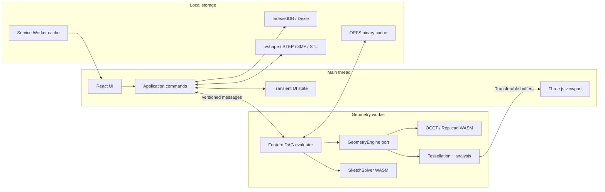
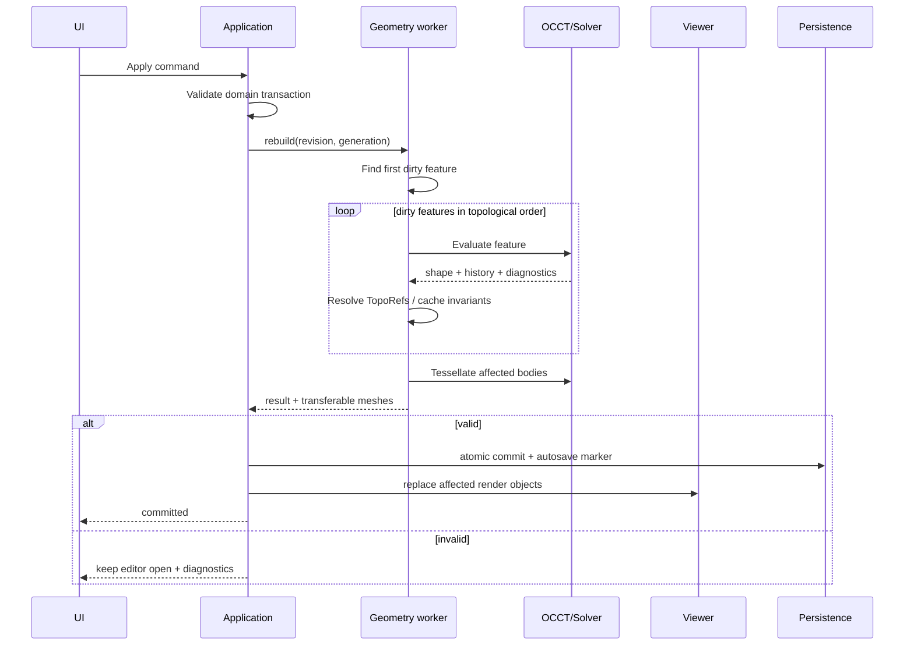

# Архитектура

## Решение

VibeShape — **статическое local-first web-приложение** с разделением UI и геометрического процесса. Backend отсутствует в обязательной конфигурации. CAD-ядро и solver исполняются в WebAssembly внутри worker; главный поток управляет интерфейсом и Three.js viewport.



## Слои

### `domain`

Чистый TypeScript без DOM, React, Three.js и OCCT:

- `Document`, `Feature`, `Sketch`, `Body`, `Variable`, `Material`, `PrinterProfile`;
- IDs, units, expressions и типы параметров;
- команды, события, undo/redo и DAG dependency rules;
- invariants и schema migrations;
- состояния ошибок без текстов UI.

Domain не содержит экземпляры WASM-классов и не сериализует объекты сторонней CAD-библиотеки.

### `application`

- use cases: create/edit/suppress feature, import/export, save/recover;
- orchestration preview/commit/rebuild;
- generation/revision control;
- transaction boundary;
- адаптация domain diagnostics в пользовательские сценарии.

### `ports`

Минимальные стабильные интерфейсы:

- `GeometryEngine`;
- `SketchSolver`;
- `ProjectRepository`;
- `BlobStore`;
- `NativeFormatCodec`;
- `CadExchangeCodec`;
- `PrintMeshCodec`;
- `Clock`, `IdGenerator`, `Telemetry` (no-op по умолчанию).

### `adapters`

- Replicad/OpenCascade.js worker;
- SolveSpace-derived WASM solver;
- Three.js renderer/picker;
- Dexie/IndexedDB и OPFS;
- File System Access/download/upload;
- STEP, STL, 3MF codecs;
- PWA/service worker.

### `ui`

React-компоненты, command palette, model tree, properties, diagnostics и project library. Геометрия в UI представлена IDs и immutable view-model, не kernel handles.

## Предлагаемая структура будущего monorepo

```text
apps/
  web/                    # PWA shell и composition root
packages/
  domain/                 # модель, units, commands, events
  protocol/               # сообщения main ↔ worker и schema versions
  geometry-worker/        # evaluator и OCCT adapter
  sketch-solver/          # solver adapter/WASM build
  viewer/                 # Three.js scene, selection, overlays
  persistence/            # IndexedDB, OPFS, migrations, recovery
  formats/                # .vshape, STEP orchestration, STL, 3MF
  print-analysis/         # mesh/build-volume checks
  ui/                     # Tailwind v4 + shadcn/Radix primitives и tokens
  test-models/            # fixtures и expected invariants
docs/
```

Корневой `package.json` объявляет Bun workspaces `apps/*` и `packages/*`. Локальные зависимости используют `workspace:*`, общие версии React/TypeScript/Tailwind/testing — Bun `catalog:`/named catalogs, а `bun.lock` коммитится. Package boundaries проверяются lint/import rules: например, `domain` не может импортировать `viewer`, `geometry-worker` или `ui`.

`packages/ui` экспортирует только визуальные primitives, hooks, tokens и CSS. CAD-specific композиции (`ModelTree`, `FeatureEditor`, `PrintCheckPanel`) остаются в `apps/web` или позднее в отдельном feature package; UI package не импортирует domain/geometry.

## Протокол main ↔ worker

Все сообщения:

- имеют `protocolVersion`, `requestId`, `documentId`, `revision` и `generation`;
- валидируются runtime-schema на обеих сторонах;
- содержат только structured-clone данные;
- передают большие typed arrays как `Transferable`, не копируют их;
- возвращают progress stage и typed diagnostic;
- не раскрывают OCCT pointer/handle.

Минимальные команды:

- `initializeEngine`;
- `openDocumentSnapshot`;
- `previewCommand`;
- `commitRevision`;
- `rebuildFromFeature`;
- `tessellateBodies`;
- `analyzeBodies`;
- `importCad`;
- `exportCad`;
- `disposeDocument`;
- `healthCheck`.

`cancel(requestId)` в alpha является **логической отменой**: результат старой generation игнорируется. Синхронный вызов OCCT не всегда можно безопасно прервать. Для зависшего/превысившего timeout вызова worker перезапускается и документ восстанавливается из последнего committed snapshot.

## Два состояния документа

- **Committed domain state** — единственный источник параметрической истины, сериализуется и участвует в undo/redo.
- **Derived geometry state** — OCCT shapes, meshes, BVH, B-Rep cache и analysis; всегда может быть перестроено.

Preview является третьим короткоживущим состоянием, но не может попасть в autosave как подтверждённая операция.

## Rebuild pipeline



Порядок feature list в UI обычно совпадает с topological order, но истинная структура — DAG. Reorder разрешается только если не создаёт цикл и все inputs доступны раньше feature.

## Кэширование

Для каждого feature вычисляется content hash из:

- типа и schema version операции;
- нормализованных параметров и units;
- hashes входных features;
- canonicalized references;
- версии geometry adapter/OCCT и tolerance policy.

Совпавший hash MAY повторно использовать B-Rep cache и tessellation. Любой cache считается недоверенным производным данным: после несовпадения версии/контрольной суммы он удаляется и перестраивается.

## Зависания и память

- один geometry worker на активный документ в alpha;
- очередь CAD-задач последовательная, чтобы не делить mutable OCCT state;
- каждый временный kernel object освобождается в `finally`/RAII façade;
- после закрытия документа вызывается `disposeDocument` и проверяется счётчик живых handles;
- viewer освобождает `BufferGeometry`, material, texture и render target при замене;
- soft memory threshold инициирует удаление mesh/B-Rep cache;
- hard threshold/worker crash приводит к безопасному restart и recovery.

## Расширяемость

Плагинная система не входит в alpha. Сначала command schema, feature registry и file migrations должны стать стабильными. Поздний plugin API не получает прямого kernel pointer и не исполняется из `.vshape`; trusted extensions загружаются только из явно установленного пакета.
