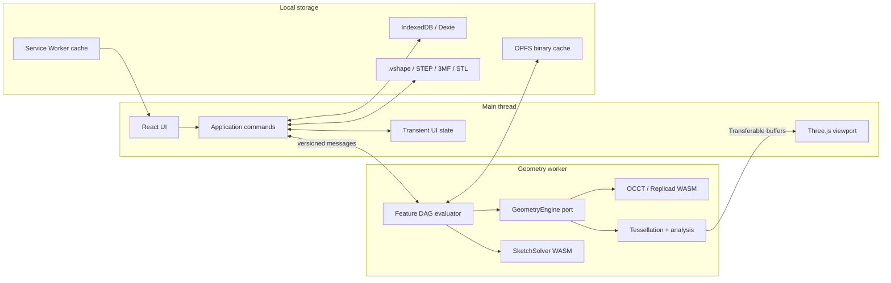
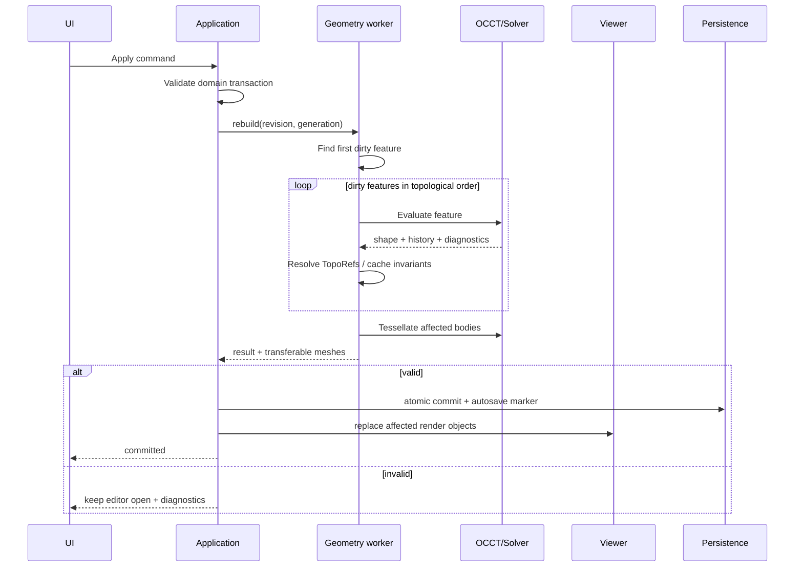

# Architecture

## Decision

VibeShape is a **static local-first web application** that separates the UI process from the geometry process. The required configuration has no backend. The CAD kernel and sketch solver execute as WebAssembly inside workers; the main thread owns the interface and Three.js viewport.



## Layers

### `domain`

Pure TypeScript without DOM, React, Three.js, or OCCT dependencies:

- `Document`, `Feature`, `Sketch`, `Body`, `Variable`, `Material`, and `PrinterProfile`;
- IDs, units, expressions, and parameter types;
- commands, events, undo/redo, and DAG dependency rules;
- invariants and schema migrations;
- typed error states without UI copy.

The domain never contains WASM-class instances and never serializes third-party CAD objects.

### `application`

- use cases for creating, editing, and suppressing features, importing/exporting, and save/recovery;
- preview, commit, and rebuild orchestration;
- generation and revision control;
- transaction boundaries;
- adaptation of domain diagnostics into user workflows.

### `ports`

Minimal stable interfaces:

- `GeometryEngine`;
- `SketchSolver`;
- `ProjectRepository`;
- `BlobStore`;
- `NativeFormatCodec`;
- `CadExchangeCodec`;
- `PrintMeshCodec`;
- `Clock`, `IdGenerator`, and `Telemetry`, with telemetry using a no-op default.

### `adapters`

- Replicad/OpenCascade.js worker;
- SolveSpace-derived WASM solver;
- Three.js renderer and picker;
- Dexie/IndexedDB and OPFS;
- File System Access plus upload/download fallbacks;
- STEP, STL, and 3MF codecs;
- PWA and service worker.

### `ui`

React components, command palette, model tree, property panels, diagnostics, and project library. UI geometry consists of IDs and immutable view models, never kernel handles.

## Monorepo structure

```text
apps/
  web/                    # PWA shell and composition root
packages/
  domain/                 # model, units, commands, events
  protocol/               # main ↔ worker messages and schema versions
  geometry-worker/        # evaluator and OCCT adapter
  sketch-solver/          # solver adapter and WASM build
  viewer/                 # Three.js scene, selection, overlays
  persistence/            # IndexedDB, OPFS, migrations, recovery
  formats/                # .vshape, STEP orchestration, STL, 3MF
  print-analysis/         # mesh and build-volume checks
  i18n/                   # ICU catalogs, locale resolution, React provider
  ui/                     # Tailwind v4, shadcn/Radix primitives, tokens
  test-models/            # fixtures and expected invariants
  typescript-config/      # browser, worker, React, and pure-library configs
docs/
```

The root `package.json` declares Bun workspaces for `apps/*` and `packages/*`. Local packages use `workspace:*`; shared React, TypeScript, Tailwind, and test versions use Bun default or named catalogs; `bun.lock` is committed.

This structure is now checked in. `apps/web` renders a static, accessible CAD-shell placeholder through Vite, resolves typed product copy through `@vibeshape/i18n`, and proves Tailwind discovery across `@vibeshape/ui`. `packages/protocol`, `packages/geometry-worker`, and `packages/test-models` now contain the isolated SPK-001 contract, adapter, and invariant fixture; they are not yet production document APIs. The domain, solver, viewer, persistence, format, and print-analysis packages remain intentionally empty until their owning spikes introduce tested contracts and dependency evidence.

Lint and import rules enforce package boundaries. For example, `domain` cannot import `viewer`, `geometry-worker`, or `ui`.

`packages/ui` exports only visual primitives, hooks, tokens, and CSS. CAD-specific compositions such as `ModelTree`, `FeatureEditor`, and `PrintCheckPanel` remain in `apps/web` or a later feature package. The UI package cannot import domain or geometry packages.

`packages/i18n` exports locale resolution, safe local preference storage, catalog validation and merging, the React provider, and typed `use-intl` hooks. It is independent of application, UI, domain, persistence, and geometry packages. The complete contract is defined in [Internationalization](internationalization.md) and [ADR-0011](../adr/0011-use-intl-localization-layer.md).

## Main-to-worker protocol

Every message:

- includes `protocolVersion`, `requestId`, `documentId`, `revision`, and `generation`;
- is validated with runtime schemas on both sides;
- contains only structured-clone data;
- transfers large typed arrays as `Transferable` objects instead of copying them;
- reports a progress stage and typed diagnostic;
- never exposes an OCCT pointer or handle.

Minimum commands:

- `initializeEngine`;
- `openDocumentSnapshot`;
- `previewCommand`;
- `commitRevision`;
- `rebuildFromFeature`;
- `tessellateBodies`;
- `analyzeBodies`;
- `importCad`;
- `exportCad`;
- `disposeDocument`;
- `healthCheck`.

In alpha, `cancel(requestId)` is a **logical cancellation**: results from an obsolete generation are ignored. A synchronous OCCT call cannot always be interrupted safely. If a call exceeds its timeout or hangs, the worker is restarted and the document is restored from the latest committed snapshot.

## Two document states

- **Committed domain state** is the sole source of parametric truth. It is serialized and participates in undo/redo.
- **Derived geometry state** includes OCCT shapes, meshes, BVHs, B-Rep caches, and analysis. It can always be rebuilt.

Preview is a third, short-lived state but can never enter autosave as a confirmed operation.

## Rebuild pipeline



The UI feature-list order usually matches topological order, but the real structure is a DAG. Reordering is allowed only when it creates no cycle and all inputs remain available before the feature.

## Caching

Every feature has a content hash derived from:

- operation type and schema version;
- normalized parameters and units;
- input-feature hashes;
- canonical references;
- geometry adapter and OCCT versions;
- tolerance-policy version.

A matching hash MAY reuse B-Rep and tessellation caches. Every cache is untrusted derived data. Version or checksum mismatches delete and rebuild it.

## Hangs and memory

- One geometry worker per active document in alpha.
- CAD jobs execute sequentially to avoid shared mutable OCCT state.
- Every temporary kernel object is released with a `finally` or RAII-style facade.
- Closing a document invokes `disposeDocument` and verifies live-handle counts.
- The viewer disposes `BufferGeometry`, materials, textures, and render targets when replacing them.
- A soft memory threshold evicts mesh and B-Rep caches.
- A hard threshold or worker crash triggers a safe restart and recovery.

## Extensibility

The executable extension platform is outside alpha, but the foundation must remain extension-ready. [ADR-0012](../adr/0012-capability-based-extension-platform.md) proposes separate profiles for deterministic parametric feature modules, capability-based workspace extensions, and bounded compute or codec modules.

Durable constraints apply before the SDK exists:

- built-in feature types register through explicit stable identifiers rather than switch statements scattered across packages;
- commands and UI contribution points use registries with ownership metadata and eligibility checks;
- domain and worker protocols accept serializable feature-type and extension-lock metadata without importing an extension runtime;
- feature and cache hashes reserve the exact extension ID, version, API version, and integrity identity;
- raw kernel handles, application stores, React nodes, file handles, and ambient browser APIs never become extension contracts;
- `.vshape` never executes embedded code, auto-installs a package, or silently resolves a missing version from the network.

No empty extension workspace is added yet. `SPK-006` must first prove the sandbox, package validation, resource limits, permissions, cross-browser lifecycle, and recovery behavior. See [Extension architecture](extensions.md) for the target design and explicit gate.
