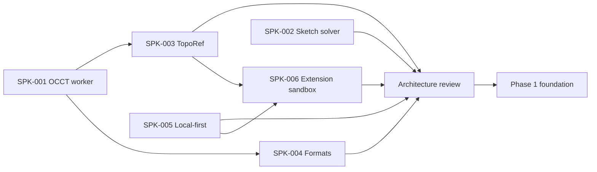

# Implementation starting plan

## Recommendation

SPK-001 through SPK-006 now have recorded decisions. Preserve their fixtures, benchmark harnesses, build scripts, and conclusions while promoting only the accepted boundaries into vertical slices. Spike adapters remain quarantined until each named production gate passes.

## Dependencies

The diagram records the completed dependency order. Production work now follows the accepted boundaries: geometry and persistence vertical slices first, followed by document-integrated extension recovery before any executable SDK work.

## SPK-001 — OCCT/Replicad worker

**Current result:** **Pass — Phase 0 stop/go gate cleared.** The protocol-v5 worker, exact modeling scenario, transient boolean and fillet history evidence, transferable tessellation and STEP bytes, internal STEP round-trip, independent-application FreeCAD import, STL export, deterministic wrapper ownership, stage memory checkpoints, hard worker restart, local Chromium performance budget, Chromium/Firefox/WebKit functional matrix, and verified corresponding-source bundle are implemented. The controlled package is built locally from verified OpenCascade.js and OCCT archives with the reviewed destructor correction. Purpose-owned OCCT adapters eliminate `FinalizationRegistry`-dependent lifetimes in the critical path. Every 1,000-operation lifecycle block retains zero bytes, post-warmup live allocation drifts by 448 bytes across four further full batches, worker initialization p95 is 178.5 ms, and complete-fixture p95 is 278.8 ms on the declared Apple M1 baseline. FreeCAD 1.1.3 imports the exact browser output as one valid solid with matching volume and bounds. See [SPK-001 evidence](spikes/spk-001-occt-worker.md).

### Question

Can the browser provide the required exact CAD API, STEP support, and operation history within an acceptable resource budget?

### Scenario

1. Initialize WASM in a module worker.
2. Create a box and cylinder.
3. Perform boolean cut.
4. Fillet selected semantic edges.
5. Validate the solid, volume, and bounding box.
6. Tessellate and transfer typed arrays to the main thread.
7. Export STEP and binary STL.
8. Repeat create/dispose 1,000 times.
9. Import the exported STEP and compare invariants.

### Compare

- Replicad with its custom build.
- Direct/custom OpenCascade.js bindings.

### Artifacts

- pinned upstream commits and toolchain;
- reproducible build;
- binding list;
- raw, gzip, and Brotli size;
- startup, operation, and peak-memory data across browsers;
- leak chart;
- API-gap report;
- recommendation update for ADR-0001.

### Stop/go

Proceed only when STEP, boolean, fillet, validation, and history are available; the main thread stays responsive; and repeated runs show no unexplained unbounded growth. Otherwise, reduce bindings or replace the adapter before building feature UI.

The functional operations, source-built destructor correction, transient history API, allocator plateau, operation isolation, hard restart, controlled responsiveness measurements, independent-application STEP import, and technical release bundle pass. The production-facade comparison and extended format corpus remain promotion work. Do not promote the spike adapter into production feature work automatically.

## SPK-002 — sketch solver

**Result: Pass.** The pinned SolveSpace v3.2 solver subset now builds as a deterministic ES module and WASM pair behind a flat typed-array ABI. The local corpus covers every P0 primitive, status and conflict reporting, 1,600 perturbation solves, degenerate geometry, 1,000 lifecycle cycles with a stable post-corpus heap, and a 19-fixture Chromium module-worker run. See [SPK-002 evidence](spikes/spk-002-sketch-solver.md) and [ADR-0014](adr/0014-solvespace-flat-wasm-solver.md).

### Question

Can the SolveSpace solver be isolated behind a robust, testable ABI without depending on its experimental UI or web port?

### Coverage

- point, line, circle, and arc entities;
- all P0 constraints;
- under-, fully-, and over-constrained states;
- conflict reporting;
- drag continuation;
- 100 randomized perturbations per canonical sketch;
- degenerate and coincident geometry;
- repeated create, solve, and dispose.

### ABI goal

Flat records and typed arrays in; typed solution, residual, status, and conflict set out. No C++ solver pointers cross the adapter boundary.

### Artifacts

- upstream commit, selected files, and patches;
- build and license bundle;
- fixture corpus;
- residual, performance, and memory report;
- unsupported-constraint list;
- stop/go result and fallback estimate.

## SPK-003 — TopoRef

**Result: Pass.** The strict `TopoRef` schema, semantic and OCCT face-lineage anchors, versioned signature policy, and local 12-scenario Chromium corpus distinguish `resolved`, `ambiguous`, and `missing` with zero false confident matches. The runner rejects `CI` and stores its report under `.artifacts`. Production feature-DAG integration, repair events, persistence, edge lineage, and broader property-based models remain follow-up implementation. See [SPK-003 evidence](spikes/spk-003-toporef.md).

### Question

Are OCCT history, semantic roles, and geometry signatures sufficient to prevent silent topology remapping?

### Corpus

- extrusion side faces and caps;
- hole through a face;
- boolean-created and split faces;
- fillet changes to adjacent edges;
- symmetric bodies;
- pattern count changes;
- suppression and re-enable of upstream features.

### Verification

Pre-label the expected `resolved`, `ambiguous`, or `missing` outcome for every parameter mutation. Measure precision and recall, but treat a **false confident match** as the primary failure.

### Stop/go

Proceed only with zero silent wrong matches in the required corpus and explainable ambiguity. A temporarily low automatic-resolution rate is acceptable; incorrect automation is not.

## SPK-004 — STEP, STL, and 3MF

**Result: Pass for the minimal 3MF gate.** The project-owned Core writer produces deterministic millimeter archives, enforces strict mesh and resource invariants, and passes local XML plus independent PrusaSlicer and Orca/Bambu consumption with matching facet, manifold, and volume metrics. SPK-001 already covers browser STEP and STL output. Production tessellation orchestration, hostile import, and broader format corpora remain follow-up work. See [SPK-004 evidence](spikes/spk-004-3mf.md).

### Question

Can fully local exports interoperate reliably?

### Scenarios

- STEP AP242/AP214 with millimeters/inches, multiple solids, names, and colors where available;
- binary STL with two tessellation tolerances;
- 3MF Core with units, one or two objects, components, transforms, and thumbnail;
- malicious, truncated, and oversized fixtures;
- round-trip dimension and invariant checks;
- open results in PrusaSlicer and Cura/OrcaSlicer.

### Artifacts

- writer or adapter decision;
- conformance and slicer matrix;
- export-report schema;
- resource limits;
- known metadata loss.

## SPK-005 — local-first PWA

**Result: Pass — semantic persistence and recovery gate cleared; installed-build update validation remains.** The strict Dexie schema-v0 contract atomically commits event, snapshot, head, and recovery records; existing-document commits require a live matching writer lease and epoch. The local Chromium, Firefox, and WebKit corpus proves forced-page recovery, stale and quota rollback, bounded checksum recovery, takeover, cached-shell offline reopen, and progressive OPFS and file fallbacks. The recorded WebKit runtime cannot open its exposed OPFS root and therefore demonstrates the required cache-disabled mode without losing semantic functionality. Production `.vshape`, autosave scheduling, BroadcastChannel UX, migrations, and a real two-build service-worker update remain follow-up work. See [SPK-005 evidence](spikes/spk-005-local-first.md).

### Question

Are autosave, recovery, update, and fallback behavior reliable across target browsers?

### Scenarios

- IndexedDB transaction journal and snapshot;
- OPFS cache write, checksum, and orphan cleanup;
- forced tab termination during command and save;
- quota error;
- multi-tab lease and takeover;
- service-worker update with an open dirty project;
- offline reopen;
- system picker where available and upload/download fallback elsewhere.

### Artifacts

- browser matrix;
- recovery loss bound;
- storage schema v0;
- failure UX;
- persistent-storage prompt decision.

## SPK-006 — extension sandbox and package model

**Current result:** **Proceed with reduced scope.** The local package corpus and Chromium, Firefox, and WebKit matrix accept immutable exact-integrity artifacts, two-version coexistence, deterministic no-import WebAssembly, loop and output containment, capability revocation, opaque-origin iframe UI, and non-destructive restricted states. A dedicated JavaScript worker exposes ambient network, clock, randomness, IndexedDB, and Cache Storage in every engine and is rejected for arbitrary untrusted workspace code. The private evidence package is not a public SDK. See [SPK-006 evidence](spikes/spk-006-extension-sandbox.md) and [ADR-0012](adr/0012-capability-based-extension-platform.md).

### Question

Can VibeShape execute locally installed third-party feature, workspace, and compute extensions without ambient authority, non-deterministic rebuilds, main-thread stalls, or unrecoverable project dependencies?

### Compare

- at least two restricted compute runtimes for parametric feature modules;
- dedicated-worker JavaScript versus WebAssembly with explicit host imports;
- opaque-origin sandboxed iframe UI with a dedicated `MessagePort`;
- local package import and a self-hosted static catalog;
- integrity-only packages and signed packages, with signatures treated as identity rather than sandbox bypass.

### Scenarios

1. Install and validate one immutable `.vsext` fixture offline.
2. Rebuild the same deterministic feature with two host sessions and compare domain and geometry invariants.
3. Attempt access to network, time, randomness, DOM, storage, undeclared imports, and raw kernel state.
4. Terminate infinite loops, message floods, oversized output, and memory growth without losing committed work.
5. Render a keyboard-accessible panel in an opaque-origin iframe under strict CSP.
6. Deny, grant, expand, and revoke a capability; verify that revocation terminates residual authority.
7. Keep two exact extension versions installed and rebuild documents pinned to each integrity hash.
8. Open a document with missing, disabled, incompatible, timed-out, and failed extensions in restricted mode.
9. Preview an update, compare required invariants, commit one lock change, and roll back.
10. Reject hostile archives, path traversal, duplicate normalized paths, invalid manifests, and checksum mismatches.

### Artifacts

- threat model and runtime comparison;
- versioned manifest and host-protocol candidates;
- package corpus and hostile fixtures;
- capability matrix and permission UX prototype;
- CPU, memory, message, output, and startup measurements across Chromium, Firefox, and WebKit;
- deterministic replay and exact-version coexistence results;
- restricted-mode, upgrade, rollback, and uninstall-preservation evidence;
- recommendation update for [ADR-0012](adr/0012-capability-based-extension-platform.md).

### Stop/go

Do not publish `extension-api`, accept third-party executable packages, or promise SDK compatibility until the accepted runtime gains a deterministic modeling ABI, a portable memory policy, production transaction and document integration, persisted update/rollback, uninstall preservation, and non-destructive recovery/rebuild evidence.

The extension spike does not block the core alpha workflow while third-party execution remains deferred. It becomes a release gate for any build that enables executable extensions.

## Architecture review after spikes

Update:

- ADR statuses and exact engine/solver versions;
- technology stack and lock policy;
- performance budgets;
- risk probabilities;
- roadmap estimates;
- native-manifest engine metadata;
- extension manifest, lock, trust, and compatibility policy;
- license and source-distribution plan.

The review ends with one decision:

- **Proceed** — all critical gates pass.
- **Proceed with reduced scope** — alpha is reduced and documentation is synchronized.
- **Rework** — repeat a specific spike.
- **Stop** — browser-only exact CAD does not meet accepted constraints.

## Initial Phase 1 epics

After Proceed:

1. `E01 Tooling`: Bun workspaces, pinned Bun and `bun.lock`, catalogs, environment-specific shared TypeScript configs, Biome, Fallow configuration and changed-code PR gate, scoped verification scripts, project-skill validation, `bun ci`, and license/SBOM skeleton.
2. `E02 Domain`: IDs, units, `Document`/`Feature` DAG, commands, and revisions.
3. `E03 Protocol`: schemas, worker lifecycle, diagnostics, and generation cancellation.
4. `E04 Geometry`: production adapter from SPK-001 with ownership and leak guards.
5. `E05 Viewer`: Three.js scene, LOD, selection mapping, and disposal.
6. `E06 Persistence`: journal, snapshot, recovery, and `.vshape` v0.
7. `E07 UI foundation`: Tailwind v4, shared `@vibeshape/ui`, typed ICU copy through `@vibeshape/i18n`, shadcn/Radix configuration, tokens, compact shell primitives, state harness, keyboard behavior, and accessibility baseline from the design and UX contract.
8. `E08 Vertical demo`: primitives → boolean → save/offline/reopen → STEP/STL.
9. `E09 Extension-ready seams`: stable built-in feature and command registries, extension-lock preservation, unknown custom-feature preservation, and restricted-mode diagnostics without executing third-party code.
10. `E10 Automation-ready seams`: first-party module ownership, bounded revision-tagged query views, schema-backed command descriptors, disposable drafts, preview and confirmation classes, idempotency and revision preconditions, cancellation, and actor provenance without importing MCP types into domain packages.

Every epic includes positive, failure, recovery, and license or format acceptance criteria. User-visible epics also include the applicable [Design and UX Guidelines](product/design-and-ux-guidelines.md) definition-of-done checks.

The first local MCP bridge is an integration spike after `E02`, `E03`, `E06`, and `E10` provide one real query and one draftable command. Its executable acceptance gate is defined in [Automation and MCP architecture](architecture/automation-and-mcp.md). Do not scaffold an empty MCP workspace or pin an SDK merely to advertise future compatibility.

### Foundation scaffold status

The repository already provides the non-engine portion of `E01`: Bun workspaces and catalogs, exact Bun and dependency pins, `bun.lock`, environment-specific TypeScript configs, Biome, Fallow, skill validation, frozen-install and security-audit commands, one fast GitHub Actions job, local Playwright E2E coverage across Chromium, Firefox, and WebKit, Vite, typed ICU localization, Tailwind v4, shared shadcn/Radix routing, semantic UI tokens, and a static shell. Production build and browser matrices are local merge gates to conserve Actions minutes. License/SBOM generation and feature-specific browser scenarios remain open.

`E02` and `E10` now share executable foundation slices: UUIDv7 domain identities, canonical length/angle/scalar quantities, revisioned document and feature commands, strict actor and event schemas, deterministic replay, revision-safe disposable drafts, validated first-party document, feature-kernel, and part-design modules, trusted command and feature-type registries that enforce descriptor-handler and active-type parity, unit-aware box/cylinder and ordered Boolean/Subtract parameter schemas, registry-bound add/update preflight and normalization, bounded semantic content projections, canonical feature-content identity version `0`, and a strict feature graph with atomic mutation, deterministic asynchronous evaluation scheduling, and failure propagation. Content identity uses ordered dependency hashes and slot-relative topology references, includes exact host/geometry/tolerance/provider identity, ignores record-only UUID/label/suppression and source-unit presentation metadata, and validates an injected SHA-256 digest without exposing environment globals to the domain. `@vibeshape/application` now coordinates that scheduler with canonical hashing and a serializable geometry port, validates a complete prior snapshot against successful hashes plus the exact environment and mesh policy, contains port failure, and exposes only final successful matching geometry. `@vibeshape/automation-api` supplies strict lifecycle schemas and the bounded `org.vibeshape.document.summary` schema version 1 read model. `@vibeshape/automation-host` adds host-generated owner-bound drafts, serialized operations, inactivity and count limits, bounded preview, idempotent discard, and atomic commit-port coordination; a validated box feature-add fixture proves the same path without exposing an MCP tool. The generic persistence boundary accepts replayable feature revisions, and structural replay plus suppression do not require the contributing runtime. `E03` and `E04` intersect through protocol v7: the worker validates and hashes feature identities, binds dependency UUIDs to canonical hash slots without including them in identity, evaluates box, cylinder, and Boolean subtraction, emits typed diagnostics and transferable meshes, and keeps exact document-scoped B-Rep ownership with transactional replacement. The web integration harness proves DAG-to-OCCT coordination, clean reuse, and descendant-only rebuild; production document-worker hosting, save/reopen rebuilds, persisted topology lineage and repair, persistent caches, hard cancellation, product persistence orchestration, feature deletion, undo/redo, idempotent command replay, session pairing and revocation, and confirmation remain open. These slices prove adapter-neutral query, command, feature-schema, identity, scheduling, and dependent worker paths and do not justify an MCP workspace or SDK dependency yet.

This early scaffold and domain slice do not waive any Phase 0 stop/go criterion.

## Definition of Done for a geometry feature

- Domain schema and migration impact are defined.
- Preview, commit, and cancel work.
- Worker messages are runtime-validated.
- Kernel result is validated and temporary objects are released.
- `TopoRef` outputs and references are defined.
- Undo/redo and reopen/rebuild are tested.
- Invalid and degenerate inputs return typed diagnostics.
- Fixture assertions use invariants.
- Performance and memory stay within budget or have an ADR.
- Documentation and known limitations are updated in English.
