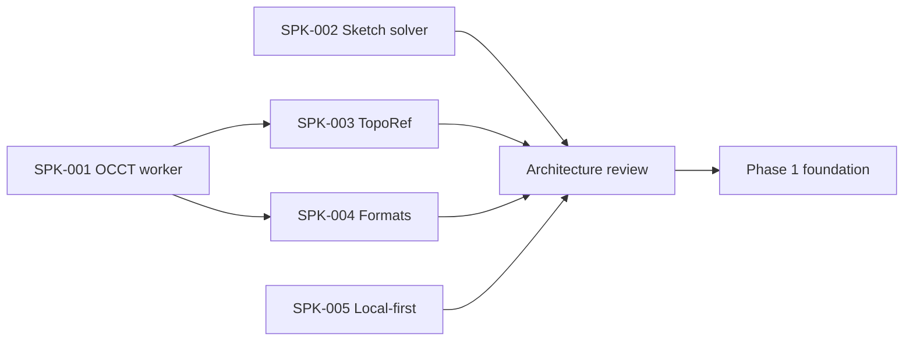

# План начала реализации

## Рекомендация

Создать пять короткоживущих spike-веток/пакетов, а production monorepo scaffold завершать только после stop/go review. Код spike можно выбросить; fixtures, benchmark harness, build scripts и выводы сохраняются.

## Зависимости

SPK-001, SPK-002 и SPK-005 можно выполнять параллельно командой. Один разработчик делает их последовательно в указанном порядке: 001 → 002 → 003 → 004 → 005.

## SPK-001 — OCCT/Replicad worker

### Вопрос

Можно ли получить требуемое exact CAD API, STEP и operation history в приемлемом browser resource budget?

### Сценарий

1. Инициализировать WASM в module worker.
2. Создать box и cylinder.
3. Boolean cut.
4. Fillet выбранных semantic edges.
5. Проверить solid/volume/bbox.
6. Tessellate и передать typed arrays main thread.
7. Export STEP и binary STL.
8. Повторить create/dispose 1 000 раз.
9. Import полученного STEP и сравнить invariants.

### Сравнить

- Replicad custom build;
- direct/custom OpenCascade.js binding.

### Артефакты

- pinned upstream commits и toolchain;
- reproducible build;
- список bindings;
- gzip/brotli/raw size;
- startup/operation/peak memory по browser matrix;
- leak chart;
- API gaps;
- recommendation update к ADR-0001.

### Stop/go

Go, если STEP/boolean/fillet/validation/history доступны, main thread не блокируется, repeated run не имеет необъяснённого unbounded growth. Иначе уменьшить bindings/сменить adapter; не строить feature UI поверх непроверенного API.

## SPK-002 — sketch solver

### Вопрос

Можно ли выделить из SolveSpace устойчивый, тестируемый solver ABI без зависимости от экспериментального UI/web-port?

### Набор

- entities: point/line/circle/arc;
- P0 constraints из feature matrix;
- under/fully/over-constrained;
- conflict reporting;
- drag continuation;
- 100 randomized perturbations каждого canonical sketch;
- degenerate/coincident geometry;
- create/solve/dispose loop.

### ABI goal

Typed arrays/flat records in, typed solution/residual/status/conflicts out. Никаких solver C++ pointers за adapter boundary.

### Артефакты

- upstream commit/selected files/patches;
- build and license bundle;
- fixture corpus;
- residual/performance/memory report;
- список unsupported constraints;
- stop/go и fallback estimate.

## SPK-003 — TopoRef

### Вопрос

Достаточны ли OCCT history + semantic roles + signatures, чтобы не делать silent remap?

### Corpus

- extrude side/caps;
- hole through face;
- boolean creates/splits faces;
- fillet changes adjacent edges;
- symmetric bodies;
- pattern count change;
- suppress/re-enable upstream feature.

### Проверка

Для каждого parameter mutation заранее разметить expected `resolved/ambiguous/missing`. Измерить precision/recall автоматического resolve, но главным failure считать **false confident match**.

### Stop/go

Go при нулевом silent wrong match на обязательном corpus и объяснимой ambiguity. Низкий auto-resolve допустим временно; неверенная автоматика — нет.

## SPK-004 — STEP/STL/3MF

### Вопрос

Можно ли обеспечить interoperable outputs полностью локально?

### Сценарии

- STEP AP242/AP214, mm/inch, multiple solids, names/colors если доступны;
- binary STL с двумя tessellation tolerances;
- 3MF Core: units, 1/2 objects, components/transforms, thumbnail;
- malicious/truncated/oversized fixtures;
- round-trip dimensions/invariants;
- open в PrusaSlicer и Cura/OrcaSlicer.

### Артефакты

- writer/adapter decision;
- conformance and slicer matrix;
- export report schema;
- resource limits;
- known metadata loss.

## SPK-005 — local-first PWA

### Вопрос

Надёжны ли autosave/recovery/update/fallback на целевых браузерах?

### Сценарии

- IndexedDB transaction journal + snapshot;
- OPFS cache write/checksum/orphan cleanup;
- forced tab kill во время command/save;
- quota error;
- multi-tab lease/takeover;
- service-worker update с открытым dirty project;
- offline reopen;
- system picker где доступен и download/upload fallback.

### Артефакты

- browser matrix;
- recovery loss bound;
- storage schema v0;
- failure UX;
- decision о persistent storage prompt.

## Architecture review после spikes

Обновить:

- ADR status и concrete engine/solver versions;
- technology stack/lock policy;
- performance budgets;
- risk probabilities;
- roadmap estimates;
- native manifest engine metadata;
- license/source distribution plan.

Review заканчивается одним из решений:

- **Proceed** — все critical gates пройдены;
- **Proceed with reduced scope** — функции alpha урезаны и документы синхронизированы;
- **Rework** — повторить конкретный spike;
- **Stop** — browser-only exact CAD не проходит принятые ограничения.

## Первые Phase 1 epics

После Proceed:

1. `E01 Tooling`: pnpm workspace, strict TS, CI, license/SBOM skeleton.
2. `E02 Domain`: IDs, units, Document/Feature DAG, commands/revisions.
3. `E03 Protocol`: schemas, worker lifecycle, diagnostics, generation cancellation.
4. `E04 Geometry`: production adapter из SPK-001, ownership/leak guard.
5. `E05 Viewer`: Three.js scene, LOD, selection mapping, dispose.
6. `E06 Persistence`: journal/snapshot/recovery and `.vshape` v0.
7. `E07 Vertical demo`: primitives → boolean → save/offline/reopen → STEP/STL.

Каждый epic имеет positive, failure, recovery и license/format acceptance criteria.

## Definition of Done для геометрической функции

- domain schema и migration impact определены;
- preview/commit/cancel работают;
- worker message runtime-валидируется;
- kernel result проверен, temporaries освобождены;
- TopoRef outputs/references определены;
- undo/redo и reopen/rebuild тестируются;
- invalid/degenerate inputs имеют typed diagnostic;
- fixture assertions используют invariants;
- performance/memory не выходят за budget без ADR;
- docs/known limitations обновлены.
