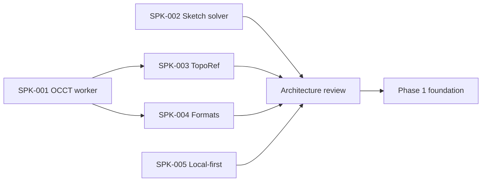

# Implementation starting plan

## Recommendation

Create five short-lived spike branches or packages. Finalize the production monorepo scaffold only after a stop/go review. Spike code may be discarded; fixtures, benchmark harnesses, build scripts, and conclusions remain.

## Dependencies

With a team, SPK-001, SPK-002, and SPK-005 can run in parallel. One developer should use this order: 001 → 002 → 003 → 004 → 005.

## SPK-001 — OCCT/Replicad worker

### Question

Can the browser provide the required exact CAD API, STEP support, and operation history within an acceptable resource budget?

### Scenario

1. Initialize WASM in a module worker.
2. Create a box and cylinder.
3. Perform boolean cut.
4. Fillet selected semantic edges.
5. Validate the solid, volume, and bounding box.
6. Tessellate and transfer typed arrays to the main thread.
7. Export STEP and binary STL.
8. Repeat create/dispose 1,000 times.
9. Import the exported STEP and compare invariants.

### Compare

- Replicad with its custom build.
- Direct/custom OpenCascade.js bindings.

### Artifacts

- pinned upstream commits and toolchain;
- reproducible build;
- binding list;
- raw, gzip, and Brotli size;
- startup, operation, and peak-memory data across browsers;
- leak chart;
- API-gap report;
- recommendation update for ADR-0001.

### Stop/go

Proceed only when STEP, boolean, fillet, validation, and history are available; the main thread stays responsive; and repeated runs show no unexplained unbounded growth. Otherwise, reduce bindings or replace the adapter before building feature UI.

## SPK-002 — sketch solver

### Question

Can the SolveSpace solver be isolated behind a robust, testable ABI without depending on its experimental UI or web port?

### Coverage

- point, line, circle, and arc entities;
- all P0 constraints;
- under-, fully-, and over-constrained states;
- conflict reporting;
- drag continuation;
- 100 randomized perturbations per canonical sketch;
- degenerate and coincident geometry;
- repeated create, solve, and dispose.

### ABI goal

Flat records and typed arrays in; typed solution, residual, status, and conflict set out. No C++ solver pointers cross the adapter boundary.

### Artifacts

- upstream commit, selected files, and patches;
- build and license bundle;
- fixture corpus;
- residual, performance, and memory report;
- unsupported-constraint list;
- stop/go result and fallback estimate.

## SPK-003 — TopoRef

### Question

Are OCCT history, semantic roles, and geometry signatures sufficient to prevent silent topology remapping?

### Corpus

- extrusion side faces and caps;
- hole through a face;
- boolean-created and split faces;
- fillet changes to adjacent edges;
- symmetric bodies;
- pattern count changes;
- suppression and re-enable of upstream features.

### Verification

Pre-label the expected `resolved`, `ambiguous`, or `missing` outcome for every parameter mutation. Measure precision and recall, but treat a **false confident match** as the primary failure.

### Stop/go

Proceed only with zero silent wrong matches in the required corpus and explainable ambiguity. A temporarily low automatic-resolution rate is acceptable; incorrect automation is not.

## SPK-004 — STEP, STL, and 3MF

### Question

Can fully local exports interoperate reliably?

### Scenarios

- STEP AP242/AP214 with millimeters/inches, multiple solids, names, and colors where available;
- binary STL with two tessellation tolerances;
- 3MF Core with units, one or two objects, components, transforms, and thumbnail;
- malicious, truncated, and oversized fixtures;
- round-trip dimension and invariant checks;
- open results in PrusaSlicer and Cura/OrcaSlicer.

### Artifacts

- writer or adapter decision;
- conformance and slicer matrix;
- export-report schema;
- resource limits;
- known metadata loss.

## SPK-005 — local-first PWA

### Question

Are autosave, recovery, update, and fallback behavior reliable across target browsers?

### Scenarios

- IndexedDB transaction journal and snapshot;
- OPFS cache write, checksum, and orphan cleanup;
- forced tab termination during command and save;
- quota error;
- multi-tab lease and takeover;
- service-worker update with an open dirty project;
- offline reopen;
- system picker where available and upload/download fallback elsewhere.

### Artifacts

- browser matrix;
- recovery loss bound;
- storage schema v0;
- failure UX;
- persistent-storage prompt decision.

## Architecture review after spikes

Update:

- ADR statuses and exact engine/solver versions;
- technology stack and lock policy;
- performance budgets;
- risk probabilities;
- roadmap estimates;
- native-manifest engine metadata;
- license and source-distribution plan.

The review ends with one decision:

- **Proceed** — all critical gates pass.
- **Proceed with reduced scope** — alpha is reduced and documentation is synchronized.
- **Rework** — repeat a specific spike.
- **Stop** — browser-only exact CAD does not meet accepted constraints.

## Initial Phase 1 epics

After Proceed:

1. `E01 Tooling`: Bun workspaces, pinned Bun and `bun.lock`, catalogs, environment-specific shared TypeScript configs, Biome, Fallow configuration and changed-code PR gate, scoped verification scripts, project-skill validation, `bun ci`, and license/SBOM skeleton.
2. `E02 Domain`: IDs, units, `Document`/`Feature` DAG, commands, and revisions.
3. `E03 Protocol`: schemas, worker lifecycle, diagnostics, and generation cancellation.
4. `E04 Geometry`: production adapter from SPK-001 with ownership and leak guards.
5. `E05 Viewer`: Three.js scene, LOD, selection mapping, and disposal.
6. `E06 Persistence`: journal, snapshot, recovery, and `.vshape` v0.
7. `E07 UI foundation`: Tailwind v4, shared `@vibeshape/ui`, shadcn/Radix configuration, tokens, compact shell primitives, state harness, keyboard behavior, and accessibility baseline from the design and UX contract.
8. `E08 Vertical demo`: primitives → boolean → save/offline/reopen → STEP/STL.

Every epic includes positive, failure, recovery, and license or format acceptance criteria. User-visible epics also include the applicable [Design and UX Guidelines](product/design-and-ux-guidelines.md) definition-of-done checks.

## Definition of Done for a geometry feature

- Domain schema and migration impact are defined.
- Preview, commit, and cancel work.
- Worker messages are runtime-validated.
- Kernel result is validated and temporary objects are released.
- `TopoRef` outputs and references are defined.
- Undo/redo and reopen/rebuild are tested.
- Invalid and degenerate inputs return typed diagnostics.
- Fixture assertions use invariants.
- Performance and memory stay within budget or have an ADR.
- Documentation and known limitations are updated in English.
