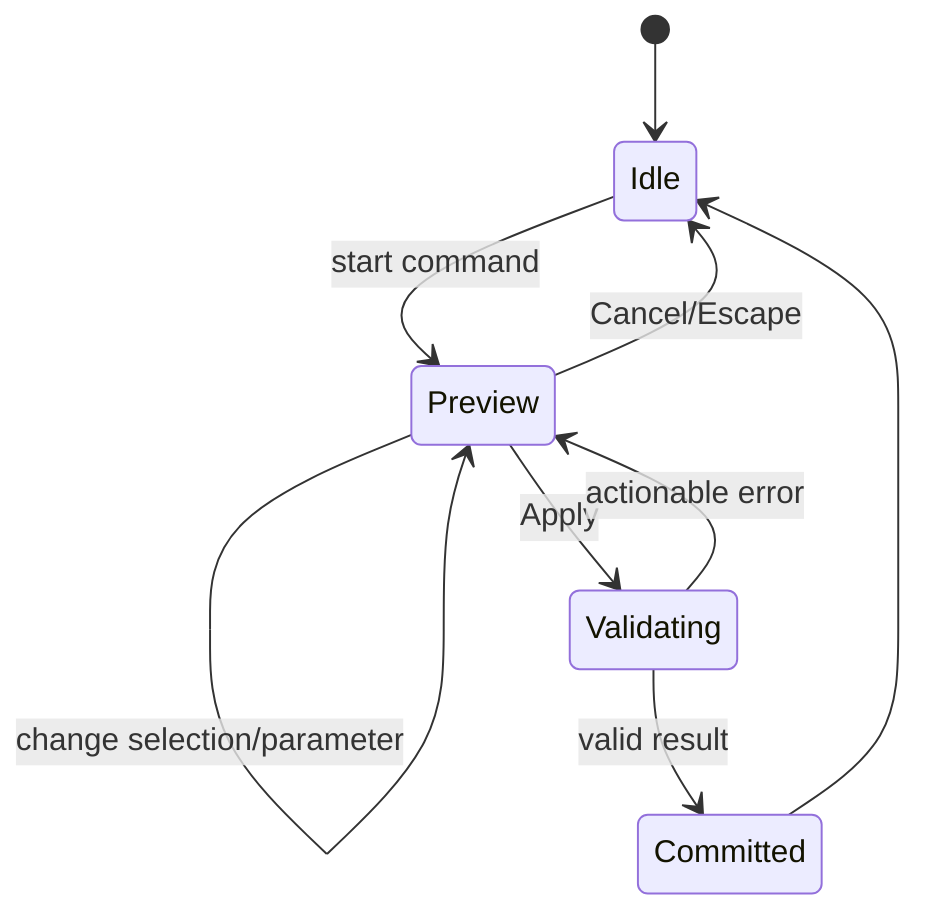

# UX and core flows

The cross-product interaction, visual, accessibility, and content rules are defined in [Design and UX Guidelines](design-and-ux-guidelines.md). This document defines the application frame and canonical end-to-end flows; the guidelines define how every state in those flows behaves.

## Interface frame

Desktop layout:

```text
┌────────────────────────────────────────────────────────────────────┐
│ Project · Save state · Undo/Redo · Command palette · Export        │
├──────────────┬───────────────────────────────────┬─────────────────┤
│ Model tree   │                                   │ Properties /    │
│              │            Viewport               │ active command  │
│ Sketches     │                                   │                 │
│ Features     │                                   │ Parameters      │
│ Bodies       │                                   │ Diagnostics     │
├──────────────┴───────────────────────────────────┴─────────────────┤
│ Status: units · selection filter · solver/rebuild · warnings       │
└────────────────────────────────────────────────────────────────────┘
```

In sketch mode, the right panel shows constraints and dimensions while the viewport switches to an orthographic normal-to-plane view. In print mode, the model tree remains visible and the right panel becomes the analysis and export report.

The shell uses Tailwind CSS v4 and source-owned shadcn/Radix primitives from `@vibeshape/ui`. Toolbar, command palette, menu, and shortcut invoke the same application command. The model tree and viewport overlays remain specialized accessible CAD components rather than being forced into generic `Card` or `Table` components.

## Command states

Every modeling command uses the same state machine:



- Preview does not modify the document and may use low-quality temporary tessellation.
- Apply creates one domain transaction and one undo entry.
- An error preserves parameters and the failing selection.
- Escape always cancels the active command before the document changes.

## Flow 1: create a printable part

1. Create a project and choose a printer profile or no profile.
2. Select an origin plane and create a sketch.
3. Draw geometry, apply constraints, and reach a clear solver state.
4. Finish the sketch and extrude it.
5. Add feature-tree operations; preview changes before commit.
6. Open Print Check for units, solid validity, mesh validity, dimensions, overhang, and wall warnings.
7. Export 3MF and optionally STEP or STL.

## Flow 2: edit an early parameter

1. Double-click a feature or dimension in the tree or viewport.
2. Enter a new value and show a debounced preview.
3. Rebuild in the worker while keeping the UI responsive.
4. Commit atomically on success.
5. If a `TopoRef` is ambiguous, highlight affected downstream operations and present a bounded candidate set.
6. Save the repaired reference as part of the command.

## Flow 3: import STEP as context

1. Choose Import → STEP; parse locally.
2. Before commit, show file size, units or assumptions, body count, and healing diagnostics.
3. Create an `ImportedBRepFeature`; let the user embed the source or keep an explicit external reference.
4. Measure the import and build a mating body around it.
5. Replace an external source only through an explicit Replace Source command; never reload it silently.

## Flow 4: crash recovery

1. Compare the latest exported version, snapshot, and autosave journal.
2. If the journal is newer than the clean-close marker, show its time and latest commands.
3. Restore into a new recovery snapshot; do not overwrite the original immediately.
4. Let the user save, compare, or discard the recovery state.

## Errors

Errors are classified as:

- **Input error** — invalid number, unit, or selection; corrected inside the active command.
- **Solver conflict** — show the smallest known conflicting set.
- **Kernel failure** — name the operation and suggest geometry-aware actions such as reducing a fillet, removing a tangent edge, or changing order.
- **Topology ambiguity** — show candidates and prohibit silent substitution.
- **Resource failure** — quota, memory, or worker crash; offer recovery export and worker restart.
- **Format error** — identify the file location, resource limit, or unsupported entity without executing file content.

Raw stack traces belong in a local diagnostic bundle but never replace a user-facing explanation.

Error wording, persistence, focus behavior, and recovery actions follow the [feedback and diagnostics rules](design-and-ux-guidelines.md#feedback-progress-and-diagnostics).

## Alpha keyboard shortcuts

| Action | Shortcut |
|---|---|
| Command palette | `Ctrl/Cmd+K` |
| Undo / redo | `Ctrl/Cmd+Z`, `Ctrl/Cmd+Shift+Z` |
| Save/export native project | `Ctrl/Cmd+S` |
| Fit view | `F` |
| Delete selection | `Delete/Backspace`, guarded during text input |
| Cancel command | `Escape` |
| Apply command | `Enter` when focus is not in a multiline input |
| Toggle orthographic | `O` |
| Standard views | Numeric presets, finalized after usability testing |

Shortcuts become configurable in P1. macOS uses `Cmd`; Windows and Linux use `Ctrl`.

The complete shortcut safety, toolbar navigation, escape hierarchy, and canvas-accessibility contract is defined in [Design and UX Guidelines](design-and-ux-guidelines.md#accessibility-contract).
