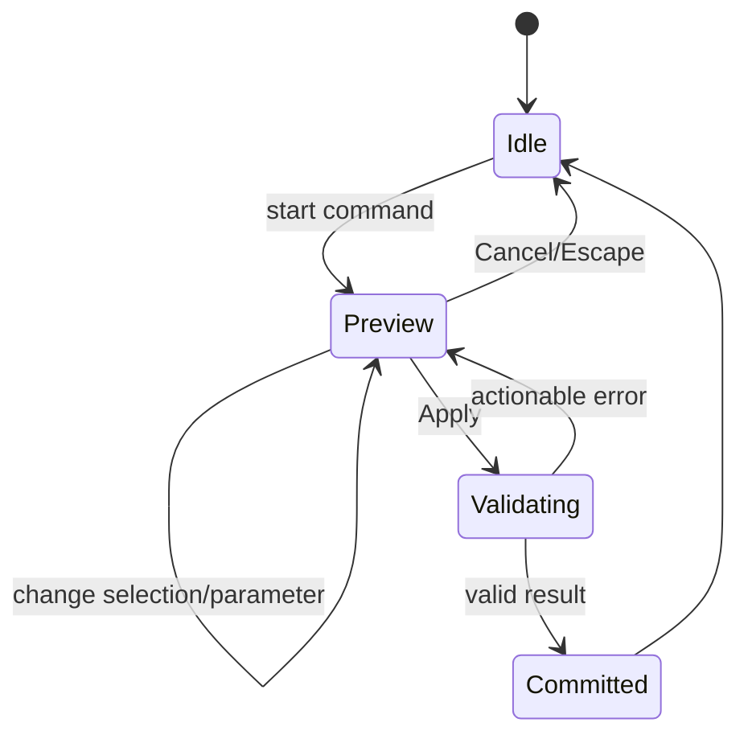

# UX and core flows

The cross-product interaction, visual, accessibility, and content rules are defined in [Design and UX Guidelines](design-and-ux-guidelines.md). This document defines the application frame and canonical end-to-end flows; the guidelines define how every state in those flows behaves.

## Interface frame

Desktop layout:

```text
┌────────────────────────────────────────────────────────────────────┐
│ Project · Save state · Undo/Redo · Command palette · Export        │
├──────────────┬───────────────────────────────────┬─────────────────┤
│ Model tree   │                                   │ Properties /    │
│              │            Viewport               │ active command  │
│ Sketches     │                                   │                 │
│ Features     │                                   │ Parameters      │
│ Bodies       │                                   │ Diagnostics     │
├──────────────┴───────────────────────────────────┴─────────────────┤
│ Status: units · selection filter · solver/rebuild · warnings       │
└────────────────────────────────────────────────────────────────────┘
```

In sketch mode, the right panel shows constraints and dimensions while the viewport switches to an orthographic normal-to-plane view. In print mode, the model tree remains visible and the right panel becomes the analysis and export report.

The shell uses Tailwind CSS v4 and source-owned shadcn/Radix primitives from `@vibeshape/ui`. Toolbar, command palette, menu, and shortcut invoke the same application command. The model tree and viewport overlays remain specialized accessible CAD components rather than being forced into generic `Card` or `Table` components.

The implemented command surface composes stable localized presentation descriptors with trusted application handlers. One resolved eligibility result drives the toolbar, command palette, and keyboard path, so a command cannot be enabled in one surface and blocked in another. The application bar opens the palette, and `Ctrl/Cmd+K` opens or closes it even while a text control owns focus. Search matches localized labels and keywords, retains disabled commands with a visible unmet requirement, and ranks the six most recently invoked commands in local UI preference storage. Palette close restores focus to its trigger. Single-letter sketch shortcuts run only outside text-entry and IME composition; `Escape` remains available to clear an in-progress placement before the global active-command cancellation handler runs.

The implemented viewport shows terminal authoritative meshes only after a successful document rebuild. Raw Three.js owns the canvas scene and GPU lifecycle outside React reconciliation; localized loading, empty, rebuild-failure, and WebGL2-unavailable states remain ordinary DOM overlays. It supports orthographic orbit, pan, pointer-centered zoom, responsive fit, shaded faces, derived feature edges, hover face preselection, and primary-click face selection. Hovering or keyboard-focusing a visible feature-tree row adds a cyan whole-feature preselection overlay, while activating the row opens edit and keeps an amber overlay on that exact feature until the task closes. These overlays use the feature's own rebuild result even when downstream operations consume it; an exact unsaved candidate mesh replaces the committed highlight during preview, and hidden features remain hidden. Whole-feature highlighting stays independent from transient face selection. XY, XZ, and YZ remain visible as translucent origin datums by default and each can be hidden independently through an icon-only, tooltip-labeled control. They are selectable only while choosing sketch support, so visible datums never block solid clicks. Independent terminal bodies use a stable display-only palette derived from their feature identities; merged or consumed features do not create a second body color. Primary drag and middle drag rotate, modifier-primary and secondary drag pan, and movement beyond the click threshold never activates a face or sketch plane. A camera-relative world-axis inset stays visible and updates during orbit without resetting the camera; its semantic X/Y/Z colors are paired with an accessible DOM legend. The selected feature and friendly face ordinal are mirrored into the DOM status bar, and an explicit canvas control clears face selection. Empty primary click and every geometry replacement clear transient face selection while preserving the current camera and any open-feature highlight. Fit runs once when the viewport is initialized and later only through the explicit user action. Current rendered-face identity is deliberately transient; body/edge/vertex selection, stable `TopoRef` selection, filters, standard views, and additional command overlays remain open.

## Command states

Every modeling command uses the same state machine:



- Preview does not modify the document and may use low-quality temporary tessellation.
- Apply creates one domain transaction and one undo entry.
- An error preserves parameters and the failing selection.
- Escape always cancels the active command before the document changes.

During sketch editing, the adjacent **Intersection** icon switches the orbitable 3D viewer into planar-face preselection. One eligible face creates an exact bounded read-only line on the active sketch plane and returns to Select. Parallel or coplanar faces are rejected before draft mutation, while exact OCCT failures remain fail-closed.

Each compatible external-reference row exposes **Replace reference**. Activating it reuses the canvas-first Use broker, limits normal and orbit candidates to a compatible topology kind, and marks the action as pressed. Live model-backed candidates stay within the same producing feature. A reference intentionally orphaned by source-feature deletion may instead target compatible topology from another visible feature and becomes an ordinary live reference after the pick. Sketch-backed candidates may come from any earlier sketch, but a curve must retain both its source and projected analytical types. Picking one candidate preserves the reference ID, projected entity IDs, metadata, and dependent constraints, then returns to Select. Finishing and reopening the sketch retains the friendly source-and-geometry label for the replacement. Activating the pressed action again cancels repair without changing the draft.

Deleting or changing referenced geometry in an earlier sketch is a valid semantic edit. The dependent reference remains persisted as unresolved intent instead of being discarded or silently redirected. The same applies when current rebuilt model geometry can no longer materialize a referenced vertex, edge, curve, or planar intersection. Before the dependent is opened, its History row shows a non-color repair status with separate direct and chained failure counts; the adjacent alert action names the affected sketch and opens it directly for repair. Opening the dependent sketch shows a non-color **Broken external reference** indicator and a specific label such as `Sketch 1 · Missing line`. Replace exposes only compatible earlier-sketch geometry directly in the viewport; one graphical pick repairs the source while retaining local projected identities and constraints. Deleting the entire source sketch remains blocked while dependents exist.

**Replace support** beside the current support leaves the sketch editor for the existing 3D support picker without discarding the draft. The replacement-specific overlay accepts an earlier origin plane, Datum Plane, or supported planar model face; later History items are rolled back and unavailable. Cancel restores the exact edit session. One accepted pick returns directly to Select, preserves all authored geometry and constraint identities, records one local undo step, and persists through Finish and reopen. Changing the support moves unchanged local sketch coordinates into the new world frame; incompatible projections remain unresolved and fail closed. Activating **Intersect planar face** from normal view similarly opens the orbitable 3D face picker immediately, displays the required one-face instruction, and never leaves the command armed without a selectable canvas target. Normal Select names each visible eligible earlier-sketch or projected-model candidate on hover or keyboard focus and accepts it directly as a stable read-only reference. Activating **Use external geometry** keeps the same analytical canvas and graphical broker active as a persistent projection mode for repeated selection and repair.

The Box and Cylinder create/edit slices implement idle → validate → persisted commit with preserved field errors and asynchronous single-flight submission. Each direct primitive exposes explicit signed X, Y, and Z placement-origin fields beside its dimensions; these fields use the project display unit, accept supported unit literals and committed `#variables`, and default legacy records to the world origin. Box width and depth remain centered on the placement origin. Cylinder radius remains centered on its placement axis. A non-centered height starts at placement Z, while centered height extends equally above and below it. Activating either primitive in the feature tree opens the same task-panel form with all authored source expressions, not only resolved millimeter values. Update preserves the feature identity and untouched record fields, closes only after the semantic revision is saved, and lets the ordinary worker rebuild replace the viewport mesh. Interactive viewport manipulators, arbitrary primitive rotation, geometry preview, and `Escape` command routing remain required before this slice satisfies the complete modeling-command state machine.

The implemented sketch-editor slice follows idle → support selection → transient authoring → live solve → persisted commit. The empty model task makes `Create sketch` the primary path and relegates direct Box and Cylinder commands to an explicit advanced section. `Create sketch` first keeps the 3D modeling viewport active, shows the XY, XZ, and YZ origin planes as translucent selectable datums, and mirrors hover preselection and the current choice into localized DOM status. Primary click accepts an origin plane or an eligible planar model face; an eligible model face takes priority where it overlaps a displayed origin plane, so an extrusion cap can be selected directly. Face hover names the exact `Feature · Face N`; overlapping model faces open a bounded Select Other list with visual preview, forward/reverse cycling, keyboard acceptance, and cancellation instead of silently choosing mesh insertion order. The accepted stable topology support retains the same resolved label in the disabled support control after Finish and reopen. Compact origin-plane buttons provide the keyboard alternative without replacing canvas selection. When a supported planar model face is already selected, `Create sketch` skips the redundant confirmation and enters the editor immediately with a stable face support. Only then does the application enter the orthographic 2D workspace with a validated, unsaved sketch draft. The active sketch plane and two perpendicular origin references remain visible as non-interactive SVG datum references and retain the same independent visibility controls as the 3D viewport. The Radix contextual toolbar then replaces unrelated solid commands with a remembered Extrude/Revolve profile-feature family, Select, Point, **Dimension**, **Use external geometry**, Construction, local Undo/Redo, direct analytical Trim/Extend/Split/Mirror/Offset, and split tool families for Line/Midpoint Line, corner/Center/Aligned/Centered Aligned Rectangle, center-point/three-point Circle and Center-point Ellipse, Inscribed/Circumscribed Polygon, three-point/Tangent/center-point Arc, and Straight/Centered/selection-driven Slot. Use external geometry projects compatible earlier sketch points, lines, circles, arcs, ellipses, and elliptical arcs into the active drawing and exposes their source geometry in the persistent orbitable 3D context; clicking either representation creates the same read-only reference. If normal-view candidates overlap at the pointer, a compact non-modal chooser lists deterministic source labels and creates only the selected stable reference; `Escape` dismisses it without changing the draft. A selected local point can receive Coincident against an external point, Point on curve against an external round curve, an exact Point on ellipse relation against a full ellipse, or an exact bounded Point on elliptical arc relation; mixed local/external selections can drive compatible relations and dimensions without making referenced geometry editable or part of the active profile. External-only driving dimensions are not offered. Ellipse centers, axis points, quadrants, the complete full-ellipse locus, and the positive elliptical-arc sweep are stable reference targets. The primary family icon invokes the active or last-used variant, while the adjacent radio menu exposes every variant and standard shortcut. The toolbar uses one tab stop and arrow-key navigation, identifies the active tool, and prevents switching back to Model until the draft is finished or canceled. Dimension uses `D`; one click selects a line or round curve, while sequential clicks collect two points or two lines without a modifier. A compatible selection previews witness leaders at the pointer, a placement click opens a variable-aware inline editor beside the annotation, and `Enter` commits one stable driving constraint. Pointer position disambiguates direct, horizontal, and vertical point distances; compact inline choices resolve round and ellipse-axis ambiguity. Double-click edits an existing value in place, label drag changes only presentation state, and staged `Escape` closes input, clears references, then exits Dimension. Applying an edited value closes both the canvas editor and any selected task-panel fallback; reopening reads the committed draft value. The task-panel form remains an accessible fallback and never receives focus automatically. Points cannot be dragged while Dimension is active. Corner Rectangle uses `G`, Center Rectangle uses `R`, center-point Circle uses `C`, Three-point Arc uses `A`, Tangent Arc uses `Shift+A`, Trim uses `M`, and Offset uses `O`, matching the corresponding Onshape shortcuts. Midpoint Line mirrors one endpoint around the first pick and stores the midpoint relation; Aligned Rectangle uses two picks for its first side and a third for signed perpendicular width; Centered Aligned Rectangle uses a center, symmetric half-axis, and perpendicular half-width; Three-point Circle accepts three circumference points and stores their point-on-curve relations; Center-point Ellipse accepts a center, first-axis endpoint, and perpendicular second-axis radius and stores three stable points around one analytical curve; Circumscribed and Inscribed Polygon use center, radius/apothem, and a pointer-derived or typed 3–50 side count while persisting exact equal-side and construction-circle intent; Tangent Arc starts from an existing line endpoint, stores tangent intent, then returns to Line; Straight Slot uses two centerline picks plus width; Centered Slot mirrors the centerline around the first center pick; and Slot from selected line is available only for exactly one selected line and needs one width pick. Trim removes the clicked line, arc, or circle portion between bounded analytical neighbors. Extend moves the clicked-near line or arc endpoint to the nearest reachable line, arc, or circle. Split divides a line or arc at one projected click; a circle accepts two projected clicks and previews complementary equal-radius arcs before committing. Mirror either reflects a preselection after one axis-line pick and returns to Select, or accepts the axis first, highlights it, and mirrors repeated point or curve picks until `Escape`; localized status copy names the active step. Offset accepts a line preselection or one canvas line, expands a valid clicked component, previews the signed mitered result, and commits the complete line chain as one editable dimension; `Escape` cancels only the distance step and keeps the tool active. Each completed tool or modification is one local history edit. The task panel retains support, compatible constraints, dimensions, and profiles; one compact Cancel/Finish pair remains anchored in its command header while the property area scrolls independently. Analytical tools call shared domain operations; Select supports additive entity selection; points drag directly; Delete removes selected geometry with dependent constraints; middle or secondary drag pans; `Shift` suppresses automatic inference; and wheel zooms toward the pointer.

The Dimension editor defaults to Driving and exposes Reference for distance, horizontal distance, vertical distance, angle, radius, and diameter. Reference mode hides the expression field, persists no value, adds no solver equation, and renders the current solved measurement as a parenthesized dashed annotation. A reference annotation remains selectable and draggable but has no expression editor. Finish and reopen preserve the reference identity and recompute its displayed value from live solved geometry.

The normal-view overlap chooser uses the same keyboard grammar as the orbitable 3D broker. Grave accent and Shift+grave accent cycle the active analytical preselection, `Enter` creates only the highlighted stable reference, and `Escape` dismisses the chooser without changing the draft.

Elliptical Arc belongs to the Arc family and follows four picks: center, primary-axis endpoint, secondary-radius/start point, and endpoint. The third and fourth stages show a temporary construction ellipse; the completed entity is one exact analytical curve and one local history edit. Compatible selections promote the complete [mandatory sketch precision toolset](sketch-toolset.md): coincident, horizontal, vertical, parallel, perpendicular, equal, tangent, concentric, midpoint, symmetric, fixed, point-on-line, and point-on-curve constraints plus distance, projected-distance, signed Offset, angle, radius, round diameter, and stable primary- and secondary-axis diameter dimensions. Selecting one point and one full ellipse or elliptical arc exposes **Point on curve** and persists the corresponding exact full or positive-sweep bounded locus. Ellipse-axis dimensions use authored axis names rather than derived major/minor names, remain valid if the secondary axis becomes longer, and place their drawing labels at separate axis endpoints. Only actions that consume the complete current selection appear in the compact icon-only viewport toolbar and accessible task-panel equivalent. Applied glyphs are selectable on the drawing; selecting a driving dimension opens the same stable constraint in the expression editor. Dimension expressions accept units and committed `#variables`; typing `#` opens the same caret-aware variable autocomplete used by feature parameters and the Variables table, while the constraint list preserves authored text and allows explicit removal. Every non-drag draft change requests a debounced document protocol v17 SolveSpace solve without creating a document revision. Point drag reuses a prepared spatial inference index and one viewport-rectangle snapshot, reduces raw pointer input to the latest animation-frame sample, and renders the active point plus incident curves immediately in a local overlay. Ordinary drafts stream exact feedback through a bounded 32 ms throttle. Dense drafts debounce exact feedback until a 120 ms pointer pause, and very dense drafts stay entirely on the local preview path until release. The scheduler sends the unchanged schema-valid sketch plus a separate target, retains at most one solve in flight and the latest pending target, and forwards continuation state. This preserves exact dependent-geometry feedback where it fits the interaction budget without reintroducing whole-sketch cloning, Zod parsing, layout reads, or unrelated curve rerenders during continuous dense motion. Pointer release preserves the final overlay, publishes exactly one global draft and undo entry including an accepted inferred relation, and requests the final exact solve. The fixed-height CAD shell keeps long constraint lists in an internal task-panel scroller, so heavy sketches cannot resize the canvas. The canvas reports solver status and degrees of freedom, renders closed regions behind exact entity strokes, and derives stable boundary selectors for profile activation. An empty draft reports that geometry has not been authored instead of presenting a misleading fully constrained solver state.

`Finish sketch` is asynchronous and single-flight, creates one ordinary add or update revision, and cannot be double-submitted. Finishing an unchanged saved sketch is treated as a successful no-op: it returns to Model without publishing a false save failure or creating a revision. Success returns directly to the Model workspace, preserves the selected closed profile for downstream features, and renders the saved sketch with the rest of the model on its exact support frame. After reload or when another sketch is active, hovering a visible saved region highlights it with a readable Sketch · Profile label; clicking it selects the canonical boundary selector without entering sketch edit, and enables the shared profile-feature commands. Its model-tree visibility action hides or restores only this derived reference display. Cancel discards the draft. Activating a saved sketch immediately enters edit mode and restores every stable entity, constraint, and expression identity; there is no redundant intermediate `Edit sketch` action. Component and browser harnesses prove a real WebGL2 origin-plane pick, the keyboard-equivalent plane path, distinct XY/XZ/YZ visibility symbols, shared model/sketch datum visibility, exact saved-sketch 3D projection and independent visibility, variable-driven dimension refactor, fully constrained solve, grouped family selection, exact Center-point Ellipse placement and OCCT extrusion, exact four-pick Elliptical Arc authoring and history, center, aligned, and centered-aligned rectangles, midpoint line, three-point circle, both regular polygon variants with typed side count, three-point arc, tangent arc, straight slot, centered slot, selected-line slot preview/intent/history, atomic line/arc/circle/ellipse/elliptical-arc Trim and Split plus open line/arc/elliptical-arc Extend with Undo and exact SolveSpace feedback, both Mirror selection orders, connected-line Offset preview/history and signed-dimension reversal through the real solver, responsive physical endpoint drag with at least 96 lines and streamed dependent-geometry feedback, edit, save, reload, profile selection, extrusion, command-palette creation, and shortcut-driven sketch-tool selection. Idle-viewport preselection-first sketch entry, additional inference modes, round and ellipse boundaries for ellipse modification, spline and curve-chain modification, the remaining command-registry shortcuts, command-level document undo, and bounded conflict-repair suggestions remain follow-up interaction work. The delivery sequence is tracked in the [Editor experience implementation plan](editor-experience-plan.md).

The first extrusion slice starts from a selected sketch profile. Extrude is one registered command across the toolbar, command palette, and contextual surfaces; it carries the stable selector into a task panel that names the selected sketch and exposes operation, target, distance, and symmetric state. While a sketch is open, the Extrude icon remains available in the Sketch toolbar and first performs the ordinary sketch save. After Finish sketch, the same command consumes the retained selection; after reload, the same profile can be selected directly from its visible 3D region. Closed regions can be activated on the sketch canvas; sketches with multiple detected regions also expose an accessible profile list. The feature stores canonical boundary entity IDs, never the displayed profile ordinal. Distance accepts the same unit-aware literals and committed `#variables` as other length fields. Valid parameter changes publish a debounced feature draft to an isolated document-worker session and render changed terminal bodies as an explicitly unsaved, non-selectable exact OCCT preview. Invalid or failed previews preserve the form buffer and committed viewport geometry. Cancel terminates and discards preview state. Asynchronous Create or Update is single-flight, persists one ordinary feature revision, and closes only after persistence and authoritative rebuild succeed. Activating the extrusion restores the exact distance expression, selector, symmetric state, operation, and target. Changing a referenced variable rebuilds the exact solid without rewriting the authored expression. Removing the source sketch is blocked until the extrusion is removed. Multiple simultaneous region selection remains open. The delivery order for that capability is defined in the [Sketch-first modeling implementation plan](sketch-first-modeling-plan.md).

Feature removal is available from an active edit task. Eligibility comes from the authoritative document dependency graph rather than a feature-only scan. Any feature, sketch support, sketch model-geometry reference, extrusion profile, or declared semantic-input consumer keeps the destructive action disabled; the adjacent explanation names up to eight dependent History items and their relations, then reports the remaining count before the user can open a confirmation. An invalid or incomplete dependency model fails closed with a specific explanation. A removable leaf opens the shared accessible `AlertDialog`, names the feature, warns that undo is not implemented, blocks repeated activation while the asynchronous commit is pending, remains open with a persistent error after failure, and closes only after semantic persistence and rebuild succeed. Successful removal closes the edit task, clears an invalid viewport selection, updates terminal geometry, and survives reload. Onshape-style removal that intentionally leaves repairable downstream model references is a separate versioned destructive command and is not inferred from ordinary Delete.

Transform extends the direct analytical modify group. It accepts either an existing selection or
subsequent point and curve picks, then exposes a canvas manipulator for free move, sketch-axis move,
rotation, and positive uniform scale. Pointer movement updates only a selected-geometry SVG overlay;
it does not publish a draft, parse the complete sketch, or request a solve. `Shift` snaps rotation
and scale. `Enter` or an empty-canvas primary click applies one domain transform and one local undo
entry; `Escape` cancels it. The origin ring relocates the pivot without changing the current affine
preview and snaps to authored points within a screen-space tolerance. The exact-value panel accepts
origin, translation, rotation, and positive scale expressions, reuses project display units and
committed `#variables`, and applies through the same single draft edit.

Linear Pattern accepts the same preselection or post-selection grammar. Its TanStack Form panel
defines a required first direction and optional second direction; each direction has an integer
count including the seed, positive spacing, and angle. Length and angle fields normalize bare values
to project units and suggest committed `#variables`. The viewport renders at most ten total seed and
copy instances while editing, then one Apply materializes at most 100 total instances as one local
history edit. Shared points stay shared inside each occurrence, internal compatible constraints are
cloned, and crossing, fixed, or rotation-incompatible constraints are omitted. The copies are
independent after commit until associative pattern metadata is introduced.

Circular Pattern reuses that selection grammar and materialization boundary. Its TanStack Form
panel exposes a project-unit-aware center, an integer count including the seed, and either a closed
360° distribution or an open signed sweep below one full turn. Length and angle inputs accept
committed `#variables`. A center glyph remains visible with the bounded SVG copy preview. `Enter`,
empty canvas, or Apply commits at most 100 total instances as one local history edit; `Escape`
cancels. Shared seed points and compatible internal constraints are cloned per occurrence, with
orientation intent retained only for exact quarter turns. Copies remain independent, and dragging
the center directly on the canvas remains open until associative pattern metadata is introduced.

Ordered Use chains remain graphical: a later sketch can select projected geometry owned by an intermediate sketch, not only that sketch's authored entities. The direct intermediate owner remains visible in labels and stable identity, while compatible edits to the original source recursively update the downstream projection after solve, save, and reopen.

## Flow 1: create a printable part

An open sketch with a selected closed profile exposes one remembered Extrude/Revolve split-family control in the Sketch toolbar, while both registered commands remain independently searchable in the command palette. The sketch task header contains only the compact Cancel/Finish pair. Either feature command first performs the same single-flight, revision-checked sketch add or update as `Finish sketch`, then opens the ordinary feature task only after persistence succeeds; a stale revision or storage failure preserves the complete draft. This follows Onshape's direct open-sketch feature path. Finishing the sketch, reselecting its visible profile, and then invoking the same feature command remains an equivalent workflow without introducing a separate Fusion-style modeling mode.

1. Create a project and choose a printer profile or no profile.
2. Select an origin plane and create a sketch.
3. Draw geometry, apply constraints, and reach a clear solver state.
4. Finish the sketch and extrude it.
5. Add feature-tree operations; preview changes before commit.
6. Open Print Check for units, solid validity, mesh validity, dimensions, overhang, and wall warnings.
7. Export 3MF and optionally STEP or STL.

The implemented Phase 1 export boundary is available from `Export…` in the application bar. It opens a modal dialog with a remembered preferred-slicer action, direct multi-object 3MF download, exact STEP exchange, and binary STL compatibility. All actions remain disabled until the current rebuilt revision contains solid geometry and are single-flight while asynchronous worker work is pending. The slicer action sends the generated 3MF only through an explicitly paired local bridge; if that bridge is not configured, unreachable, or cannot start the chosen application, the dialog downloads the same 3MF and says that it downloaded instead. A successful bridge handoff and direct format downloads preserve localized status in the application bar after the dialog closes. Browser-local save, geometry exchange, bridge handoff, slicer import, and printing are distinct states and must never share success copy. Print checks, placement, configurable tolerance profiles, and a persistent export report remain later work.

The always-visible project identity in the application bar and the current row in `Project…` include the same icon-only, tooltip-labeled Rename action. Its shared TanStack Form composition preserves the current name, validates the domain's normalized 120-character boundary, and commits one ordinary `org.vibeshape.document.rename` command against the displayed revision. Submission is single-flight; a stale revision or storage failure preserves the edited name and adjacent diagnostic. A successful rename immediately updates the application bar, open local-project library, `.vshape` content, and generated export filenames without changing the stable document ID. Inactive library rows are not renamed implicitly because only the active document owns the live revisioned command session.

The adjacent icon-only Units action opens the project display-unit dialog. Length offers `um`, `mm`, `cm`, `m`, `in`, and `ft`; angle offers `deg` and `rad`. Apply dispatches one revision-checked `org.vibeshape.document.set-display-units` command and is single-flight. Success immediately converts derived results, profile measurements, orientation labels, status, and new dimensional-field defaults while leaving geometry and authored expressions unchanged. A bare numeric literal entered into a known length or angle field is persisted with the active unit explicitly. Reload and `.vshape` round-trip preserve the preference; read-only documents expose it without permitting a semantic change.

`Project…` owns both the local-project library and the separate native-file flow. The library strictly reads bounded project summaries from IndexedDB, marks the current project, and shows each name, semantic revision, localized modification time, and exact-revision isometric preview. A project without successful terminal geometry, with a stale preview, or with unavailable derived storage gets a labeled placeholder rather than a synthetic shape. `New project` closes the current session before creating a new browser-stored document; `Open` closes it before switching by stable document ID. Both actions are single-flight and leave the current project selected when pre-switch validation fails. `Duplicate` verifies and replays the selected semantic history, assigns a fresh document ID and fresh command IDs, preserves document-scoped variable and feature identities plus authored expressions, appends a localized bounded copy name, and atomically publishes a clean inactive project without changing the current selection. It does not set the external-backup timestamp; an available preview copies afterward as non-authoritative best effort. `Delete` is available only for an inactive project, opens the shared accessible confirmation, states that the full browser history is permanent while exported `.vshape` files are unaffected, and remains open with a persistent error after a stale-revision or live-lease conflict. The deletion transaction removes the project head, events, snapshots, preview, recovery marker, and expired lease atomically. The External backup card downloads `.vshape` even when the model has no exportable solid because semantic history, variables, and features are the payload. The Open project file card uses the cross-browser file-input baseline, reports verification as an asynchronous state, and switches only after atomic import succeeds. A same-ID collision remains visible, preserves the browser copy, and directs the user to Local projects. Active-project deletion, explicit same-ID restore or copy-as-new import, backup reminders, and system-picker enhancement remain later work.

Saved sketches and features expose persistent icon-only, tooltip-labeled Rename actions beside their model-tree labels. Focusing either tree item and pressing `F2` opens the identical dialog, so pointer and keyboard paths cannot diverge. A feature rename updates only its label through the ordinary revisioned feature-update command; a sketch rename updates only its label through the ordinary revisioned sketch-update command. Stable IDs, parameters, geometry, dependencies, and references remain unchanged. The currently edited sketch disables Rename until Finish or Cancel because committing its earlier draft would otherwise restore a stale label. Read-only documents disable all semantic rename actions with an explanatory tooltip. Validation, asynchronous locking, stale-revision recovery, and persistence-failure behavior are shared with project Rename.

## Flow 2: edit an early parameter

1. Double-click a feature or dimension in the tree or viewport.
2. Enter a new value and show a debounced preview.
3. Rebuild in the worker while keeping the UI responsive.
4. Commit atomically on success.
5. If a `TopoRef` is ambiguous, highlight affected downstream operations and present a bounded candidate set.
6. Save the repaired reference as part of the command.

The current Box, Cylinder, and Extrusion implementations cover tree activation, raw parameter restoration, validation, atomic update, worker rebuild, and reload persistence. Direct Box and Cylinder edits also restore their authored X/Y/Z placement expressions and centered-height interpretation. Extrusion additionally proves stable profile intent across variable-driven sketch and distance rebuilds plus debounced exact create/edit preview without a document revision. Multi-region feature input, interactive solid manipulators, and topology-reference repair remain later interaction increments.

## Flow 3: import STEP as context

1. Choose Import → STEP; parse locally.
2. Before commit, show file size, units or assumptions, body count, and healing diagnostics.
3. Create an `ImportedBRepFeature`; let the user embed the source or keep an explicit external reference.
4. Measure the import and build a mating body around it.
5. Replace an external source only through an explicit Replace Source command; never reload it silently.

## Flow 4: crash recovery

1. Compare the latest exported version, snapshot, and autosave journal.
2. If the journal is newer than the clean-close marker, show its time and latest commands.
3. Restore into a new recovery snapshot; do not overwrite the original immediately.
4. Let the user save, compare, or discard the recovery state.

## Errors

Errors are classified as:

- **Input error** — invalid number, unit, or selection; corrected inside the active command.
- **Solver conflict** — show the smallest known conflicting set.
- **Kernel failure** — name the operation and suggest geometry-aware actions such as reducing a fillet, removing a tangent edge, or changing order.
- **Topology ambiguity** — show candidates and prohibit silent substitution.
- **Resource failure** — quota, memory, or worker crash; offer recovery export and worker restart.
- **Format error** — identify the file location, resource limit, or unsupported entity without executing file content.

Raw stack traces belong in a local diagnostic bundle but never replace a user-facing explanation.

Error wording, persistence, focus behavior, and recovery actions follow the [feedback and diagnostics rules](design-and-ux-guidelines.md#feedback-progress-and-diagnostics).

## Alpha keyboard shortcuts

| Action | Shortcut |
|---|---|
| Command palette | `Ctrl/Cmd+K` |
| Undo / redo | `Ctrl/Cmd+Z`, `Ctrl/Cmd+Shift+Z` |
| Save/export native project | `Ctrl/Cmd+S` |
| Fit view | `F` |
| Delete selection | `Delete/Backspace`, guarded during text input |
| Cancel command | `Escape` |
| Apply command | `Enter` when focus is not in a multiline input |
| Toggle orthographic | `O` |
| Standard views | Numeric presets, finalized after usability testing |

Shortcuts become configurable in P1. macOS uses `Cmd`; Windows and Linux use `Ctrl`.

The complete shortcut safety, toolbar navigation, escape hierarchy, and canvas-accessibility contract is defined in [Design and UX Guidelines](design-and-ux-guidelines.md#accessibility-contract).

### Associative editing context

Orbit-view **Use external geometry** resolves pointer overlap through a closest-first Select Other stack.
Grave accent cycles forward, Shift+grave accent cycles backward, Enter or pointer activation accepts the
highlighted source, and Escape closes the overlay without changing the draft. Cycling changes only transient
viewer preselection; the committed reference continues to store stable source identity rather than a renderer ID.
After acceptance, the task panel resolves that stable identity against the current rebuild and keeps the same
localized feature-and-subshape label after save, rebuild, feature rename, and sketch reopen. Missing or ambiguous
topology remains explicit; internal semantic roles, lineage tokens, candidate IDs, and feature UUIDs are never
display labels.

Visible earlier sketches remain in the normal drawing as muted points, lines, circles, arcs, ellipses, and elliptical arcs, while the mounted 3D context preserves their spatial relation to the model. Ordinary projected geometry uses solid strokes and construction geometry uses reduced-emphasis dashed strokes. The analytical drawing is the sole rendering owner for every earlier sketch it projects in normal mode; the mounted Three.js scene continues to render upstream bodies but omits those saved-sketch displays, so circles, points, and curves cannot appear twice. Orbit mode hides the analytical drawing and restores the same earlier sketches to Three.js alongside one current unsaved solved draft. Returning normal restores analytical ownership without changing the draft or camera session. The model-tree eye action controls the same source in both views. **Use external geometry** makes compatible earlier points, lines, and analytical curves hit-testable without painting every candidate over the drawing. The muted source remains visible, and only the candidate under pointer preselection or keyboard focus receives an amber overlay before activation. Stable references recursively resolve solved upstream intent and use exact affine curve projection across non-degenerate supports; a circle can therefore remain a circle or become an ellipse as required by the target frame. While Point or Line is active, visible earlier-sketch and uniquely resolved coplanar model points, lines, and analytical curves wake directly under the pointer with an amber source highlight, source label, and compatible inference preview. Dragging an existing authored point uses the same passive candidate set, including midpoint, point-on-line, quadrant, and exact full or bounded ellipse relations. Hover and pointer motion remain disposable; release atomically materializes one stable read-only reference, moves the authored point, and adds the inferred constraint as one sketch-local edit. `Shift` suppresses wake-up and other suggestions for the current pointer sample. The candidate query is prepared outside pointer motion and returns only nearby analytical geometry, so dragging does not scan every visible curve per frame. A committed read-only reference then joins ordinary local inference without becoming editable and replaces its source candidate, so one source curve never appears as duplicate geometry. Non-coplanar projection and unsupported topology remain explicit **Use** workflows. Center points use fixed-screen crosshairs.

**Pierce to external line** is selection-first: exactly one authored point must be selected before the icon
becomes available. Activating it keeps the same sketch draft, opens the persistent orbitable 3D context, and
shows only visible earlier-sketch finite lines and stable linear model edges that cross the active support
transversely. Hover and keyboard focus name the source as `Sketch · Line` or `Feature · Edge`; one pick creates
a stable read-only Pierce point and Coincident, returns to Select, and preserves both identities through Finish
and reopen. A model-backed Pierce stores only its stable edge `TopoRef` and projected point identity; rebuilds
recompute the crossing from current exact edge geometry, while missing or ambiguous edges enter the ordinary
reference-repair flow. Parallel, coplanar, degenerate, or outside-segment candidates are not offered. Normal to
sketch cancels the pending pick without mutation.

In Select mode, a committed projected point, line, or compatible analytical curve joins the ordinary
canvas multi-selection. Selecting it together with authored geometry exposes only relations that the
solver can apply while keeping the projected entity fixed. Projected-only selections expose no mutating
constraint or driving-dimension actions. Applied external relations retain their link treatment in the
canvas and constraint list, survive Finish and reopen, and resolve again from the stable source after an
upstream edit.

A new unsaved sketch treats every committed sketch as earlier context. Editing an existing sketch keeps only the committed sketches before it in document order, so a draft cannot create a forward reference to itself or a later sketch.

Editing a sketch rolls the viewport back at its History row by hiding its committed display and every later sketch or feature, including independent later items. Terminal bodies are derived again from the remaining feature graph, which keeps the latest upstream body visible in both normal and orbit views even when a hidden downstream operation consumed it. Explicit model-tree visibility remains independent: hiding a body does not expose an older body state, and restoring it takes effect immediately while the sketch stays open.

**Show final result** temporarily restores the downstream result behind the editable draft when the rollback view lacks useful spatial context. If rollback removes every solid but a later visible result exists, a compact viewport notice explains the History boundary and exposes this action directly; it does not appear while any earlier solid remains available. A visible **Final result · display only** status distinguishes that presentation from the authoritative editing boundary. Downstream geometry never enters hover inference, selection, or **Use** candidate sets, and the preference resets when the sketch session closes.
