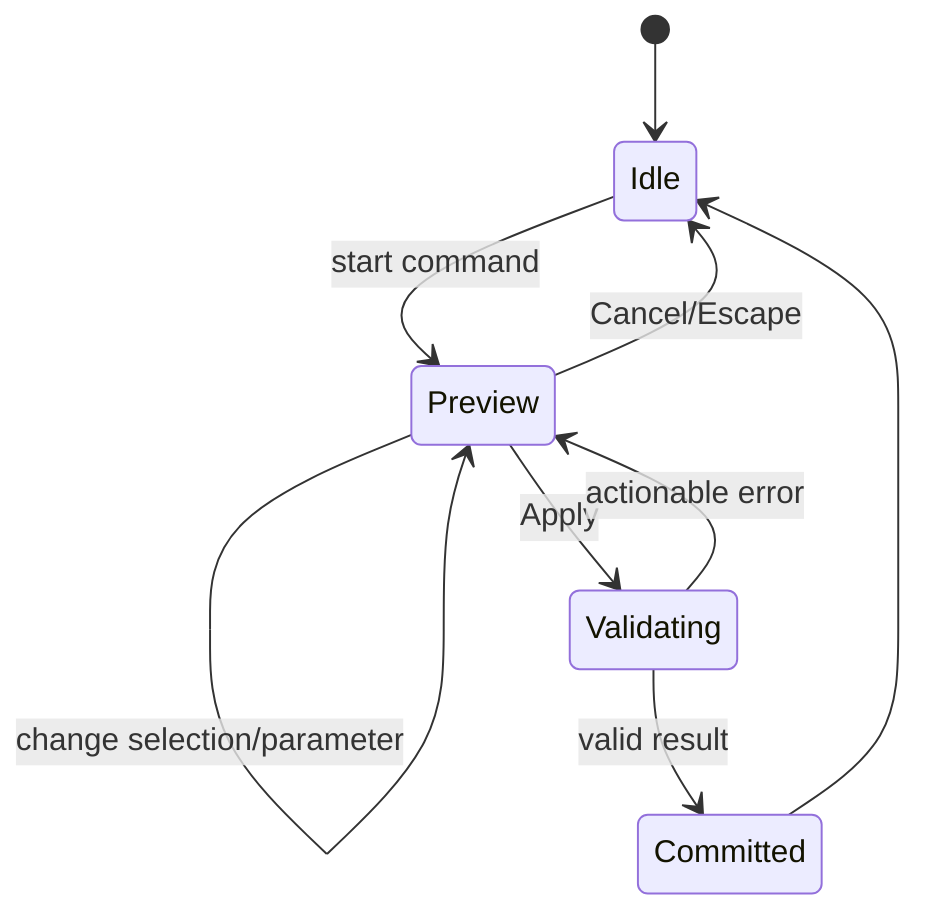

# UX и ключевые сценарии

## Каркас интерфейса

Desktop layout:

```text
┌────────────────────────────────────────────────────────────────────┐
│ Project · Save state · Undo/Redo · Command palette · Export        │
├──────────────┬───────────────────────────────────┬─────────────────┤
│ Model tree   │                                   │ Properties /    │
│              │            Viewport               │ active command  │
│ Sketches     │                                   │                 │
│ Features     │                                   │ Parameters      │
│ Bodies       │                                   │ Diagnostics     │
├──────────────┴───────────────────────────────────┴─────────────────┤
│ Status: units · selection filter · solver/rebuild · warnings       │
└────────────────────────────────────────────────────────────────────┘
```

В sketch mode правая панель показывает constraints и dimensions, а viewport переходит в ортографический вид normal-to-plane. В print mode дерево не исчезает, но правая панель становится отчётом анализа и экспортом.

UI shell строится на Tailwind CSS v4 и source-owned shadcn/Radix primitives из `@vibeshape/ui`. Это не меняет application commands: toolbar, command palette, menu и shortcut вызывают один и тот же use case. Model tree и viewport overlays остаются специализированными accessible CAD-компонентами, а не маскируются под универсальные `Card`/`Table`.

## Состояния команды

Любая моделирующая команда следует одной машине состояний:



- Preview не меняет документ и может строить низкокачественную временную тесселяцию.
- Apply создаёт одну domain transaction и одну undo-запись.
- Ошибка обязана сохранить введённые параметры и проблемную selection.
- Escape всегда отменяет текущую команду до изменения документа.

## Flow 1: новая печатная деталь

1. Пользователь создаёт проект и выбирает профиль принтера или «без профиля».
2. Выбирает origin plane и создаёт sketch.
3. Рисует, добавляет constraints, доводит solver до понятного статуса.
4. Завершает sketch и делает extrude.
5. Добавляет операции в feature tree; изменения показывают preview перед commit.
6. Открывает Print Check: единицы, solid validity, mesh validity, габариты, overhang и wall warnings.
7. Экспортирует 3MF; при необходимости STEP/STL.

## Flow 2: изменение раннего параметра

1. Double-click feature/dimension в дереве или viewport.
2. Ввести новое значение; показать debounce-preview.
3. Rebuild идёт в worker, UI остаётся интерактивным.
4. При успехе commit атомарен.
5. При `TopoRef ambiguous` downstream операции подсвечены, пользователь выбирает новую геометрию из ограниченного набора кандидатов.
6. После repair обновлённая ссылка сохраняется как часть команды.

## Flow 3: импорт STEP как контекст

1. Import → STEP, чтение локально.
2. До commit показать размер файла, единицы/предположение, число тел и диагностические сообщения healing.
3. Создать `ImportedBRepFeature`; исходный файл может быть embedded или external-reference по выбору.
4. Пользователь измеряет и строит собственное тело рядом/вокруг импорта.
5. Изменение внешнего файла выполняется явной командой Replace Source; скрытая перезагрузка запрещена.

## Flow 4: аварийное восстановление

1. При открытии сравнить последнюю экспортированную версию, snapshot и autosave journal.
2. Если journal новее clean-close marker, показать время и список последних команд.
3. Восстановление создаёт новый recovery snapshot; исходное состояние не перезаписывается немедленно.
4. Пользователь сохраняет, сравнивает или отбрасывает recovery.

## Ошибки

Ошибки делятся на:

- **input error** — неверное число, единица или selection; исправляется в активной команде;
- **solver conflict** — показать минимальный известный набор конфликтов;
- **kernel failure** — назвать операцию и предложить геометрически осмысленные действия: уменьшить fillet, убрать tangent edge, изменить порядок;
- **topology ambiguity** — показать кандидатов, запретить молчаливую подмену;
- **resource failure** — quota/memory/worker crash; предложить export recovery и restart worker;
- **format error** — путь внутри файла, лимит или unsupported entity без выполнения содержимого.

Raw stack trace доступен в локальном diagnostic bundle, но не заменяет пользовательское сообщение.

## Горячие клавиши alpha

| Действие | Shortcut |
|---|---|
| Command palette | `Ctrl/Cmd+K` |
| Undo / redo | `Ctrl/Cmd+Z`, `Ctrl/Cmd+Shift+Z` |
| Save/export native | `Ctrl/Cmd+S` |
| Fit view | `F` |
| Delete selection | `Delete/Backspace` с защитой текстового ввода |
| Cancel command | `Escape` |
| Apply command | `Enter` только когда focus не в multiline input |
| Toggle orthographic | `O` |
| Standard views | цифровые пресеты, финально после usability test |

Shortcuts настраиваемы в P1. На macOS используется `Cmd`, на Windows/Linux `Ctrl`.
