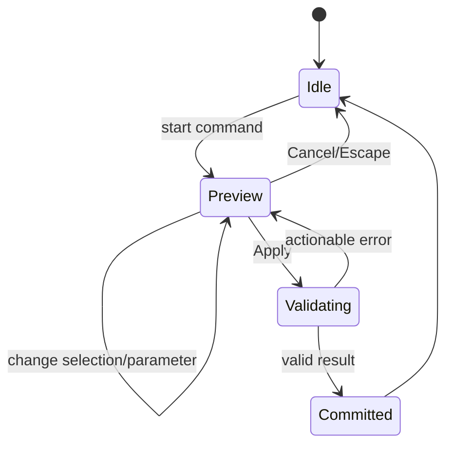

# UX and core flows

The cross-product interaction, visual, accessibility, and content rules are defined in [Design and UX Guidelines](design-and-ux-guidelines.md). This document defines the application frame and canonical end-to-end flows; the guidelines define how every state in those flows behaves.

## Interface frame

Desktop layout:

```text
┌────────────────────────────────────────────────────────────────────┐
│ Project · Save state · Undo/Redo · Command palette · Export        │
├──────────────┬───────────────────────────────────┬─────────────────┤
│ Model tree   │                                   │ Properties /    │
│              │            Viewport               │ active command  │
│ Sketches     │                                   │                 │
│ Features     │                                   │ Parameters      │
│ Bodies       │                                   │ Diagnostics     │
├──────────────┴───────────────────────────────────┴─────────────────┤
│ Status: units · selection filter · solver/rebuild · warnings       │
└────────────────────────────────────────────────────────────────────┘
```

In sketch mode, the right panel shows constraints and dimensions while the viewport switches to an orthographic normal-to-plane view. In print mode, the model tree remains visible and the right panel becomes the analysis and export report.

The shell uses Tailwind CSS v4 and source-owned shadcn/Radix primitives from `@vibeshape/ui`. Toolbar, command palette, menu, and shortcut invoke the same application command. The model tree and viewport overlays remain specialized accessible CAD components rather than being forced into generic `Card` or `Table` components.

The implemented viewport shows terminal authoritative meshes only after a successful document rebuild. Raw Three.js owns the canvas scene and GPU lifecycle outside React reconciliation; localized loading, empty, rebuild-failure, and WebGL2-unavailable states remain ordinary DOM overlays. It supports orthographic orbit, pan, zoom, responsive fit, shaded faces, derived feature edges, hover face preselection, and primary-click face selection. Middle drag rotates and secondary drag pans so primary click remains unambiguous. The selected feature and friendly face ordinal are mirrored into the DOM status bar, and an explicit canvas control clears selection. Empty primary click and every geometry replacement also clear selection. Current rendered-face identity is deliberately transient; body/edge/vertex selection, stable `TopoRef` selection, filters, standard views, and command preview overlays remain open.

## Command states

Every modeling command uses the same state machine:



- Preview does not modify the document and may use low-quality temporary tessellation.
- Apply creates one domain transaction and one undo entry.
- An error preserves parameters and the failing selection.
- Escape always cancels the active command before the document changes.

The Box create/edit slice implements idle → validate → persisted commit with preserved field errors and asynchronous single-flight submission. Activating a Box in the feature tree opens the same task-panel form with its authored source expressions, not only resolved millimeter values. Update preserves the feature identity and untouched record fields, closes only after the semantic revision is saved, and lets the ordinary worker rebuild replace the viewport mesh. Interactive geometry preview and `Escape` command routing remain required before this slice satisfies the complete modeling-command state machine.

The implemented sketch-editor slice follows idle → transient authoring → live solve → persisted commit. The empty model task makes `Create sketch` the primary path and relegates direct Box and Cylinder commands to an explicit advanced section. `Create sketch` enters an orthographic 2D workspace with a validated, unsaved sketch draft. The Radix contextual toolbar then replaces unrelated solid commands with Select, Point, Line, corner Rectangle, Circle, center-point Arc, Construction, and local Undo/Redo actions. It uses one tab stop and arrow-key navigation, identifies the active tool, and prevents switching back to Model until the draft is finished or canceled. The task panel retains support, compatible constraints, dimensions, profiles, and a persistent Finish/Cancel footer. Analytical tools call shared domain operations; Select supports additive entity selection; points drag directly; Delete removes selected geometry with dependent constraints; Shift-primary or middle drag pans; and wheel zooms toward the pointer.

Compatible selections promote coincident, horizontal, vertical, parallel, perpendicular, equal, tangent, concentric, fixed, point-on-line, and point-on-curve actions; incompatible actions no longer occupy the task panel as a disabled wall. Two points, two lines, or one round curve expose applicable distance, projected-distance, angle, radius, or diameter dimensions through the TanStack Form adapter. Dimension expressions accept units and committed `#variables`; the constraint list preserves authored text and allows explicit removal. Every draft change requests a debounced protocol-v6 SolveSpace solve without creating a document revision. The canvas uses solved coordinates for display, reports solver status and degrees of freedom, renders closed regions behind exact entity strokes, and derives stable boundary selectors for profile activation. An empty draft reports that geometry has not been authored instead of presenting a misleading fully constrained solver state.

`Finish sketch` is asynchronous and single-flight, creates one ordinary add or update revision, and cannot be double-submitted. Cancel discards the draft. Single activation of a saved sketch selects it and exposes eligible downstream commands without entering edit mode; explicit `Edit sketch` restores every stable entity, constraint, and expression identity. The browser harness proves variable-driven dimension refactor, fully constrained solve, edit, save, reload, profile selection, and extrusion. Origin-plane picking in the viewport, hover inference glyphs, center-rectangle and three-point Arc tools, constraint glyph layout, complete command-registry shortcuts, command-level document undo, and bounded conflict-repair suggestions remain follow-up interaction work. The delivery sequence is tracked in the [Editor experience implementation plan](editor-experience-plan.md).

The first extrusion slice starts from a selected saved sketch profile. `Extrude selected profile` is the primary post-sketch action and carries its stable selector into a task panel that names the selected sketch and exposes distance plus symmetric state. Closed regions can be activated on the sketch canvas; sketches with multiple detected regions also expose an accessible profile list. The feature stores canonical boundary entity IDs, never the displayed profile ordinal. Distance accepts the same unit-aware literals and committed `#variables` as other length fields. Invalid raw text and the selected profile remain visible; asynchronous Create or Update is single-flight, persists one ordinary feature revision, and closes only after persistence and authoritative rebuild succeed. Activating the extrusion restores the exact distance expression, selector, and symmetric state. Changing a referenced variable rebuilds the exact solid without rewriting the authored expression. Removing the source sketch is blocked until the extrusion is removed. Multiple simultaneous region selection, operation modes other than new body, and an unsaved solid preview remain open. The delivery order for those capabilities is defined in the [Sketch-first modeling implementation plan](sketch-first-modeling-plan.md).

Feature removal is available from an active edit task. A feature with direct dependents keeps the destructive action disabled and names the downstream features that must be removed first; the initial implementation never guesses a cascade. A removable leaf opens the shared accessible `AlertDialog`, names the feature, warns that undo is not implemented, blocks repeated activation while the asynchronous commit is pending, remains open with a persistent error after failure, and closes only after semantic persistence and rebuild succeed. Successful removal closes the edit task, clears an invalid viewport selection, updates terminal geometry, and survives reload.

## Flow 1: create a printable part

1. Create a project and choose a printer profile or no profile.
2. Select an origin plane and create a sketch.
3. Draw geometry, apply constraints, and reach a clear solver state.
4. Finish the sketch and extrude it.
5. Add feature-tree operations; preview changes before commit.
6. Open Print Check for units, solid validity, mesh validity, dimensions, overhang, and wall warnings.
7. Export 3MF and optionally STEP or STL.

The implemented Phase 1 export boundary is available from `Export…` in the application bar. It opens a modal dialog with a remembered preferred-slicer action, direct multi-object 3MF download, exact STEP exchange, and binary STL compatibility. All actions remain disabled until the current rebuilt revision contains solid geometry and are single-flight while asynchronous worker work is pending. The slicer action sends the generated 3MF only through an explicitly paired local bridge; if that bridge is not configured, unreachable, or cannot start the chosen application, the dialog downloads the same 3MF and says that it downloaded instead. A successful bridge handoff and direct format downloads preserve localized status in the application bar after the dialog closes. Browser-local save, geometry exchange, bridge handoff, slicer import, and printing are distinct states and must never share success copy. Print checks, placement, configurable tolerance profiles, and a persistent export report remain later work.

`Project…` owns both the local-project library and the separate native-file flow. The library strictly reads bounded project summaries from IndexedDB, marks the current project, and shows each name, semantic revision, localized modification time, and exact-revision isometric preview. A project without successful terminal geometry, with a stale preview, or with unavailable derived storage gets a labeled placeholder rather than a synthetic shape. `New project` closes the current session before creating a new browser-stored document; `Open` closes it before switching by stable document ID. Both actions are single-flight and leave the current project selected when pre-switch validation fails. `Duplicate` verifies and replays the selected semantic history, assigns a fresh document ID and fresh command IDs, preserves document-scoped variable and feature identities plus authored expressions, appends a localized bounded copy name, and atomically publishes a clean inactive project without changing the current selection. It does not set the external-backup timestamp; an available preview copies afterward as non-authoritative best effort. `Delete` is available only for an inactive project, opens the shared accessible confirmation, states that the full browser history is permanent while exported `.vshape` files are unaffected, and remains open with a persistent error after a stale-revision or live-lease conflict. The deletion transaction removes the project head, events, snapshots, preview, recovery marker, and expired lease atomically. The External backup card downloads `.vshape` even when the model has no exportable solid because semantic history, variables, and features are the payload. The Open project file card uses the cross-browser file-input baseline, reports verification as an asynchronous state, and switches only after atomic import succeeds. A same-ID collision remains visible, preserves the browser copy, and directs the user to Local projects. Active-project deletion, explicit same-ID restore or copy-as-new import, backup reminders, and system-picker enhancement remain later work.

## Flow 2: edit an early parameter

1. Double-click a feature or dimension in the tree or viewport.
2. Enter a new value and show a debounced preview.
3. Rebuild in the worker while keeping the UI responsive.
4. Commit atomically on success.
5. If a `TopoRef` is ambiguous, highlight affected downstream operations and present a bounded candidate set.
6. Save the repaired reference as part of the command.

The current Box and Extrusion implementations cover tree activation, raw parameter restoration, validation, atomic update, worker rebuild, and reload persistence. Extrusion additionally proves stable profile intent across variable-driven sketch and distance rebuilds. Debounced solid preview, multi-region feature input, and topology-reference repair remain later interaction increments.

## Flow 3: import STEP as context

1. Choose Import → STEP; parse locally.
2. Before commit, show file size, units or assumptions, body count, and healing diagnostics.
3. Create an `ImportedBRepFeature`; let the user embed the source or keep an explicit external reference.
4. Measure the import and build a mating body around it.
5. Replace an external source only through an explicit Replace Source command; never reload it silently.

## Flow 4: crash recovery

1. Compare the latest exported version, snapshot, and autosave journal.
2. If the journal is newer than the clean-close marker, show its time and latest commands.
3. Restore into a new recovery snapshot; do not overwrite the original immediately.
4. Let the user save, compare, or discard the recovery state.

## Errors

Errors are classified as:

- **Input error** — invalid number, unit, or selection; corrected inside the active command.
- **Solver conflict** — show the smallest known conflicting set.
- **Kernel failure** — name the operation and suggest geometry-aware actions such as reducing a fillet, removing a tangent edge, or changing order.
- **Topology ambiguity** — show candidates and prohibit silent substitution.
- **Resource failure** — quota, memory, or worker crash; offer recovery export and worker restart.
- **Format error** — identify the file location, resource limit, or unsupported entity without executing file content.

Raw stack traces belong in a local diagnostic bundle but never replace a user-facing explanation.

Error wording, persistence, focus behavior, and recovery actions follow the [feedback and diagnostics rules](design-and-ux-guidelines.md#feedback-progress-and-diagnostics).

## Alpha keyboard shortcuts

| Action | Shortcut |
|---|---|
| Command palette | `Ctrl/Cmd+K` |
| Undo / redo | `Ctrl/Cmd+Z`, `Ctrl/Cmd+Shift+Z` |
| Save/export native project | `Ctrl/Cmd+S` |
| Fit view | `F` |
| Delete selection | `Delete/Backspace`, guarded during text input |
| Cancel command | `Escape` |
| Apply command | `Enter` when focus is not in a multiline input |
| Toggle orthographic | `O` |
| Standard views | Numeric presets, finalized after usability testing |

Shortcuts become configurable in P1. macOS uses `Cmd`; Windows and Linux use `Ctrl`.

The complete shortcut safety, toolbar navigation, escape hierarchy, and canvas-accessibility contract is defined in [Design and UX Guidelines](design-and-ux-guidelines.md#accessibility-contract).
